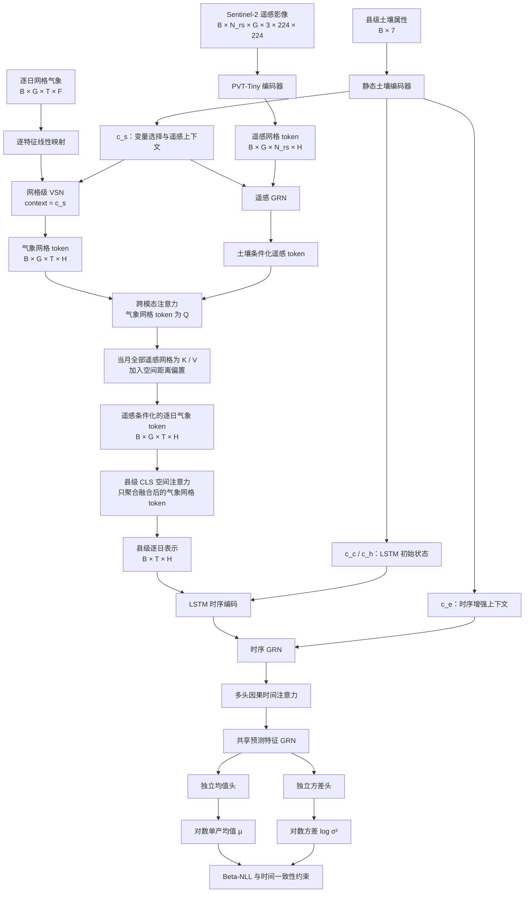

# 基于网格级空间注意力与时间融合变换器的县级玉米单产预测研究

---

## 摘要

针对县级玉米单产预测中遥感标注有限、县域空间异质性易被均值化、遥感与气象时间粒度不一致以及逐日预测缺少中间标签等问题，本文提出一种“多模态自监督预训练—监督微调”的时间融合变换器框架。预训练阶段使用多州多年无标签遥感—气象配对数据：同一网格、同一月份的逐日气象 token 作为 Query，增强后的遥感图像经 PVT 编码得到 patch token 并作为 Key/Value，通过 SimCLR 对比损失学习气象条件化的遥感表征。微调阶段在目标五州数据上加载预训练参数，引入土壤静态上下文、逐网格变量选择、跨模态注意力、县级空间注意力、LSTM 与因果时间注意力，并通过独立均值/方差预测头、Beta-NLL 和时间 KL 一致性约束生成逐日单产概率分布。实验框架分别评估预训练表征质量、迁移收益、多模态对齐、最终预测精度、概率校准和季中预测行为。

**关键词：** 玉米单产预测；时间融合变换器；空间注意力；变量选择网络；网格级气象；季中预报

## Abstract

To address limited yield supervision, within-county spatial heterogeneity, mismatched temporal resolutions between remote sensing and weather, and the absence of intermediate labels for daily forecasting, this study develops a self-supervised pretraining and supervised fine-tuning framework based on the Temporal Fusion Transformer. During pretraining, daily weather tokens from the same grid and month serve as queries, while patch tokens extracted from two augmented views of a Sentinel-2 image serve as keys and values. A SimCLR objective trains the PVT backbone and weather-to-remote cross-modal attention using multi-state, multi-year unlabeled pairs. During fine-tuning, the pretrained modules are transferred to the target five-state yield task and combined with soil-conditioned variable selection, county-level spatial attention, an LSTM, causal temporal attention, independent mean and variance heads, Beta-NLL, and temporal KL consistency. The evaluation framework separately examines representation quality, transfer gains, multimodal alignment, point prediction, uncertainty calibration, and in-season forecasting behavior.

**Keywords:** corn yield prediction; Temporal Fusion Transformer; spatial attention; variable selection network; grid-level weather; mid-season forecasting

---

## 1 引言

### 1.1 研究背景与意义

#### 1.1.1 研究背景

玉米是全球最重要的粮食与饲料作物之一，也是美国播种面积与产量最大的作物。美国中西部的"玉米带"（Corn Belt）是全球最重要的玉米产区之一，其县级单产统计不仅关系粮食安全与国际农产品市场，也是农业保险定价、粮食储备与宏观调控的基础依据。近年来，全球气候变化导致极端高温、干旱、强降水等异常天气事件频发，生长季内气象条件波动加剧，玉米单产的年际波动与区域差异显著放大。在此背景下，**提前且准确地预测县级尺度玉米单产**，已成为农情监测、市场调控与粮食安全决策的关键技术需求。

从市场与金融视角看，县级单产预测的经济价值直接体现在农产品衍生品交易中。美国玉米期货与期权在芝加哥期货交易所（CBOT）挂牌，其中玉米期权自 1985 年推出，是全球成交量最大的农产品期权品种，2017 年成交量约 239 万手、年末持仓约 100 万手[18]。由于玉米价格对供给冲击高度敏感，单产预测（尤其是 8 月作物巡查、USDA 月度供需报告等关键节点的单产调整）往往在短时间内显著影响 CBOT 玉米期价与期权隐含波动率，进而改变贸易、压榨与养殖企业的套保成本与头寸损益。以 2026 年为例，Pro Farmer 作物巡查给出的美国玉米单产预估为 173.2 bu/ac，较 USDA 8 月报告的 180.7 bu/ac 低 7.5 bu/ac，为六年来最大的单产分歧；若据此下调产量而需求不变，美国玉米期末库存将由 16.53 亿蒲式耳收紧至约 9.84 亿蒲式耳，库存消费比下降近 4 个百分点至约 6%，CBOT 玉米随之突破 500 美分并看向 550—600 美分区间[19]。围绕收获季产量与价格预期，市场亦出现大规模期权头寸，例如一笔约 10 万手 11 月 5.50/6.00 美元看涨价差交易（权利金约 2000 万—2200 万美元，理论最大盈利约 2.3 亿—2.5 亿美元），被普遍解读为对产量下滑与收获期价格上行的押注[20]。可见，单产预测的精度与时效会通过期货与期权市场直接转化为经济价值。

在此背景下，中国企业与机构也已参与对美国玉米产量的跟踪，并将其作为衍生品交易决策的重要输入。中粮期货研究中心等国内机构持续跟踪 Pro Farmer 巡查与 USDA 报告，把美国玉米单产预测作为 CBOT 玉米走势研判与交易策略的核心依据，并面向国内产业客户发布专题分析[19]。在期权应用层面，国内企业已积累多个玉米期权保值案例：路易达孚（中国）贸易有限责任公司在 2019 年玉米采购中通过卖出看涨期权并配合 delta 对冲锁定销售价格，综合收益约 216 万元，优于同期期货套保[21]；良运集团在大连商品交易所玉米期权上市后率先试点"期权垂直价差组合"套保策略，用于粮食采购与库存管理[22]；北大荒中垦珠海贸易有限公司则通过买入看跌期权为 2 万吨玉米库存保值[21]。此外，海大集团等大型农牧企业在 2026 年公告了覆盖玉米、大豆、豆粕等品种的期货与期权套期保值计划，单商品套保保证金上限达 40 亿元[23]。这些实践表明，产量预测能力在国内产业与国际市场上均具有可观测的商业价值。

县级单产预测具有明显的尺度矛盾。一方面，USDA-NASS 等统计机构通常以县为单位发布产量数据，县级结果是农业保险、产量预警和区域资源配置可以直接使用的空间单元；另一方面，一个县往往覆盖数百至数千平方公里，内部可能同时包含不同地形、土壤和水分条件。生长季内的最高温度、降水过程、蒸散需求和水分亏缺并不会在县域内均匀分布，将多个气象网格简单平均后，容易把局地高温、短时强降水或持续干旱等对产量形成具有重要作用的信号平滑掉。尤其在极端天气年份，平均气象条件可能看起来接近常年，但少数网格中的严重胁迫仍会显著影响县域产量，这使得县内空间异质性成为单产预测中不能忽略的因素。

此外，单产预测具有严格的时间约束。完整生长季结束后获得的高精度结果虽然便于统计核算，但对保险定损、粮食调运和灾害响应而言往往偏晚。实际业务更关注“截至当前日期已经掌握的信息能够解释多少最终产量”，因此模型需要在不使用未来观测的条件下持续更新预测。如何在县域空间结构、逐日气象过程和有限的季中信息之间建立统一表示，是当前数据驱动单产预测需要解决的核心问题。

#### 1.1.2 研究意义

从科学角度看，作物单产由品种遗传特性、生长季气象条件、土壤属性与田间管理措施等多类因素**非线性耦合**决定，且在空间与时间上高度异质，其预测问题本身具有重要的科学研究价值。从应用角度看，生长季内的**滚动预报**能够为农户、保险公司与政府部门提供及时的管理决策依据；而**可解释的预测**则有助于回答"哪些气象因子、在哪个生育阶段、在哪些区域对产量影响最大"等农学问题，推动数据驱动模型与农业科学的交叉融合。因此，发展兼顾精度、时效性与可解释性的县级玉米单产预测方法，兼具科学价值与应用价值。

本文的研究意义可以进一步分为三个层面。第一，在理论层面，研究将县域内部的多个气象网格视为具有位置和局地状态的基本单元，探讨变量选择与空间聚合的先后关系，有助于说明“先保留局地信息、再进行县级汇总”是否比直接平均更适合产量形成过程。这一问题不仅适用于玉米，也可以推广到小麦、大豆等具有明显空间异质性的区域作物预测任务。第二，在方法层面，本文将静态土壤上下文、动态气象变量和农学构造特征纳入同一时间融合框架，并通过变量选择权重和空间注意力为模型决策提供可观测接口，从而缓解深度模型预测精度与农学解释之间的矛盾。第三，在应用层面，模型融合网格级气象、县级土壤与 Sentinel-2 遥感影像，兼顾县域内部空间异质性与作物长势信息，可为遥感与气象多源数据协同的县级单产预测提供可复现的技术方案。

同时，本文特别关注模型性能在不同县和不同州之间是否均匀。总体 RMSE 可能掩盖少数区域的系统性偏差，而这些区域往往正是极端气候更频繁、产量波动更大的地区。通过逐县误差和分州指标分析，可以识别模型的“困难区域”，更完整地评估模型在不同空间单元上的适用性与局限性。

### 1.2 国内外研究现状

#### 1.2.1 传统单产预测方法

传统作物单产预测方法大致可分为两类。其一为**机理模型（过程模型）**，即基于作物生理生态过程的逐日模拟模型，能够刻画作物生长发育与产量形成机理，但通常需要大量难以获取的田间管理参数、精细的土壤剖面数据和严格的气象驱动输入，在大范围县级尺度上难以规模化推广。其二为**统计与浅层机器学习模型**，如线性回归、随机森林、支持向量机等，实现简单、可解释性较好，但对气象-产量之间复杂的非线性与时序依赖关系表达能力有限。

#### 1.2.2 基于深度学习的单产预测

随着农业大数据与深度学习的发展，研究者提出了多种面向作物单产预测的深度模型。

Khaki 等提出 CNN-RNN 框架，使用一维卷积网络分别对天气时序与土壤剖面特征建模，再以长短期记忆网络（LSTM）捕捉年际时序依赖，对美国玉米带 13 个州的玉米与大豆单产进行预测，取得了优于传统机器学习方法的效果[3]。该工作较早系统地将 CNN 与 RNN 的混合结构引入作物单产预测，但其天气输入采用了县域平均或站点级数据，未涉及县域内部的空间结构。

Lin 等在注意力 LSTM（AT-LSTM）基础上结合多任务学习，提出 DeepCropNet，将美国玉米带划分为若干区域并分别拟合区域特定的输出层，利用积温（Growing Degree Days, GDD）与高温累积（KDD）等农业气象特征工程，在县尺度玉米单产估计中取得良好表现[2]。该工作说明**结合作物生理学知识的特征工程**能够提升深度模型的预测能力。

Wang 等提出知识引导的机器学习方法（Knowledge-guided Machine Learning, KGML），将作物生长的领域知识嵌入深度模型的结构中，用于干旱情境下的县尺度玉米单产预测，展示了物理知识与数据驱动模型融合的潜力[6]。Luo 等提出 PhenoYieldNet，学习作物感知的物候响应，实现多作物（玉米、大豆）单产的统一预测，验证了将物候期信息引入深度预测模型的必要性[7]。Park 等提出空间变化深度泛函神经网络（Spatially Varying Deep Functional Neural Network），将单产视为气象过程的泛函映射，并通过空间变化系数刻画区域差异，在大型作物单产预测任务中取得较好效果，强调了**空间异质性建模**的重要性[10]。

在生长季内预报方面，Schwalbert 等结合卫星影像与气象变量，对美国玉米带进行季中县尺度玉米单产预报，展示了多源数据在季中滚动预测中的价值[11]。

#### 1.2.3 空间-时间联合建模与遥感方法

作物单产同时受空间与时间因素影响，近年来空间-时间联合建模成为研究热点。

Lin 等提出了多模态空间-时间视觉变换器（MMST-ViT），将卫星遥感影像与气象观测等多模态数据输入视觉变换器，并针对气候变化下的产量预测开展研究[4]。其配套工作发布了 **CropNet 开放数据集**，涵盖美国县级玉米/大豆单产、卫星遥感影像与再分析气象数据等多模态信息，为相关研究提供了统一的数据基准[5]。MMST-ViT 的工作还系统复现并比较了包括 CNN-RNN、ConvLSTM 与 GNN-RNN 在内的多种基线模型，但上述基线均以**遥感影像**或县均值气象作为输入。

Hasan 等提出 VITA（变分预训练变换器），通过在大规模卫星气象数据上预训练变换器表征，提升模型在极端气候年景下的预测鲁棒性[8]；其关于连续气象数据的变换器编码器改造（WeatherFormer 系列）为气象时序的建模提供了统一的正余弦空间-时间位置编码方案[9]。

#### 1.2.3.1 遥感—气象数据的时间对齐与多模态融合

现有遥感—气象产量预测模型虽然使用了相近的数据来源，但对“两个模态如何对齐、在哪里交互”采用了不同策略。该问题不仅是网络结构选择，也对应不同的农业观测假设：卫星影像主要反映观测时刻的冠层状态，气象数据则描述观测日前后作物所经历的热量、水分和胁迫过程。因此，融合方式需要同时考虑观测日期、空间网格和信息可用性，而不能只在模型输入端进行无条件拼接。

**（1）MMST-ViT 的定向跨模态注意力。** Lin 等提出的 MMST-ViT 使用与本文相同或相近的 CropNet 数据体系，将 Sentinel-2 多时相影像、9 km 网格气象和县级产量联合建模[4,5]。其多模态模块先用视觉骨干网络提取遥感 patch 表征，再将遥感表征作为 Query、短期气象表征作为 Key 和 Value，计算

$$
\mathbf{Z}=\operatorname{softmax}\left(\frac{\mathbf{Q}_{RS}\mathbf{K}_{W}^{\mathsf T}}{\sqrt d}\right)\mathbf{V}_{W}.
$$

这种方式使遥感 token 主动查询气象序列，随后再进行空间 Transformer 和时间 Transformer。它的优点是模态角色清晰，能够直接学习遥感冠层状态与气象过程之间的对应关系；但其交互具有明显的方向性，输出主要由气象 Value 聚合得到，遥感 token 与气象 token 并未作为同一日期 block 中的平等 token 进行双向更新。对于同一日期内“天气条件—冠层状态—局地网格”之间的联合观测关系，模型需要依赖后续模块间接表达，且原方法没有将遥感缺失日期作为不产生 token 的观测事件显式处理。

**（2）CMAViT 的气象条件化视觉注意力。** Kamangir 等提出 CMAViT，将多时相 Sentinel-1/2、同期气象数据和产量信息输入多模态视觉 Transformer[24]。其 STMM 模块分别计算视觉相似度和气象相似度，并将两者相加后用于视觉注意力：

$$
\operatorname{STMM}=\operatorname{softmax}\left(
\frac{\mathbf{Q}_{s}\mathbf{K}_{s}^{\mathsf T}}{\sqrt d}
 +
\frac{\mathbf{Q}_{m}\mathbf{K}_{m}^{\mathsf T}}{\sqrt d}
\right)\mathbf{V}_{s}.
$$

该方法不是把天气 token 与遥感 token 拼入同一序列，而是让天气相似度改变视觉 self-attention 的 logits，最终仍聚合视觉 Value。其优点是天气能够条件化视觉特征提取，避免简单拼接；局限是天气信息主要作为注意力条件或偏置发挥作用，难以直接保留天气 token 本身的独立表示，也不显式区分“同日交互”和“跨日预测因果”。此外，该方法采用固定的周尺度观测对齐和云量筛选，适合规则观测场景，但对缺失遥感日期、不同网格的可用观测数量以及不规则观测间隔的处理空间有限。

**（3）时间步特征拼接。** Pathak 等将时间对齐后的 Sentinel-2、ERA5 气象、土壤和地形特征在每个时间步直接拼接，再送入 LSTM 或树模型[25]：

$$
\mathbf{z}_{t}=[\mathbf{x}_{t}^{RS};\mathbf{x}_{t}^{W};\mathbf{x}^{soil};\mathbf{x}^{DEM}].
$$

这种 early fusion 实现简单、计算代价低，并且适合构造统一的多模态基线。但拼接本身不包含模态间的动态匹配机制：同一时间步内所有气象变量和遥感特征被无差别地送入后续编码器，模型不能明确表达某一气象过程对某些遥感网格的选择性影响；当不同模态的时间分辨率或有效观测日期不一致时，重采样和聚合还可能将观测误差隐藏在拼接向量中。

**（4）独立编码后的高层融合。** Mia 等分别使用 CNN 和天气序列编码器处理 UAV 多光谱影像与天气数据，再拼接两类高层表示并通过全连接层预测水稻产量[26]。Aviles Toledo 等则对多模态遥感、环境和遗传信息分别进行时序编码，再通过 late fusion attention 汇聚不同模态[27]。这类方法保留了各模态的专用编码能力，适合作为稳健的多模态基线；但遥感与天气在独立编码阶段不发生交互，最终的模态权重或特征拼接也难以表达“某个日期的天气胁迫是否改变某个空间网格的遥感响应”。同时，若先对每个模态压缩成一个全局向量，县域内部网格的空间异质性会在融合前被部分消解。

**（5）融合后再做时间注意力。** Shyam 和 Chandrakar 的模型先分别用 CNN/MLP 编码卫星与气候数据，再拼接为时间步表示，最后用时间注意力选择重要日期[28]。这类结构能够回答“哪些时间步对预测重要”，但不能直接回答“某日哪些遥感网格与哪些气象变量共同重要”。此外，时间注意力是在模态已经压缩和拼接之后计算的，因而无法像 token 级注意力一样保留模态之间的细粒度空间对应关系。由于该工作是预印本且方法和数据描述尚不完整，本文不将其作为主要实验依据，而仅将其作为融合后时间加权结构的补充例子。

**（6）本文的对齐与改进。** 上述方法的共同不足不是“没有使用遥感或气象”，而是大多没有同时显式建模以下三个约束：

1. **日期约束**：气象和遥感应围绕真实观测日期对齐，而不是仅按补齐后的数组位置对齐；
2. **空间约束**：同一日期的气象状态应与同一网格的遥感冠层状态关联，而不是在县域级特征压缩后再融合；
3. **信息可用性约束**：缺失遥感日期不应被当作真实的零值观测，未来日期的信息也不能参与当前预测。

为解决遥感观测频率低于逐日气象观测的问题，本文不直接复用 MMST-ViT 中以遥感 token 为 Query 的定向跨模态注意力。MMST-ViT 的输出以遥感观测时相为中心，更适合在遥感时相尺度上进行融合；若直接应用于本文任务，模型的跨模态更新天然受限于低频遥感日期，难以为每一个气象日生成预测。本文因此采用相反的注意力方向：以每个时间步、每个空间网格的气象 token 作为 Query，以当前月份对应的遥感网格 token 作为 Key 和 Value。这样，遥感信息作为当前月份的作物长势条件，被注入到逐日气象表示中，而跨模态融合后的输出仍然保持逐日气象时间轴和网格结构。

具体而言，本文先将气象和遥感 token 分别经过包含县级土壤上下文的 GRN，得到

$$
\tilde{\mathbf{w}}_{i,g,t}=\operatorname{GRN}_{w}(\mathbf{w}_{i,g,t},\mathbf{c}_{s}),
\qquad
\tilde{\mathbf{r}}_{i,g,m}=\operatorname{GRN}_{r}(\mathbf{r}_{i,g,m},\mathbf{c}_{s}),
$$

其中 $\mathbf{c}_{s}$ 为县级土壤静态上下文，$t$ 表示逐日气象时间步，$m$ 表示遥感月份。对于属于月份 $m(t)$ 的每个气象网格，使用同一网格位置的当月遥感 token 执行跨模态注意力：

$$
\mathbf{Q}_{i,g,t}=W_Q\tilde{\mathbf{w}}_{i,g,t},
\qquad
\mathbf{K}_{i,g,t}=W_K\tilde{\mathbf{r}}_{i,g,m(t)},
\qquad
\mathbf{V}_{i,g,t}=W_V\tilde{\mathbf{r}}_{i,g,m(t)}.
$$

由于每个网格在当前月份对应一个遥感 token，跨模态注意力可以写为

$$
\mathbf{u}_{i,g,t}=\operatorname{softmax}
\left(
\frac{\mathbf{Q}_{i,g,t}\mathbf{K}_{i,g,t}^{\mathsf T}}{\sqrt d}
\right)\mathbf{V}_{i,g,t},
$$

并通过残差连接或门控残差变换得到逐日融合气象 token。该设计与 MMST-ViT 的主要区别在于 Query 的粒度和输出的时间粒度：MMST-ViT 以遥感 token 查询气象序列，输出围绕遥感时相组织；本文以逐日气象网格查询当月遥感，输出始终保留 $T$ 个逐日时间步，因此可以在每天生成产量预测。

跨模态融合后，本文只对更新后的气象网格 token 进行空间 CLS 注意力聚合，再将县级逐日表示输入 LSTM 和因果时间注意力。因而模型的结构顺序为：

$$
\text{逐网格 VSN}
\rightarrow
\text{土壤条件化 GRN}
\rightarrow
\text{气象 Q—遥感 K/V 跨模态注意力}
\rightarrow
\text{气象网格空间 CLS 聚合}
\rightarrow
\text{LSTM 与因果时间注意力}.
$$

在当前月份遥感观测缺失时，模型应使用有效性掩码屏蔽对应的跨模态 Key/Value；不使用未来月份的遥感信息。这样既保留了逐日天气过程，又使遥感长势信息以月份为条件参与每天的产量预测。

与上述设计对应，第 $t$ 个日期的空间候选 token 不再包含独立的遥感 token，而是包含经过当月遥感条件化后的气象网格 token：

$$
\mathcal{B}_{t}=\{\mathbf{w}_{t},\mathbf{r}_{t,1},\ldots,\mathbf{r}_{t,G_t}\}.
$$

随后，空间注意力在每个日期内部由县级 CLS 查询聚合这些已经完成跨模态更新的气象网格 token；因果约束在后续时间注意力中执行，保证第 $t$ 个时间步不能访问未来日期。月份遥感只作为当前月份的 Key/Value 条件参与该月的逐日气象 Query 更新。

$$
M_{ij}=\begin{cases}
0, & d_j\leq d_i,\\
-\infty, & d_j>d_i,
\end{cases}
$$

其中 $d_i$ 和 $d_j$ 为时间注意力中的真实相对日期索引。若某个月份的遥感时相缺失，则该月份的跨模态 Key/Value 由有效性掩码排除，不使用未来月份的遥感观测。该设计相对于 MMST-ViT 的遥感 Query 方案，明确将低频遥感作为月份条件注入逐日气象 Query；相对于简单拼接，保留了跨模态注意力的方向性、网格对应关系和逐日输出粒度。

需要强调的是，本文的“改进”首先是融合拓扑和信息约束上的改进，而不是已经由实验充分证明的普适优势。不同融合方式的优劣仍需通过同一数据划分下的特征拼接、定向跨模态注意力、气象条件化视觉注意力和本文“逐日气象 Query—当月遥感 Key/Value + 空间聚合 + 因果时间注意力”方案进行消融验证。

上述工作表明，**空间-时间联合建模**与**可迁移的预训练表征**是当前作物单产预测的重要发展方向。然而，遥感影像的高获取成本与复杂性，使得"仅依赖气象与土壤数据、仍能保留空间结构"的建模路线具有重要的实用价值。

#### 1.2.4 可解释时序建模与时间融合变换器

Lim 等提出的时间融合变换器（Temporal Fusion Transformer, TFT）是为多步预测设计的一种注意力架构，能够同时处理静态（时不变）协变量、已知的未来输入以及仅在历史观测到的外生时序，并具备良好的可解释性[1]。TFT 的核心组件包括：用于静态信息编码的上下文网络、用于变量筛选的**变量选择网络（VSN）**、用于局部时序处理的**循环层（LSTM）**以及用于长期依赖建模的**多头因果注意力**。其中，VSN 通过可学习的软选择权重显式输出各输入变量的重要性，因果注意力则输出时间维度上的注意力分布，二者共同赋予 TFT 以可解释性。

TFT 的可解释机制（特征重要性 + 时间注意力）与作物产量预测中对"关键气象因子与关键生育期"的农学分析需求高度契合，但 TFT 本身面向通用多步时序预测，将其适配到"网格级气象输入 + 单产标量预测"的县级产量预测任务，并保留空间信息建模，仍是值得探索的方向。

#### 1.2.5 研究现状评述

综上，现有研究的主要局限可概括为：

- 多数基于气象输入的深度模型将县域内网格气象**平均化**，丢失空间结构；
- 保留空间结构的模型往往**依赖遥感影像**，数据获取与处理成本高；
- 深度学习模型普遍**可解释性不足**，难以支撑农学层面的分析与决策。

本文在 CropNet 数据框架下，提出一种**融合网格级气象、县级土壤与 Sentinel-2 遥感影像、兼具空间建模能力与可解释性**的 TFT 编码器产量预测模型，并在统一口径下与代表性基线进行公平对比。相较于已有的特征拼接、独立编码后融合和气象条件化视觉注意力，本文进一步研究低频遥感的前向时间对齐、逐日空间联合聚合和因果时间注意力，以满足季中预报的信息约束。

### 1.3 研究内容

围绕上述问题，本文开展以下四方面研究：

1. **网格级气象数据的构建与预处理**：建立全州无标签预训练样本和五州监督样本组成的网格级气象—遥感数据集，明确生长季时间窗口、网格对齐规则与标准化口径，为空间结构建模提供数据基础；
2. **空间-时序联合预测模型的构建**：设计以“逐网格变量选择 → 空间注意力聚合 → 时序编码 → 因果注意力 → 逐时间步预测”为主线的 TFT 编码器模型，同时建模县域内部的空间异质性与生长季内的时间依赖；
3. **消融验证与基线对比**：通过消融实验验证变量选择位置与空间聚合方式的作用，并在统一数据来源、年份划分与评价指标下，与 DeepCropNet、CNN-RNN、ConvLSTM、GNN-RNN 四类代表性基线模型进行对比；
4. **季中预报与区域误差评估**：设置自 4 月末起每月末一个的固定预报节点（4/28、5/28、…、9/28），评估模型的提前预报能力；利用变量选择权重与注意力分布开展可解释性分析，并保存测试集逐县预测，比较不同州的误差分布和区域难度差异。

### 1.4 技术路线

本文的技术路线如图 1 所示，主要分为四个阶段：

1. **数据准备阶段**：从 CropNet 框架获取县级单产、WRF-HRRR 网格级气象与 gSSURGO 土壤数据，经时间窗口选取、网格对齐与标准化构建模型输入；
2. **模型构建阶段**：搭建逐网格变量选择与空间注意力聚合模块，实现“逐网格变量选择—空间聚合—时序编码—因果注意力—逐时间步预测”的整体流水线；
3. **两阶段训练阶段**：先在所有完整覆盖州的 2017—2020 年无标签配对数据上进行多模态自监督预训练，再在五州 2021 年有标签数据上进行监督微调；
4. **独立评估与分析阶段**：在同一五州 2022 年数据上评估最终预测精度与各预报节点的提前预报精度，输出逐县预测和误差，按州比较误差分布及概率校准，并结合变量权重、跨模态权重、空间注意力和时间注意力开展诊断。

本文技术路线可概括为：数据获取与质量控制 → 预训练/微调数据划分 → 生长季窗口选取、网格对齐和特征标准化 → 多模态自监督预训练 → 参数迁移与土壤条件化监督微调 → 跨模态空间聚合 → LSTM 与因果注意力时序编码 → 概率单产预测与季中滚动预报 → 迁移收益、消融、基线比较和可解释性分析。

### 1.5 本文创新点

1. **面向逐日产量预测的气象 Query—遥感 Patch Key/Value 多模态预训练与迁移**。针对遥感影像监督稀缺及遥感—气象时间粒度不一致问题，本文参考 MMST-ViT 的多模态 SimCLR 框架，但反转跨模态注意力方向：同一网格、同一月份的逐日气象 token 作为 Query，遥感增强视图的 PVT patch token 作为 Key/Value。预训练不使用 PVT CLS，而对气象 Query 获得的遥感上下文进行时间池化和对比学习，从而迫使 PVT patch 与气象过程共同参与表征学习。预训练参数迁移到监督模型后，逐日气象网格继续查询当月遥感信息，并经县级空间聚合和 TFT 时序主干产生每日预测。

2. **基于异方差 NLL 与时间 KL 一致性的逐时间步概率预测**。本文将时间注意力输出映射为共享预测特征，再通过参数独立的均值 head 和方差 head 输出对数单产均值与对数方差，并使用 Beta-NLL 联合学习点预测和样本相关不确定性。针对每个县-年只有最终单产标签、缺少中间时间步监督的问题，本文进一步将最后有效时间步的预测分布作为停止梯度教师，通过指数加权的高斯 KL 散度约束各中间时间步向最终分布平稳收敛。该设计不声称中间时间步具有独立真实标签，而是通过概率分布一致性提高逐日预测轨迹的稳定性、可用性和不确定性表达能力，并为季中固定截止日期评估提供统一输出。

### 1.6 本章小结

本章阐述了县级玉米单产预测的研究背景与意义，梳理了从传统方法、深度学习方法到时空联合建模与可解释时序建模的国内外研究现状，归纳了现有研究在空间结构保留、遥感依赖与可解释性三方面的不足，明确了本文的研究内容、技术路线与三点创新，为后续章节的理论介绍、模型构建与实验验证奠定了基础。

---

## 2 相关理论基础

### 2.1 循环神经网络与序列建模

循环神经网络（Recurrent Neural Network, RNN）通过沿时间维度的隐状态传递刻画序列内部的时间依赖，其隐状态更新可表示为 $\mathbf{h}_t = f(\mathbf{W}_h \mathbf{h}_{t-1} + \mathbf{W}_x \mathbf{x}_t + \mathbf{b})$。尽管 RNN 原理简洁，但在长序列上存在梯度消失与梯度爆炸问题，难以捕捉长期依赖。

#### 2.1.1 长短期记忆网络（LSTM）

长短期记忆网络（Long Short-Term Memory, LSTM）通过引入**记忆单元** $\mathbf{c}_t$ 与遗忘门、输入门、输出门三类门控结构，实现了对信息的选择性写入、遗忘与输出，有效缓解了梯度消失问题。其核心递推为

$$
\mathbf{f}_t = \sigma(\mathbf{W}_f[\mathbf{h}_{t-1};\mathbf{x}_t] + \mathbf{b}_f),\quad
\mathbf{i}_t = \sigma(\mathbf{W}_i[\mathbf{h}_{t-1};\mathbf{x}_t] + \mathbf{b}_i),
$$

$$
\tilde{\mathbf{c}}_t = \tanh(\mathbf{W}_c[\mathbf{h}_{t-1};\mathbf{x}_t] + \mathbf{b}_c),\quad
\mathbf{c}_t = \mathbf{f}_t \odot \mathbf{c}_{t-1} + \mathbf{i}_t \odot \tilde{\mathbf{c}}_t,
$$

$$
\mathbf{o}_t = \sigma(\mathbf{W}_o[\mathbf{h}_{t-1};\mathbf{x}_t] + \mathbf{b}_o),\quad
\mathbf{h}_t = \mathbf{o}_t \odot \tanh(\mathbf{c}_t),
$$

其中 $\sigma$ 为 sigmoid 函数，$\odot$ 为逐元素相乘。LSTM 能够对生长季逐日气象序列中的局部时序依赖（如连续高温、干旱累积效应）进行建模，是本文模型中时序编码模块的基础。

#### 2.1.2 门控循环单元（GRU）

门控循环单元（Gated Recurrent Unit, GRU）是 LSTM 的一种简化结构，仅保留**更新门**与**重置门**，参数量更少、训练更高效，在序列建模中同样被广泛使用。本文模型以 LSTM 为主；GRU 可作为网络结构变体用于消融比较。

### 2.2 注意力机制与 Transformer

#### 2.2.1 自注意力机制

自注意力（Self-Attention）机制通过查询（Query）、键（Key）与值（Value）三组向量计算序列元素间的依赖：将查询与各键做缩放点积相似度，经 softmax 归一化得到注意力权重，再对值向量加权求和，即

$$
\mathrm{Attention}(\mathbf{Q},\mathbf{K},\mathbf{V}) = \mathrm{softmax}\left(\frac{\mathbf{Q}\mathbf{K}^\top}{\sqrt{d_k}}\right)\mathbf{V},
$$

其中 $d_k$ 为键的维度。自注意力具有全局感受野，能够建模任意远距离元素之间的依赖，且可并行计算，是 Transformer 的核心。

#### 2.2.2 多头注意力与位置编码

多头注意力（Multi-Head Attention）将查询、键、值投影到 $H$ 个不同的子空间，并行执行注意力后拼接并线性变换，使模型能够在不同子空间关注不同类型的依赖关系。由于自注意力不含序列顺序信息，Transformer 通过正余弦位置编码注入位置先验：

$$
\mathrm{PE}_{(t,2j)} = \sin\left(\frac{t}{10000^{2j/d}}\right),\quad
\mathrm{PE}_{(t,2j+1)} = \cos\left(\frac{t}{10000^{2j/d}}\right).
$$

该编码方案可推广到**多维度**（时间、纬度、经度等），为空间-时间联合建模提供统一的位置注入手段。

### 2.3 时间融合变换器（TFT）

时间融合变换器（Temporal Fusion Transformer, TFT）是 Lim 等提出的面向多步预测的注意力架构[1]，能够统一处理静态协变量、已知的未来输入与仅历史可观测的外生序列，并兼具可解释性。其核心组件包括：

#### 2.3.1 门控残差网络（GRN）

门控残差网络（Gated Residual Network, GRN）由层归一化、线性变换、ELU 激活与门控机制组成，并通过残差连接保证深层网络的训练稳定性。GRN 以可学习的方式决定非线性变换与残差路径的权重，对不同尺度与分布的输入具有良好的适应能力，是 TFT 各模块共用的基本构件。

#### 2.3.2 变量选择网络（VSN）

变量选择网络（Variable Selection Network, VSN）对多变量输入执行**软选择**：每个变量经独立的 GRN 编码为表征，所有变量原始输入拼接后经另一 GRN 与 softmax 输出逐时间步的变量权重，再对各变量表征加权求和得到融合特征。VSN 输出的变量权重即为各输入变量的**可解释的重要性度量**。

#### 2.3.3 静态上下文编码与多步预测结构

TFT 将静态（时不变）特征编码为若干上下文向量，分别条件化变量选择、LSTM 初态与注意力等模块，实现静态信息对时序建模的注入。在时序处理上，TFT 以 LSTM 刻画局部依赖，以**多头因果注意力**刻画长期依赖——因果性保证每一时间步仅关注其历史，从而在逐时间步预测中不泄露未来信息。

对于本文的县级玉米单产任务，TFT 并不是直接将原始县均值序列输入预测头，而是作为空间编码之后的时序主干使用。具体而言，每个时间步首先得到县内各网格的局地表示，再由空间聚合模块形成县级表示 $\boldsymbol{z}_{i,t}$；静态土壤特征则通过多路上下文向量分别影响变量选择、LSTM 初始化和时序增强。这样的结构使模型能够区分三类信息：网格局地气象变量回答“某个位置当前发生了什么”，空间注意力回答“当前哪些位置更值得关注”，TFT 时序模块回答“截至当前日期，哪些历史过程对最终单产仍然有解释力”。

与普通单步回归网络相比，本文采用逐时间步预测头具有两个优点。其一，因果掩码保证第 $t$ 个输出仅依赖 $1,\ldots,t$ 的观测，因而同一模型可以在多个截止日期上进行滚动推理；其二，变量选择权重、空间权重和时间注意力可以分别从特征、位置和时间三个维度提供诊断信息。需要注意的是，注意力权重和变量权重是模型内部的归因信号，并不自动等价于严格的因果效应，因此本文将其与不同截止日期下的预测行为结合分析，而不单独依据某一组权重作因果判断。

### 2.4 本章小结

本章介绍了本文模型所依赖的核心理论基础：LSTM/GRU 序列建模、自注意力与多头注意力机制、正余弦位置编码以及时间融合变换器（TFT）的组件结构（GRN、VSN、静态上下文编码与因果注意力）。这些理论为第 4 章所提出的"网格级空间注意力聚合 + TFT 编码器"模型提供了方法支撑。

---

## 3 研究区域与数据

### 3.1 研究区域概况

本文在 CropNet 开放数据集框架[5]的基础上，选取美国本土具备完整 Sentinel-2 遥感（q2+q3 季度）的 **40 个玉米主产州**作为研究区域。研究区域覆盖北纬 30°~49°、西经 75°~124° 范围内所有主要玉米种植区，包括中西部玉米带（Iowa, Illinois, Indiana, Ohio, Nebraska, Minnesota, Missouri, Wisconsin, Kansas, South Dakota, North Dakota, Michigan, Kentucky 等）、大平原南部（Texas, Oklahoma）、东南部（Alabama, Georgia, Mississippi, Louisiana, Arkansas, Tennessee, North Carolina, South Carolina, Virginia 等）、中大西洋（Pennsylvania, Maryland, Delaware, New York）以及西部灌溉区（California, Idaho, Washington, Colorado 等）。区域内气候类型自南向北、自东向西差异显著，热量、降水与土壤条件跨度大，为检验模型的跨气候区空间泛化能力提供了理想场景。

### 3.2 数据来源

本文使用的数据来自 CropNet 开放数据集框架[5]，具体包括四类来源：

| 数据类型                 | 来源                                  | 说明                                                                         |
| ------------------------ | ------------------------------------- | ---------------------------------------------------------------------------- |
| 县级玉米单产（目标变量） | 美国农业部全国农业统计局（USDA NASS） | 县-年粒度，单位 bu/ac                                                        |
| 网格级气象               | WRF-HRRR 再分析气象                   | 9 km 分辨率逐日气象，共 11 个变量（特征工程后为 15 维动态输入，见 4.3）      |
| 县级土壤属性             | 美国 gSSURGO 土壤数据库               | 县均值，7 个连续变量（0–30 cm 深度加权）                                    |
| 遥感影像                 | Sentinel-2（CropNet）                 | 网格级农业影像（AG），单时相 224×224×3，生长季 6 个月初时相（4/1—9/1），按真实日期与同日气象 token 对齐 |

#### 3.2.1 县级单产数据

县级玉米单产由 USDA-NASS 提供[12]，作为模型的目标变量，保留原始 bu/ac 空间，以保证 RMSE 等指标具有实际农学含义。

#### 3.2.2 网格级气象数据

网格级气象数据来自 WRF-HRRR 再分析气象产品，空间分辨率 9 km，逐日观测，共 11 个变量，各变量的名称、单位与含义见表 1。每个县内包含多个气象网格（网格数统计见 3.3 节），构成县内空间气象场。在此基础上，本文进一步构造累计积温、高温累积、累计降水与累计水分亏缺 4 个农学特征（见 4.3 节），作为模型动态输入，共 15 维。

**表 1 WRF-HRRR 网格级气象特征（11 维）**

| 序号 | 特征名称     | WRF-HRRR 字段                     | 单位      | 含义                                       |
| ---- | ------------ | --------------------------------- | --------- | ------------------------------------------ |
| 1    | 平均温度     | Avg Temperature                   | K         | 日均气温                                   |
| 2    | 最高温度     | Max Temperature                   | K         | 日最高气温                                 |
| 3    | 最低温度     | Min Temperature                   | K         | 日最低气温                                 |
| 4    | 降水         | Precipitation                     | kg·m⁻² | 逐日降水量（1 kg·m⁻² 相当于 1 mm 水深） |
| 5    | 相对湿度     | Relative Humidity                 | %         | 日均相对湿度                               |
| 6    | 阵风         | Wind Gust                         | m·s⁻¹  | 日最大阵风风速                             |
| 7    | 风速         | Wind Speed                        | m·s⁻¹  | 日均风速                                   |
| 8    | 风东西分量   | U Component of Wind               | m·s⁻¹  | 纬向（东西向）风分量                       |
| 9    | 风南北分量   | V Component of Wind               | m·s⁻¹  | 经向（南北向）风分量                       |
| 10   | 下行短波辐射 | Downward Shortwave Radiation Flux | W·m⁻²  | 到达地表的向下短波辐射通量                 |
| 11   | 饱和水汽压差 | Vapor Pressure Deficit            | kPa       | 空气饱和水汽压与实际水汽压之差             |

#### 3.2.3 县级土壤数据

县级土壤属性来自美国 gSSURGO 土壤数据库，经县内加权聚合为 7 个连续变量（见表 2），作为时不变的静态特征输入。

**表 2 县级土壤特征（7 维，0–30 cm 深度加权县均值）**

| 特征名称   | 字段         | 单位         | 含义                                 |
| ---------- | ------------ | ------------ | ------------------------------------ |
| 黏粒含量   | clay_pct     | %            | 土壤黏粒（粒径 <0.002 mm）含量       |
| 砂粒含量   | sand_pct     | %            | 土壤砂粒含量                         |
| 粉粒含量   | silt_pct     | %            | 土壤粉粒含量                         |
| 有机质含量 | om_pct       | %            | 土壤有机质含量                       |
| pH         | ph           | 无量纲       | 土壤酸碱度                           |
| 容重       | bulk_density | g·cm⁻³    | 土壤容重                             |
| 有效含水量 | awc          | cm³·cm⁻³ | 田间持水量与凋萎点之差（体积含水率） |

#### 3.2.4 遥感影像数据

遥感影像来自 Sentinel-2 卫星（L1C 级），经 CropNet 数据集按县级组织为农业影像（AG）[5]。原始季度文件保留重访序列，本文选取月初观测作为遥感输入。每个时相在县域内每个气象网格上提供一幅 RGB 影像，经 PVT-Tiny 编码为网格级 token，并使用县级土壤上下文进行 GRN 调制。融合阶段，逐日气象网格 token 作为 Query，查询当前月份全部有效遥感网格 token 的 Key/Value；空间注意力随后只聚合跨模态更新后的气象网格 token。缺失月份通过模态有效性掩码排除遥感 Key/Value，不使用未来月份观测。遥感、气象与土壤共同构成模型的多源输入。

### 3.3 数据统计概况

本文将数据划分为无标签多模态预训练集和有标签监督数据集。预训练集覆盖所有具备完整遥感与短期气象输入的州，用于学习通用遥感—气象表征；监督数据集限定为 Illinois、Iowa、Louisiana、Mississippi 和 New York 五州，用于保证本文模型与 MMST-ViT 基线在相同目标区域上比较。

**表 3 数据集划分框架（具体样本量待填写）**

| 阶段 | 年份 | 区域 | 输入 | 标签用途 |
| ---- | ---- | ---- | ---- | ---- |
| 多模态预训练 | 2017–2020 | 所有完整覆盖州 | 遥感 + 短期气象 | 不使用产量标签 |
| 监督微调 | 2021 | 五州 | 遥感 + 短期气象 + 长期气象 + 土壤 | 训练与模型选择 |
| 独立评估 | 2022 | 同一五州 | 遥感 + 短期气象 + 长期气象 + 土壤 | 仅用于最终评价 |

单产统计上，样本单产均值为 183.5 bu/ac，标准差为 26.8 bu/ac，最小值为 63.2 bu/ac，最大值为 246.7 bu/ac。县内气象网格数最少为 2、最多为 129（中位数 14）；生长季内有效逐日步数为固定的 168 天（4 月 1 日—9 月 28 日）。

### 3.4 本章小结

本章介绍了研究区域和四类数据来源，并将数据划分为全州无标签多模态预训练集、五州监督微调集和五州独立评估集。预训练阶段不读取长期气象和产量标签；长期气象仅在监督微调与独立评估阶段按照官方 MMST-ViT 输入格式构造。

---

## 4 模型构建

### 4.1 问题定义与总体框架

本文以县-年（county-year）为监督样本单位，并在网格—月份层面构造无标签预训练样本。完整模型的流水线为“多模态自监督预训练 → 参数迁移 → 逐网格变量选择 → 土壤条件化跨模态注意力 → 空间聚合 → 时序编码 → 因果注意力 → 逐时间步概率预测”。

**图 1 模型总体结构。** 气象与遥感在同一网格坐标体系中编码，并分别由包含土壤静态上下文的 GRN 调制。每个逐日气象网格 token 作为 Query，读取当前月份全部有效遥感网格 token 提供的 Key 和 Value，并通过空间距离偏置强化同位置及邻近网格关系。空间注意力只聚合跨模态更新后的气象网格 token，随后由时序模块建模生长季依赖。共享预测特征分别输入独立的均值头和方差头，形成概率预测分布。

### 4.2 输入表示与特征体系

对第 $i$ 个县-年样本，定义如下输入：

- **网格级气象**：$\mathbf{X}_i \in \mathbb{R}^{G_i \times T_i \times F}$，其中 $G_i$ 为该县内 9 km 分辨率气象网格的个数，$T_i$ 为生长季内的逐日时间步数（固定为 168），$F = 15$ 为动态变量数，包括 11 个原始气象变量和 4 个农学构造特征；
- **网格坐标**：$\mathbf{P}_i \in \mathbb{R}^{G_i \times 2}$，即每个网格的纬度与经度，用于空间位置建模；
- **县级土壤静态特征**：$\mathbf{S}_i \in \mathbb{R}^{7}$，即 gSSURGO 数据库的县均土壤属性，作为时不变静态特征；
- **网格级遥感影像**：$\mathbf{V}_i \in \mathbb{R}^{6 \times G_i \times 3 \times 224 \times 224}$，即生长季内 6 个每月 1 日时相的 Sentinel-2 农业影像（AG）；每个有效时相经 PVT-Tiny 编码为网格级遥感 token，并由土壤静态上下文调制。对于月份 $m$ 内的逐日气象 Query，使用该月全部有效遥感网格 token 作为 Key 和 Value，并以网格距离作为注意力偏置；不使用未来月份遥感。

由于不同县的网格数 $G_i$ 与有效时间步数 $T_i$ 各不相同，输入在批内按最大值填充，并配套**有效掩码**（网格掩码与时间步掩码）以屏蔽填充位置，保证注意力与损失仅作用于有效元素。

### 4.3 多模态自监督预训练

预训练样本以“县—年份—月份—网格”为基本单位，不使用县级产量标签和长期气象。对同一网格月初遥感影像生成两个随机增强视图，并取同网格、同月份前 28 天的短期气象。PVT 在预训练路径中不使用视觉 CLS，仅输出图像内部 patch token：

$$
\mathbf{R}_{i,m,g}^{(a)},\mathbf{R}_{i,m,g}^{(b)}\in\mathbb{R}^{N_p\times d}.
$$

九维短期气象经逐变量映射和 VSN 得到逐日气象 token：

$$
\mathbf{W}_{i,m,g}\in\mathbb{R}^{28\times d}.
$$

本文以气象 token 为 Query、遥感 patch token 为 Key/Value：

$$
\mathbf{C}^{(v)}=\operatorname{softmax}\left(
\frac{W_Q\mathbf{W}(W_K\mathbf{R}^{(v)})^{\mathsf T}}{\sqrt d}
\right)W_V\mathbf{R}^{(v)},\qquad v\in\{a,b\}.
$$

为避免两个增强视图通过共享气象残差走捷径，SimCLR 表征只由注意力读取的遥感上下文产生，不直接加入原始气象 token。对 28 个输出作时间池化并经投影头得到 $\mathbf{z}^{(a)}$ 与 $\mathbf{z}^{(b)}$，使用 NT-Xent 损失拉近同一图像的两种增强，并将 batch 中其他网格月度样本作为负样本。预训练完成后迁移 PVT、气象特征映射、VSN 及跨模态 Q/K/V 参数，丢弃仅用于对比学习的投影头。

### 4.4 监督微调与参数迁移

监督微调限定在五州 2021 数据上，并在同一五州 2022 数据上独立评估。预训练权重用于初始化 PVT、气象编码器和跨模态注意力；土壤静态编码、县级空间聚合、LSTM、因果时间注意力以及均值/方差预测头在监督阶段联合训练。为区分预训练收益与模型容量收益，实验同时保留相同架构的随机初始化对照。

### 4.5 数据预处理

- **时间窗口**：取生长季 **4 月 1 日至 9 月 28 日** 的逐日气象观测，按月内 1—28 日取值，共 **168 步**，与 CropNet/MMST-ViT 的生长季协议保持一致[5]。遥感影像只保留 4 月 1 日至 9 月 1 日的 6 个月初时相。月份 $m$ 内的逐日气象网格 token 统一查询月份 $m$ 的遥感网格 token 集合，因此模型仍保留完整逐日输出；若该月遥感缺失，则通过模态有效性掩码跳过遥感 Key/Value，不使用未来月份观测替代。
- **农学构造特征**：玉米生长发育由生长季内的热量、水分供给与高温胁迫共同驱动，农学上分别以生长度日（Growing Degree Days, GDD）、累积降水与高温累积（Killing Degree Days, KDD）刻画。本文参考 DeepCropNet[2] 的做法，将逐网格日均温按基准温度 $8\,^\circ\mathrm{C}$（与 DeepCropNet 一致的积温口径）在生长季内逐日累积，得到累计积温通道 CumGDD，并对日均温高于 $30\,^\circ\mathrm{C}$ 的部分逐日累积得到高温累积通道 KDD（对应灌浆期高温胁迫）；同时对逐日降水逐日累积得到累计降水通道 CumPRCP。考虑到水分亏缺（作物需水与供水的差值）较单一降水更能刻画干旱胁迫，本文进一步采用 Hargreaves–Samani 公式[14]由逐日最高/最低/平均气温与网格纬度估算参考蒸散 $\mathrm{ET}_0$（利用 FAO-56 地外辐射计算[15]），并将累计降水与累计蒸散之差作为累计水分亏缺通道 CumDeficit（负值表示水分亏缺）。四个构造通道由原始气象通道与网格坐标在数据加载时逐网格现算，作为第 12—15 维动态特征直接输入模型，模型动态输入共 15 维（11 维原始气象 + 4 维构造特征）。DeepCropNet 在美国玉米带县级单产估计上的实验表明，引入 GDD、KDD 与降水后的时序深度模型精度优于 LASSO 与随机森林等常规方法[2]，故本文将上述构造特征作为固定输入，不纳入消融讨论。四个构造特征的定义、单位与农学含义见表 4。

**表 4 农学构造特征（第 12—15 维动态特征，逐网格逐日计算）**

| 特征       | 单位   | 定义（截至时间步$t$）                               | 农学含义                                     |
| ---------- | ------ | ----------------------------------------------------- | -------------------------------------------- |
| CumGDD     | °C·d | $\sum_{s=1}^{t}\max(0,\,T_{\mathrm{mean},s}-8)$     | 累计有效积温，刻画热量供给（基准温度 8 °C） |
| KDD        | °C·d | $\sum_{s=1}^{t}\max(0,\,T_{\mathrm{mean},s}-30)$    | 高温累积，刻画灌浆期高温热害（阈值 30 °C）  |
| CumPRCP    | mm     | $\sum_{s=1}^{t}\max(0,\,P_s)$                       | 累计降水，刻画水分供给                       |
| CumDeficit | mm     | $\sum_{s=1}^{t}P_s-\sum_{s=1}^{t}\mathrm{ET}_{0,s}$ | 累计水分亏缺，负值表示水分亏缺（干旱）       |

（表中 $T_{\mathrm{mean},s}$ 为第 $s$ 天日均温（°C），$P_s$ 为第 $s$ 天降水（mm），$\mathrm{ET}_{0,s}$ 为 Hargreaves–Samani 参考蒸散（mm·d⁻¹）；求和自生长季起始日 4 月 1 日起逐日累积。）

- **特征标准化**：气象动态特征采用训练年份样本上的均值-标准差标准化（z-score），土壤特征仅在训练县上计算标准化统计量，避免验证信息泄漏。
- **目标变量**：单产保持原始 bu/ac 空间，不做归一化，以保证 RMSE 等指标具有实际农学含义。
- **数据划分**：预训练集为所有完整覆盖州的 2017—2020 年无标签遥感—短期气象配对数据；监督微调集为五州 2021 年数据；独立评估集为同一五州 2022 年数据。各集合最终样本量以冻结后的 manifest 为准。

### 4.6 网格内变量选择与空间聚合

县域内部的局地气候差异是造成同县不同地块产量差异的重要原因。本文保留县内全部气象网格，并先在每个网格内部进行静态条件化的变量选择，再以当前月份的遥感网格 token 条件化每日气象网格表示，最后将每日网格表示聚合为县尺度时序。设第 $i$ 个县-年样本在网格 $g$、时间步 $t$ 的 $F=15$ 维动态输入为 $\mathbf{x}_{i,g,t}$，由第 $f$ 个特征的线性投影得到
$$\mathbf{u}_{i,g,t}^{(f)}=\phi_f(x_{i,g,t,f})\in\mathbb{R}^{d},\qquad f=1,\ldots,F.$$

县级土壤特征编码为四路静态上下文
$$\mathbf{c}_s,\mathbf{c}_e,\mathbf{c}_c,\mathbf{c}_h=\Psi(\mathbf{s}_i).$$
其中 $\mathbf{c}_s$ 用于网格内变量选择，$\mathbf{c}_e$ 用于时序增强，$\mathbf{c}_c$ 与 $\mathbf{c}_h$ 用于 LSTM 初始状态。对每个网格独立应用变量选择网络，得到
$$\boldsymbol{w}_{i,g,t}=\operatorname{Softmax}\left(\operatorname{GRN}_{v}\left([\mathbf{u}_{i,g,t}^{(1)};\ldots;\mathbf{u}_{i,g,t}^{(F)}],\mathbf{c}_s\right)\right),$$
$$\mathbf{r}_{i,g,t}=\sum_{f=1}^{F}w_{i,g,t,f}\operatorname{GRN}_{f}(\mathbf{u}_{i,g,t}^{(f)})\in\mathbb{R}^{d}.$$
这一步使不同土壤条件下的网格能够选择不同的气象变量组合。

设 $\mathbf{w}_{i,g,t}$ 为网格 $g$ 在时间步 $t$ 的气象表示，$\mathbf{r}_{i,g,m(t)}$ 为该网格在所属月份 $m(t)$ 的遥感 PVT 表示。天气与遥感表示分别经过以土壤上下文 $\mathbf{c}_s$ 为条件的 GRN：

$$
\tilde{\mathbf{w}}_{i,g,t}=\operatorname{GRN}_{w}(\mathbf{w}_{i,g,t},\mathbf{c}_s),
\qquad
\tilde{\mathbf{r}}_{i,g,m(t)}=\operatorname{GRN}_{r}(\mathbf{r}_{i,g,m(t)},\mathbf{c}_s).
$$

本文采用气象 Query、遥感 Key/Value 的定向跨模态注意力。对第 $t$ 天，将全部气象网格和当前月份全部有效遥感网格分别写成矩阵：

$$
\mathbf{Q}_{i,t}=W_Q\tilde{\mathbf{W}}_{i,t},\quad
\mathbf{K}_{i,t}=W_K\tilde{\mathbf{R}}_{i,m(t)},\quad
\mathbf{V}_{i,t}=W_V\tilde{\mathbf{R}}_{i,m(t)},
$$

$$
\mathbf{A}_{i,t}=\operatorname{softmax}\left(
\frac{\mathbf{Q}_{i,t}\mathbf{K}_{i,t}^{\mathsf T}}{\sqrt d}+\mathbf{B}_{i}
\right),\qquad
\mathbf{U}_{i,t}=\operatorname{GRN}_{fuse}\left(
\tilde{\mathbf{W}}_{i,t}+\mathbf{A}_{i,t}\mathbf{V}_{i,t},\mathbf{c}_s\right).
$$

其中 $\mathbf{A}_{i,t}\in\mathbb{R}^{G_i\times G_i}$，$\mathbf{B}_{i}$ 为网格距离偏置。每个逐日气象网格可以从当前月份全部遥感网格中选择信息，因此跨模态模块输出仍为 $G_i\times T_i\times d$，不会将预测时间粒度降为月度。空间聚合只作用于融合后的气象网格表示 $\mathbf{u}_{i,g,t}$。设 $m_{i,g}$ 为有效网格掩码。均值消融采用掩码平均
$$\mathbf{z}_{i,t}^{\mathrm{mean}}=\frac{\sum_gm_{i,g}\mathbf{u}_{i,g,t}}{\sum_gm_{i,g}}.$$

注意力模型采用县级 CLS 查询的 WeatherFormer 四槽时空加性编码。对网格坐标和时间索引定义
$$\mathbf{p}_{i,g,t}[4j:4j+4]=[\sin(tf_j),\cos(tf_j),\sin(\operatorname{lat}_{i,g}f_j),\cos(\operatorname{lon}_{i,g}f_j)],\qquad f_j=10000^{-4j/d}.$$
县级 CLS 坐标取有效网格中心的掩码平均，并据此得到 $\mathbf{p}_{i,\mathrm{cls},t}$。令 $\mathbf{c}_{\mathrm{cls}}$ 为可学习 CLS 向量，则
$$\mathbf{q}_{i,t}=W_q(\mathbf{c}_{\mathrm{cls}}+\mathbf{p}_{i,\mathrm{cls},t}),\quad \mathbf{k}_{i,g,t}=W_k(\mathbf{u}_{i,g,t}+\mathbf{p}_{i,g,t}),\quad \mathbf{v}_{i,g,t}=W_v(\mathbf{u}_{i,g,t}+\mathbf{p}_{i,g,t}).$$
空间权重与县尺度表示为
$$\alpha_{i,g,t}=\frac{m_{i,g}\exp(\mathbf{q}_{i,t}^{\top}\mathbf{k}_{i,g,t}/\sqrt d)}{\sum_{g'}m_{i,g'}\exp(\mathbf{q}_{i,t}^{\top}\mathbf{k}_{i,g',t}/\sqrt d)},\qquad \mathbf{z}_{i,t}^{\mathrm{attn}}=\operatorname{LN}\left(\sum_g\alpha_{i,g,t}\mathbf{v}_{i,g,t}\right).$$
均值模型与注意力模型共用同一跨模态融合网格 token，仅改变空间聚合算子。空间注意力输出的县级逐日表示再输入 LSTM 与因果时间注意力。

### 4.7 时序编码与因果注意力

空间聚合后的县尺度表示 $\mathbf{z}_{i,t}$ 输入 LSTM。静态上下文 $\mathbf{c}_c$ 和 $\mathbf{c}_h$ 分别用于初始化细胞状态与隐藏状态：
$$\mathbf{h}_{i,t},\mathbf{c}_{i,t}=\operatorname{LSTM}(\mathbf{z}_{i,t},\mathbf{h}_{i,t-1},\mathbf{c}_{i,t-1}),\qquad (\mathbf{h}_{i,0},\mathbf{c}_{i,0})=(\mathbf{c}_h,\mathbf{c}_c).$$

LSTM 输出经以 $\mathbf{c}_e$ 为条件的门控残差变换后，输入多头因果缩放点积注意力。对单个注意力头，权重与输出为
$$\beta_{i,t,t'} = \frac{\exp\!\left(\mathbf{q}_{i,t}^{\top}\mathbf{k}_{i,t'}/\sqrt{d_k}\right)}{\sum_{u\le t}\exp\!\left(\mathbf{q}_{i,t}^{\top}\mathbf{k}_{i,u}/\sqrt{d_k}\right)},\quad t'\le t,\qquad \mathbf{a}_{i,t}=\sum_{t'\le t}\beta_{i,t,t'}\mathbf{v}_{i,t'}.$$
并在有效时间步内施加时间步掩码以屏蔽填充，因果约束保证预报时刻不使用未来信息。注意力分布 $\beta_{t,t'}$ 提供模型对历史时间步依赖关系的解释。

### 4.8 预测头与概率损失函数

#### 4.8.1 概率建模框架

传统的作物产量预测模型在每个时间步输出标量预测值 $\hat{y}_{i,t}$，并以均方误差（MSE）作为损失函数。然而，作物产量预测本质上是一个"信息逐步积累、不确定性逐步消解"的动态决策过程。在生长季早期，可用气象与遥感信息有限，预测应具有较大的不确定性；随生长季推进，更多关键物候、热量与水分信息注入，预测应逐步收敛至终值。标准 MSE 损失无法刻画这一过程。

为此，本文将模型的条件分布输出参数化：令第 $i$ 个样本在时间步 $t$ 的观测序列为 $\mathbf{x}_{i,1:t}=[\mathbf{x}_{i,1},\ldots,\mathbf{x}_{i,t}]$，模型输出该条件下产量 $y_i$ 的条件概率分布：

$$
q_\theta(y_i\mid \mathbf{x}_{i,1:t}) = \mathcal{N}\big(\mu_{i,t},\;\sigma_{i,t}^2\big).
$$

因果注意力输出 $\mathbf{a}_{i,t}$ 先经过共享预测 GRN 得到 $\mathbf{h}_{i,t}^{pred}$，再分别输入参数独立的均值 head 与方差 head：

$$
\mathbf{h}_{i,t}^{pred}=\mathrm{GRN}_{pred}(\mathbf{a}_{i,t}),
\qquad
\mu_{i,t} = f_\mu(\mathbf{h}_{i,t}^{pred}),
\qquad
\alpha_{i,t} = f_\alpha(\mathbf{h}_{i,t}^{pred}),
\quad
\sigma_{i,t}^2 = \exp(\alpha_{i,t}).
$$

采用对数方差 $\alpha_{i,t}$ 的参数化方式，以保证方差恒正且有利于数值稳定。

#### 4.8.2 滤波后验的数学性质

将 $q_\theta(y\mid\mathbf{x}_{i,1:t})$ 视为真实后验分布 $P(y\mid\mathbf{x}_{i,1:t})$ 的可学习近似。真实后验满足贝叶斯递推：

$$
P(y\mid\mathbf{x}_{1:t+1}) = 
\frac{P(\mathbf{x}_{t+1}\mid y,\mathbf{x}_{1:t})\,P(y\mid\mathbf{x}_{1:t})}
{\int P(\mathbf{x}_{t+1}\mid y',\mathbf{x}_{1:t})\,P(y'\mid\mathbf{x}_{1:t})\,dy'} \tag{1}
$$

由这一递推可导出滤波后验的两个基本性质，任何合理的近似后验都应尽可能保留。

**性质 1：条件均值是鞅（Martingale Property）。** 由迭代期望定理：

$$
\mathbb{E}\big[\mathbb{E}[y\mid\mathbf{x}_{1:t+1}] \mid \mathbf{x}_{1:t}\big] = \mathbb{E}[y\mid\mathbf{x}_{1:t}],
\quad\Rightarrow\quad
\mathbb{E}[\mu_{t+1}\mid\mathbf{x}_{1:t}] = \mu_t.
$$

其物理含义为：基于当前信息对下一时刻后验均值的期望，应等于当前后验均值。换言之，预测序列 $\mu_1,\ldots,\mu_T$ 应是无偏的鞅过程——逐步平稳收敛于真值 $y$，而非突发跳跃。

**性质 2：条件方差是上鞅（Variance Supermartingale Property）。** 由总方差分解：

$$
\mathrm{Var}[y\mid\mathbf{x}_{1:t}] = 
\mathbb{E}\big[\mathrm{Var}[y\mid\mathbf{x}_{1:t+1}] \mid \mathbf{x}_{1:t}\big] +
\mathrm{Var}\big[\mathbb{E}[y\mid\mathbf{x}_{1:t+1}] \mid \mathbf{x}_{1:t}\big].
$$

右侧两项均非负，因此：

$$
\sigma_t^2 \ge \mathbb{E}[\sigma_{t+1}^2\mid\mathbf{x}_{1:t}].
$$

其物理含义为：随着更多信息注入，模型对产量不确定性（方差）的认知在期望意义上不应增大——信息积累 → 不确定性递减。若 $\sigma_{t+1} > \sigma_t$，则表明模型在获得更多信息后反而"更不确信"，这通常对应信息处理中的维度偏差或噪声放大。

需要指出，上述两个性质不依赖于高斯假设，仅来自迭代期望定理与总方差分解，属于滤波后验的一般数学性质。

#### 4.8.3 基于最终分布教师的时间一致性损失

由于每个县-年样本只有一个最终单产标签，本文不把不同时间步视为具有不同真实产量标签的独立任务，而作出如下**共享目标分布假设**：对于同一个县-年样本，在任意信息截止时间 $t$ 下，模型所预测的随机变量都是同一个最终单产的对数分布；时间步的变化只表示可用信息逐步增加，而不表示预测目标发生改变。令

$$
z_i=\log(y_i),
$$

其中 $y_i>0$ 为最终单产。第 $t$ 个有效时间步的条件分布记为

$$
q_{i,t}(z)=\mathcal{N}\left(\mu_{i,t},\sigma_{i,t}^2\right),
\qquad \sigma_{i,t}^2=\exp(\alpha_{i,t}).
$$

最后一个有效时间步 $T_i$ 使用完整生长季信息，其分布作为同一样本中间时间步的教师分布。为避免教师与学生相互追逐，教师参数在 KL 项中停止梯度：

$$
\bar\mu_i=\operatorname{stopgrad}(\mu_{i,T_i}),
\qquad
\bar\alpha_i=\operatorname{stopgrad}(\alpha_{i,T_i}).
$$

对任意有效时间步 $t\leq T_i$，使用最终分布与当前分布之间的高斯 KL 散度：

$$
 D_{\mathrm{KL}}(q_{i,T_i}\;\|\;q_{i,t}) =
\frac{1}{2}\!\left[
\frac{\sigma_{T_i}^2}{\sigma_{i,t}^2} +
\frac{(\mu_{i,t}-\mu_{i,T_i})^2}{\sigma_{i,t}^2} -
1 - \ln\frac{\sigma_{T_i}^2}{\sigma_{i,t}^2}
\right].
$$

以对数方差重写，并代入停止梯度教师分布，得到

$$
D_{\mathrm{KL}}(q_{i,T_i}\;\|\;q_{i,t}) =
\frac{1}{2}\!\left[
\exp(\bar\alpha_i-\alpha_{i,t}) +
\frac{(\mu_{i,t}-\bar\mu_i)^2}{\exp(\alpha_{i,t})} -
1 - (\bar\alpha_i-\alpha_{i,t})
\right] \tag{2}
$$

式（2）不是要求所有时间步的真实后验严格相等，而是在“所有截止时间预测同一个最终产量分布”的任务假设下，为无独立中间标签的时间步提供自蒸馏监督。它具有以下含义：

- **$\dfrac{(\mu_{i,t}-\bar\mu_i)^2}{\exp(\alpha_{i,t})}$**：当前截止时间的均值与最终教师均值之间的偏差，并以当前预测方差标准化。
- **$\exp(\bar\alpha_i-\alpha_{i,t})$**：教师方差与当前方差的比例，防止当前时间步随意给出过小的不确定性。
- **$-(\bar\alpha_i-\alpha_{i,t})$**：方差尺度的归一化项，使 KL 在两个高斯分布相同时为零。

为避免早期时间步在信息不足时被过强地拉向最终分布，本文对距离最终时间步越远的时间步施加越小的指数权重：

$$
w_{i,t}=\exp\left[-\gamma(T_i-t)\right],
\qquad \gamma>0.
$$

因此，$w_{i,T_i}=1$，越早的时间步权重越小。所有有效时间步都参与 KL 计算，但最后时间步的 KL 恒为零。批内 padding 时间步通过有效时间掩码排除。

最终损失由最后时间步的 Beta-NLL 和指数加权的时间一致性 KL 组成：

$$
\boxed{
\mathcal{L} = 
\underbrace{\frac{1}{N}\sum_{i=1}^{N}\frac{1}{2}\!\left[
\exp(-\beta\alpha_{i,T_i})
\left(\frac{(z_i-\mu_{i,T_i})^2}{\exp(\alpha_{i,T_i})}+\alpha_{i,T_i}\right)
\right]}_{\text{末步 Beta-NLL}}
+
\lambda_{\mathrm{KL}}\underbrace{\frac{1}{N}\sum_{i=1}^{N}
\frac{\sum_{t=1}^{T_i}w_{i,t}D_{\mathrm{KL}}(q_{i,T_i}\;\|\;q_{i,t})}
 {\sum_{t=1}^{T_i}w_{i,t}}}_{\text{最终分布教师的时间一致性}}
}
$$

其中 $\beta$ 为 Beta-NLL 的方差权重系数，$\lambda_{\mathrm{KL}}$ 控制辅助一致性损失。第一项只在最后有效时间步直接使用真实标签 $z_i$，因为每个县-年只有一个最终单产观测。

第二项将最后时间步分布作为停止梯度教师，向所有有效时间步提供辅助监督。它不是声称不同截止时间的真实后验严格相等，而是在共享最终目标分布的假设下，约束模型预测随信息增加向最终分布逐步逼近。$\gamma$ 和 $\lambda_{\mathrm{KL}}$ 通过验证集确定。

#### 4.8.4 退化到 MSE 的情形

当方差固定为常数 $\sigma_t^2\equiv 1$（即 $\alpha_t\equiv 0$）时，上述损失退化为：

$$
\mathcal{L}_{\sigma=1} = 
\frac{1}{N}\sum_{i=1}^{N}\frac{1}{2}(z_i-\mu_{i,T_i})^2 +
\lambda_{\mathrm{KL}}\frac{1}{N}\sum_{i=1}^{N}
\frac{\sum_{t=1}^{T_i}w_{i,t}\frac{1}{2}(\mu_{i,t}-\bar\mu_i)^2}
{\sum_{t=1}^{T_i}w_{i,t}}.
$$

前一项为对数单产空间的末步 MSE，后一项退化为所有有效时间步均值向最终教师均值靠拢的指数加权平方一致性。由此可见，所提 KL 项推广了普通均值一致性，使其同时约束均值和预测方差；但这种一致性仍建立在共享最终目标分布的任务假设上，而不是由贝叶斯递推必然推出的不同时间后验等式。

#### 4.8.5 季中预报的概率解释

在所提概率损失框架下，模型不再仅输出点预测值 $\mu_t$，还同时输出不确定性度量 $\sigma_t$。推理时，在任意预报截止日期 $t^*$（例如 8 月 31 日），可直接取 $\mu_{i,t^*}$ 作为点预测，$\sigma_{i,t^*}$ 作为该预测的标准差；更一般地，可将 $\mathcal{N}(\mu_{i,t^*},\sigma_{i,t^*}^2)$ 解释为模型在截至 $t^*$ 的信息下对最终单产的信度分布。这一不确定性随季节递减的过程自然地刻画了农业产量预报中"信息越多、把握越大"的实际决策逻辑。

此外，与需为不同预报日分别训练独立模型的方案不同，本文仅在末步提供产量监督的条件下，通过 KL 一致性约束使中间时间步的训练轨迹天然趋向末步收敛。因此，5.5 节的季中预报评估不仅是"末步监督下的行为证据"，更是损失函数理论设计的直接结果——训练时中间步已通过概率约束习得了向最终预测合理收敛的性质。

### 4.9 本章小结

本章分别定义了无标签多模态预训练和有标签监督微调。预训练以逐日气象 Query 查询遥感 patch，使用 SimCLR 对比损失学习跨模态表示；微调阶段在五州数据上加载预训练参数，并通过土壤条件化 VSN、跨模态空间融合、LSTM、因果注意力和概率预测头完成县级逐日单产预测。

---

### 5.1 实验设置

#### 5.1.1 两阶段训练设置

本文采用两阶段训练流程。第一阶段在所有可用州的无标签遥感—短期气象配对数据上进行多模态自监督预训练；第二阶段将预训练的 PVT、气象编码和跨模态模块迁移到五州 2021 监督任务，并使用 2022 年同一区域进行独立评估。关键设置如下，具体性能数值在实验完成后填写：

| 阶段 | 数据 | 目标 | 模型/损失 | 结果记录 |
| ---- | ---- | ---- | ---- | ---- |
| 自监督预训练 | 全州、2017–2020 | 遥感增强视图的一致表征 | PVT + Weather-Q/Remote-Patch-KV + NT-Xent | 预训练损失、线性探测、迁移收益 |
| 监督微调 | 五州、2021 | 县级单产分布 | 全模型 + Beta-NLL + 时间 KL | 验证集指标、早停轮次 |
| 独立评估 | 五州、2022 | 评价泛化能力 | 固定微调模型 | RMSE、$R^2$、Corr、校准指标 |

监督阶段的长期气象输入固定为官方 MMST-ViT 的五年上下文格式。预训练阶段不使用长期气象和产量标签，避免把监督任务信息引入自监督表征学习。

本文不对结构组合进行不受约束的超参数搜索。所有比较共享相同年份划分、五州监督区域、预训练权重来源和训练预算；结构消融只改变预先定义的模块开关。

#### 5.1.2 评价指标

本文模型在每个时间步均输出对最终单产的估计（即"截至该步的产量估计"），因此可以在任意预报时点进行评估。本文采用两种评价口径：

- **季末（最终）预测精度（主要指标）**：取每个样本生长季后段（8 月及以后，共 122 个有效时间步）最后一个有效时间步的预测作为最终单产估计，据此计算整体指标。训练损失仅在此时点计算，因此季末精度是与训练目标完全一致的评价口径；
- **提前预报精度（Schwalbert 式季中预报）**：以若干固定截止日期作为预报时点，取各样本在该截止日期前最后一个有效时间步的预测作为该时点的预报，逐时点分别计算指标。由于中间节点从未被直接监督，其预报精度随提前量的变化同时作为**时序注意力已识别关键时间步的行为证据**（见 5.5 节）。

两种口径均采用以下指标：

- **均方根误差（RMSE）**，单位 bu/ac，衡量预测与真实单产的绝对偏差；
- **决定系数（$R^2$）**，衡量模型对单产方差的解释能力；
- **皮尔逊相关系数（Corr）**，衡量预测与真实单产的线性相关程度。

#### 5.1.3 基线模型

为验证本文模型的有效性，在相同的数据来源、年份划分与评价指标下，对比四类代表性基线模型：

- **DeepCropNet**：注意力 LSTM + 区域特定多任务输出层，并引入积温（GDD）与高温累积（KDD）等农业气象特征[2]；
- **CNN-RNN**：一维卷积网络对天气时序建模 + LSTM 捕捉时序依赖[3]；
- **ConvLSTM**：卷积长短期记忆网络，以卷积门控在空间排序的网格场上建模；
- **GNN-RNN**：以县为节点的图神经网络（kNN 邻接）+ LSTM 的时空模型。

为公平比较，四类基线均不使用遥感影像，只以县均值气象或网格气象场与县级土壤为输入；本文模型在此基础上额外引入 Sentinel-2 遥感影像。考虑到不同基线的原始方法定义不同，各模型保留其对应的特征变换：DeepCropNet 使用周尺度 GDD、KDD 和降水，CNN-RNN 与 GNN-RNN 使用县均值逐日气象，ConvLSTM 使用县内网格逐日气象；本文模型使用 11 维原始气象与 4 维农学构造特征，并融合遥感影像。各基线采用预先设定的统一训练配置，不使用 2022 年结果调整超参数。GNN-RNN 在训练、验证和测试三个年份分别依据该年份全部县的地理坐标构建独立的 k 近邻图，测试图不使用产量标签，属于基于已知空间坐标的传导式评估。因而该比较检验的是完整模型方案在统一数据来源和评价协议下的表现，而不是人为抹平不同模型的特征表达方式。

### 5.2 多模态预训练质量评估

预训练阶段不使用产量标签，因此不以 RMSE 作为唯一判断标准。本文记录 NT-Xent 损失、正负样本相似度和表示坍塌指标，并在冻结预训练表征后训练轻量 probe，最后比较不同初始化方式在相同五州监督微调预算下的迁移收益。只有当对比学习稳定收敛、正负样本可分、表示未坍塌且下游迁移结果改善时，才认为预训练有效。

**表 5 预训练质量与迁移收益（结果待填写）**

| 初始化方式 | NT-Xent | 正样本相似度 | Probe 指标 | 2021 验证指标 | 2022 独立指标 |
| ---------- | ------: | ------------: | ---------: | -------------: | -------------: |
| 随机初始化 | 待填写 | 待填写 | 待填写 | 待填写 | 待填写 |
| 视觉预训练 | 待填写 | 待填写 | 待填写 | 待填写 | 待填写 |
| 多模态预训练 | 待填写 | 待填写 | 待填写 | 待填写 | 待填写 |

### 5.3 监督微调与模块消融实验

为验证本文核心结构，本节在统一的数据划分和评价口径下进行分阶段消融。消融因素包括：是否使用多模态预训练、气象 Query—遥感 Patch Key/Value 跨模态模块、土壤上下文、逐网格 VSN、空间 CLS 聚合、概率方差头和时间 KL。一切监督比较均使用五州 2021 微调与五州 2022 独立评估。

#### 5.3.1 变量选择位置与空间聚合联合消融

四组模型均使用 15 维动态气象特征、7 维静态土壤特征、相同的 LSTM 与因果注意力，仅改变以下两个因素：

1. **聚合后变量选择（county VSN）**：先对每一个动态变量在网格维度进行空间聚合，再在县尺度上进行变量选择；
2. **逐网格变量选择（grid VSN）**：先在每一个网格内进行静态条件化变量选择，形成网格 token，再进行空间聚合。

空间聚合包括掩码均值和基于 CLS 查询、WeatherFormer 时空加性位置编码的缩放点积空间注意力，归一化操作包含在相应的空间聚合算子中。四组组合对应于
$$\operatorname{Pool}(\operatorname{VSN}(\mathbf X))\quad\text{与}\quad\operatorname{VSN}(\operatorname{Pool}(\mathbf X)),$$
其中比较的是完整空间聚合算子与变量选择网络的先后顺序；各分支的参数规模、时序主干和训练目标保持一致。农学构造特征固定开启，不作为本节消融变量。

**表 6 监督微调与模块消融（结果待实验完成后填写）**

| 预训练 | 土壤上下文 | 跨模态 Q/K/V | 空间聚合 | 验证集 RMSE | 测试集 RMSE |
| ------ | ---------- | ------------ | -------- | -----------: | -----------: |
| 无 | 有/无 | 有/无 | 均值/CLS | 待填写 | 待填写 |
| 视觉预训练 | 有/无 | 有/无 | 均值/CLS | 待填写 | 待填写 |
| 多模态预训练 | 有/无 | 有/无 | 均值/CLS | 待填写 | 待填写 |

该实验检验预训练迁移、土壤上下文、跨模态注意力和空间 CLS 聚合的贡献。每组实验使用相同的监督年份、五州样本、优化器、训练轮数和早停策略，并报告多随机种子均值与离散程度。
$$\Delta_{\mathrm{VSN}}=\frac{M_{gs}+M_{ga}}2-\frac{M_{cs}+M_{ca}}2,$$
$$\Delta_{\mathrm{Attn}}=\frac{M_{ca}+M_{ga}}2-\frac{M_{cs}+M_{gs}}2,$$
$$\Delta_{\mathrm{Int}}=(M_{ga}-M_{gs})-(M_{ca}-M_{cs}).$$
主要指标包括 RMSE、$R^2$、Corr、负对数似然和预测区间覆盖率；具体数值待实验完成后填写。

结果分析将围绕变量选择主效应、空间注意力主效应及二者交互效应展开，并结合不同随机种子下的均值与离散程度判断结构差异是否稳定。该部分只在所有模型采用相同数据划分、输入口径与训练预算后填写。

### 5.4 注意力、对齐与土壤上下文诊断

可解释性分析围绕两类权重展开。第一类为 $w_{i,g,t,f}$，表示逐网格 VSN 在不同网格和时间步上的动态变量选择权重；聚合后 VSN 则对应县级权重 $w_{i,t,f}$。第二类为空间注意力权重：逐网格 VSN 使用融合 token 的 $\alpha_{i,g,t}$，聚合后 VSN 对每个变量分别使用 $\alpha_{i,g,t,f}$。若逐网格 VSN 有效，则变量权重不仅应随时间变化，还应在不同网格之间表现出差异；若空间注意力有效，则相应的空间权重应偏离均匀分布，并随季节和局地气象条件变化。

### 5.5 与基线模型的对比分析

结合预训练迁移和模块消融结果，本文将在 2021 年五州监督集上选择最终模型。各基线模型在相同训练、验证和测试年份及相同输入来源下进行比较，避免使用 2022 年独立评估结果参与结构选择。

**表 7 各模型在独立测试集上的最终预测表现（结果待填写）**

| 模型 | RMSE | $R^2$ | Corr |
| ---- | ----: | ----: | ----: |
| DeepCropNet | 待填写 | 待填写 | 待填写 |
| CNN-RNN | 待填写 | 待填写 | 待填写 |
| ConvLSTM | 待填写 | 待填写 | 待填写 |
| GNN-RNN | 待填写 | 待填写 | 待填写 |
| 本文模型 | 待填写 | 待填写 | 待填写 |

基线比较将报告点预测精度、县际排序能力和方差解释能力，并基于完全对齐的逐县预测结果进行配对统计检验。结论部分只讨论经重复实验和显著性检验支持的差异。

结果章节的统一评估顺序为：首先报告预训练表征和迁移收益；其次报告五州监督任务的总体点预测；随后报告模块消融、空间/跨模态注意力分布、土壤置零和土壤打乱；最后报告分州误差、预测标准误与真实残差对应关系，以及不同截止日期的逐日预测曲线。所有结果表先保留空值，待固定随机种子、训练预算和 checkpoint 后统一填写。

### 5.6 县级与州级误差异质性及概率校准分析

为了判断总体指标是否掩盖区域性困难样本，本文使用最终模型在 2022 年测试集上的逐县预测结果开展误差分析。每个县-年样本保存真实单产、预测单产、带符号误差 $e_i=\hat{y}_i-y_i$ 和绝对误差 $|e_i|$，再按照州标签进行分组统计。该分析只使用已经训练完成的模型进行推理，不参与模型结构或超参数选择。

**表 8 独立测试集分州误差与不确定性表现（结果待填写）**

| 州 | $N$ | RMSE | MAE | Bias | $R^2$ | Corr | 平均预测方差 | 误差—方差相关性 |
| --- | ---: | ---: | ---: | ---: | ---: | ---: | ---: | ---: |
| 各州分别统计 | 待填写 | 待填写 | 待填写 | 待填写 | 待填写 | 待填写 | 待填写 | 待填写 |

区域分析将比较不同州的误差水平、偏差方向、预测离散程度和概率不确定性，并检验误差分布及方差是否存在显著州际差异。对于样本量较小的州，仅报告描述性结果，不作过强结论。

### 5.7 提前预报评估：时序注意力已识别关键时间步的行为证据

本节将提前预报口径作为**时序注意力机制的可解释性证据**。评估范式上，本文沿用作物单产预报中广泛采用的"**单模型、多截止日**"季中预报设计：模型以固定参数训练一次、逐时间步输出对最终单产的估计，推理时按目标预报日期读取相应节点的输出，无需为每个预报日重新训练——Schwalbert 等即以单一模型在生长季中相继截止日评估季中预报，误差随季末临近单调下降[11]；Daily DeepCropNet 亦采用逐日时序输入与逐时间步输出，支撑生长季内任意时点的产量估计[16]；AAR-LSTM 则将注意力加权的历史产量自回归组分与 LSTM 状态动态融合，面向易波动的时序提供逐时步产量预报[17]。如前所述，模型在每个时间步均输出对最终单产的估计，但训练损失仅直接监督生长季末的有效时间步（9 月 28 日）；换言之，模型在训练中**未获得任何关于中间时间步应如何预报的直接监督**，各中间节点的输出完全由同一序列模型在学习季末目标时形成的时序表征（LSTM 编码与因果多头注意力）生成。

在这一前提下，若模型在生长季中的某个节点已能给出接近季末水平的预报，则说明其时序编码已学会从已有生长过程中提取对最终产量起决定作用的信息——即**时序注意力在末步目标的监督下，自主识别了哪些时间步对产量至关重要**。因此，中间节点预报精度的变化既是提前预报能力的度量，更是时序注意力学习效果的行为证据。

仿照 Schwalbert 等对季中单产预报的评估方式[11]，本文自 4 月末起设置固定预报节点；各节点取样本在该日期前最后一个有效时间步的输出作为当点预报。表 9 将采用验证集选择的最终模型在 2022 年独立评估集上的结果。

**表 9 本文模型在不同预报节点下的测试集预报精度（结果待填写）**

| 预报节点 | RMSE | $R^2$ | Corr | Bias | 预测方差 |
| -------- | ---: | ----: | ---: | ---: | -------: |
| 各固定截止日期 | 待填写 | 待填写 | 待填写 | 待填写 | 待填写 |

季中预报分析将考察误差是否随信息积累整体下降、局部时间节点是否出现退化、预测方差是否随生长季推进收敛，以及时间注意力是否集中于具有农学意义的阶段。中间节点结果仅作为滚动预测行为证据，不直接解释为因果效应。

### 5.8 本章小结

本章按照“联合消融、独立测试、基线比较、区域误差与不确定性分析、提前预报”的顺序组织实验。后续结论将分别回答：逐网格变量选择和空间注意力是否稳定有效；遥感输入及其空间对应关系是否产生可验证贡献；均值预测与方差预测是否同时校准；不同州的误差是否存在系统差异；季中预测是否随信息积累稳定改善。

---

## 6 结论与展望

### 6.1 结论

本文围绕县级玉米单产预测中的空间异质性保留、时序依赖建模、概率预测和季中预报问题，构建了一个融合网格级气象、县级土壤与 Sentinel-2 遥感影像的空间-时间预测框架。后续实验结论将按以下框架组织。

（1）本文构建了面向县-年样本的网格级动态输入体系。模型使用 9 km 分辨率的逐日气象网格，结合累计积温、高温累积、累计降水和累计水分亏缺四类农学构造特征，并通过县级土壤属性形成静态上下文。该输入体系在保留县内局地气象差异的同时，引入了与热量、水分和高温胁迫相关的农学先验。

（2）通过联合消融分析逐网格变量选择、空间注意力及二者交互作用，判断在空间聚合前保留网格特定变量组合是否能够稳定改善预测。

（3）通过统一数据协议下的基线比较评估完整模型的点预测能力，并结合配对统计检验判断性能差异是否稳定，而不只依据单次最优指标作结论。

（4）通过固定截止日期评估季中滚动预测，分析均值误差、相关性和预测方差随信息积累的变化，并检查局部时间节点是否存在精度退化。

（5）利用变量选择、空间注意力和时间注意力作为模型内部诊断接口，并结合遥感置零、空间打乱和截止日期行为实验，避免将注意力权重直接等同于因果贡献。

（6）按州比较误差、偏差、预测离散程度和异方差输出，检验模型能否在高误差区域同步给出更大的预测不确定性，并识别需要进一步校准的区域。

### 6.2 不足与展望

本文仍存在以下局限。第一，模型虽已引入 Sentinel-2 遥感影像，但尚未纳入品种、播期、灌溉和田间管理等变量，因此对管理措施差异的直接刻画仍然不足。第二，县级土壤被表示为县均值静态特征，无法描述县域内部土壤剖面的空间变化。第三，实验目前采用单个验证年和单个独立测试年，虽然 2022 年结果支持模型的跨年泛化能力，但仍需要更多年份滚动验证或跨区域测试来评估稳定性。第四，虽然研究已扩展至 27 个州，但仍有部分西部灌溉区和非玉米带边缘州县因土壤或遥感数据缺失未纳入，结论向完整美国玉米带的推广仍需更全面的数据覆盖。第五，基线模型采用各自原生的特征变换和预设训练配置，当前比较尚未进行完整的逐样本统计显著性检验，因此性能差异的统计可靠性仍需进一步确认。第六，GNN-RNN 的测试图依据测试县的地理坐标独立构建，属于不使用测试标签的传导式空间评估；在严格的归纳式部署场景中，还需要研究训练区到新县域的图结构迁移方法。

后续研究可从以下方面展开：一是融合卫星植被指数、土壤剖面和作物物候观测，构建多源异构的空间-时间输入；二是将县级土壤上下文细化为网格级土壤条件，以进一步提升逐网格变量选择的农学针对性；三是采用滚动年份验证、跨区域留一验证和多随机种子重复实验，系统评估模型稳定性，并开展配对 $t$ 检验与 Diebold–Mariano 检验；四是引入概率预测或深度集成，量化极端天气年份下的预测不确定性；五是研究面向业务部署的在线更新和更高频率季中预报，使模型能够服务于农业保险、产量监测和粮食管理决策。

---

## 参考文献

[1] Lim B, Arık S Ö, Loeff N, et al. Temporal fusion transformers for interpretable multi-horizon time series forecasting[J]. International Journal of Forecasting, 2021, 37(4): 1748–1764.

[2] Lin T, et al. DeepCropNet: a deep spatial-temporal learning framework for county-level corn yield estimation[J]. Environmental Research Letters, 2020, 15(3): 034016.

[3] Khaki S, Wang L, Archontoulis S V. A CNN-RNN framework for crop yield prediction[J]. Frontiers in Plant Science, 2020, 11: 1658.

[4] Lin F, Crawford S, Guillot K, et al. MMST-ViT: Climate change-aware crop yield prediction via multi-modal spatial-temporal vision transformer[C]//Proceedings of the IEEE/CVF International Conference on Computer Vision (ICCV). 2023: 5751–5761. DOI:10.1109/ICCV51070.2023.00531.

[5] Lin F, et al. An open and large-scale dataset for multi-modal climate change-aware crop yield predictions[C]//Proceedings of the 30th ACM International Conference on Multimedia (MM '22). 2022: 6358–6367.

[6] Wang X, Xu Y, Huang J, et al. Knowledge-guided machine learning for county-level corn yield prediction under drought[J]. 2024.

[7] Luo Y, Zhu X, Zeng S, et al. PhenoYieldNet: Learning crop-aware phenological responses for multi-crop yield prediction[J]. 2025.

[8] Hasan A, Roozbehani M, Dahleh M. VITA: Variational pretraining of transformers for climate-robust crop yield forecasting[J/OL]. arXiv preprint.

[9] Hasan A. Adapting transformer encoder architecture for continuous weather datasets with applications in agriculture, epidemiology and climate science[D]. Massachusetts Institute of Technology, 2024.

[10] Park Y, Li B, Li Y. Spatially varying deep functional neural network: Application in large-scale crop yield prediction[J].

[11] Schwalbert R, Amado T, Nieto L, et al. Mid-season county-level corn yield forecast for US Corn Belt integrating satellite imagery and weather variables[J]. Crop Science, 2020, 60(2).

[12] USDA-NASS. Field crops: Usual planting and harvesting dates for U.S. field crops[G/OL]. Agricultural Handbook No. 628. Washington, DC: U.S. Department of Agriculture, National Agricultural Statistics Service, 2010.

[13] Abendroth L J, Elmore R W, Boyer M J, et al. Corn growth and development[M]. PMR 1009. Ames, IA: Iowa State University Extension, 2011.

[14] Hargreaves G H, Samani Z A. Reference crop evapotranspiration from temperature[J]. Applied Engineering in Agriculture, 1985, 1(2): 96–99.

[15] Allen R G, Pereira L S, Raes D, et al. Crop evapotranspiration: Guidelines for computing crop water requirements[M]. FAO Irrigation and Drainage Paper No. 56. Rome: Food and Agriculture Organization, 1998.

[16] Xiong X, Zhong R, Tian Q, et al. Daily DeepCropNet: A hierarchical deep learning approach with daily time series of vegetation indices and climatic variables for corn yield estimation[J]. ISPRS Journal of Photogrammetry and Remote Sensing, 2024, 209: 249–266.

[17] Gandotra S, Chhikara R, Dhull A. AAR-LSTM: An interpretable attention based auto regressive LSTM for volatile temporal dynamics[C]//2025 2nd International Conference on Intelligent Systems for Cybersecurity (ISCS). Gurugram, India: IEEE, 2025: 1–5.

[18] 嘉吉：玉米期权开拓农业风险管理新路径[EB/OL]. 大连商品交易所, 2018-06-21. http://www.dce.com.cn/dalianshangpin/xwzx93/jysxw/6108764/index.html

[19] 中粮期货研究中心（张大龙）. 【市场聚焦】Profarmer 作物巡查总结及后市展望[EB/OL]. 新浪财经, 2026-08-25. https://finance.sina.com.cn/money/future/fmnews/2026-08-25/doc-inipnuhw1626275.shtml

[20] Massive corn options bet targets major harvest rally[EB/OL]. All Ag News, 2025. https://www.allagnews.com/massive-corn-options-bet-targets-major-harvest-rally/

[21] 巧用玉米期权 企业增强稳健经营能力[EB/OL]. 我的钢铁网（Mysteel）, 2020-03-05. https://news.mysteel.com/20/0305/08/C43409129CAE4AC3.html

[22] 马竺萱. “期权垂直价差组合”套期保值策略研究——以良运集团玉米采购与库存业务为例[D].

[23] 海大集团. 关于开展套期保值业务的可行性分析[EB/OL]. 东方财富网, 2026-07-31. https://data.eastmoney.com/notices/detail/002311/AN202607311827534510.html

[24] Kamangir H, Sams B S, Dokoozlian N, et al. CMAViT: Integrating climate, management, and remote sensing data for crop yield estimation with multimodel vision transformers[J/OL]. arXiv preprint, 2024. https://arxiv.org/abs/2411.16989.

[25] Pathak D, Miranda M, Mena F, et al. Predicting crop yield with machine learning: An extensive analysis of input modalities and models on a field and sub-field level[C]//2023 IEEE International Geoscience and Remote Sensing Symposium (IGARSS). 2023: 2767–2770. DOI:10.1109/IGARSS52108.2023.10282318.

[26] Mia M S, Tanabe R, Habibi L N, et al. Multimodal deep learning for rice yield prediction using UAV-based multispectral imagery and weather data[J]. Remote Sensing, 2023, 15(10): 2511. DOI:10.3390/rs15102511.

[27] Aviles Toledo C, Crawford M M, Tuinstra M R. Integrating multi-modal remote sensing, deep learning, and attention mechanisms for yield prediction in plant breeding experiments[J]. Frontiers in Plant Science, 2024, 15: 1408047. DOI:10.3389/fpls.2024.1408047.

[28] Shyam G K, Chandrakar I. Attention-based multi-modal deep learning model of spatio-temporal crop yield prediction with satellite, soil and climate data[J/OL]. arXiv preprint arXiv:2604.19217, 2026. https://arxiv.org/abs/2604.19217.

---

## 致谢

（待填写。）

---
