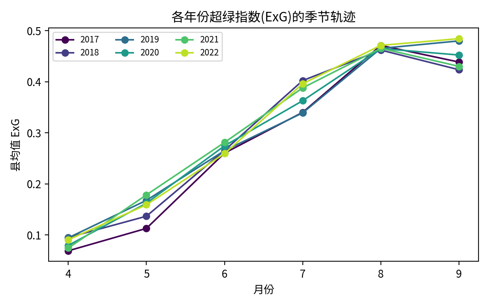
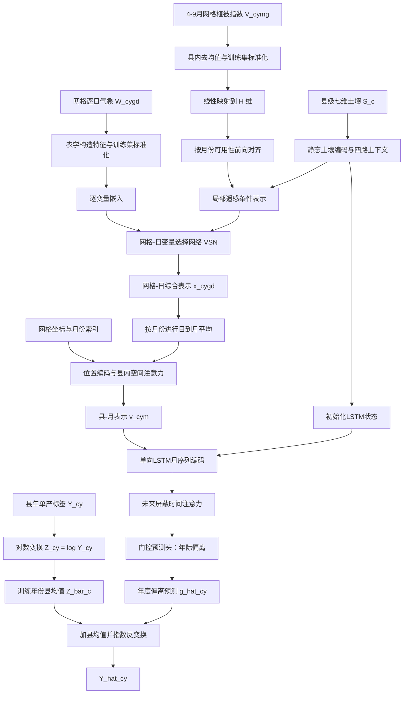

# 面向小样本县级面板的面板感知时间融合变换器及美国玉米产区单产预测研究

## 摘要

县级作物单产预测是农业风险管理、粮食供需研判和农业保险定价的重要基础。玉米单产同时受到土壤等静态条件、逐日气象和冠层状态的影响，这些因素具有时间累积性和县内空间异质性。本文以CropNet多模态数据为基础[1]，研究美国29个州741个县2017—2022年的平衡面板（4446个县年观测），协变量包括约9 km × 9 km网格上的逐日气象、4—9月六期Sentinel-2 RGB影像和七维县级土壤属性。

县级单产预测这一任务本身有三个难点。一是样本量小、县际差异占主导：741个县只有2017—2021五年的标签，训练集仅3705个县年，而仅县固定效应就解释了对数单产方差的80.3%，可用于学习的年际变化很有限。二是多源输入需要融合：逐日网格气象、月度卫星影像和静态土壤要进入同一个模型，而高容量的图像编码器在如此少的年度标签上难以端到端训练。三是小样本下的优化并不自动收敛到有用的解：在如此少的年度标签上，端到端训练可能退化为"对全部县年输出同一常数"的平凡解（第5.4节）。现有的深度单产模型各有侧重，但没有一个针对上述三点设计：CNN-RNN与GNN-RNN一类方法先把县内网格平均为县级序列，UNet-ConvLSTM对网格等权汇总，PhenoYieldNet依赖大规模预训练与物候对齐，而且大多只报告单次运行的结果。时间融合变换器（Temporal Fusion Transformer，TFT）以静态协变量编码、变量选择网络、长短期记忆网络（Long Short-Term Memory，LSTM）和可解释注意力为核心组件，能同时处理静态与动态协变量、在较多候选变量中自适应选择并刻画生长季内的时间依赖，因而是适合这一任务的基础框架。但把TFT按常规做法直接适配到网格级多模态数据上，并不能自动满足这三点要求。

针对这三个难点，本文提出面板感知时间融合变换器（Panel-Aware Temporal Fusion Transformer，PA-TFT）。第一，针对县际差异主导方差，借鉴面板数据固定效应的思想，以训练年份的县均值作为偏移量，使网络只学习相对本县历史水平的年际偏离，把有限样本集中于年际信号。第二，针对图像编码器在少量年度标签上不可训练，以由RGB影像逐像素计算、并在县内去均值的可见光植被指数作为遥感输入，使遥感信息以低维、可训练的形式进入模型，并且只携带相对本县往年的冠层变化。第三，针对这一点，依据训练集准则事先确定较小的学习率，并配合梯度裁剪、权重衰减与固定轮数，使训练在同一协议下可复现。

本文以2017—2021年训练、2022年测试的单折时间外推评价PA-TFT。均方根误差（Root Mean Square Error，RMSE）为18.23 bu/ac，平均绝对误差（Mean Absolute Error，MAE）为13.44 bu/ac，$R^2$为0.808，州内异常相关为0.411。PA-TFT比UNet-ConvLSTM、PhenoYieldNet和GNN-RNN分别低43.9%、48.2%和36.1%，比县固定效应基线低18.9%，按州与按县聚类的自助区间都不含0。与PA-TFT共享骨干、但遥感走端到端PVT图像编码器且不加面板适配的PVT-TFT在同一折上没有训练成功：三个随机种子都退化为常数预测（RMSE 41.57 bu/ac，预测标准差不超过0.09 bu/ac），其图像编码器输出不携带县年信息。组件消融表明，去掉县均值偏移、植被指数的县内去均值或遥感输入，误差分别上升7.34、3.23和2.97 bu/ac，按县与按州重抽样的区间都不含0。测试时在县之间置换植被指数后，PA-TFT的误差上升2.74 bu/ac，置零后上升3.02 bu/ac，两者都与去掉遥感输入重新训练的结果（21.19 bu/ac）接近，说明模型在预测时确实使用了遥感信息；全样本置换检验也表明，植被指数在天气之外提供了显著的县年信息（加入后全样本RMSE由13.40降到12.87，$p=0.002$）。

**关键词：** 玉米单产预测；时间融合变换器；面板数据；县固定效应；植被指数；时间外推验证

---

## Abstract

County-level crop yield prediction supports agricultural risk management, food supply assessment, and crop insurance. Corn yield depends on static conditions such as soil, on daily weather, and on canopy state, with temporal accumulation and within-county spatial heterogeneity. Using the CropNet data [1], this thesis studies a balanced panel of 741 counties in 29 U.S. states from 2017 to 2022 (4,446 county-years), with daily gridded weather, six monthly Sentinel-2 RGB images from April to September, and seven county-level soil attributes.

County-level yield prediction poses three difficulties of its own. First, the sample is small and between-county differences dominate: the 741 counties have only five labelled years, 3,705 training county-years in all, while county fixed effects alone explain 80.3% of the variance of log yield, so little year-to-year variation is left to learn. Second, the inputs are heterogeneous: daily gridded weather, monthly satellite imagery and static soil must enter one model, yet a high-capacity image encoder cannot be trained end-to-end on so few annual labels. Third, optimisation at this sample size does not by itself converge to a useful solution: with so few annual labels, end-to-end training can collapse to the trivial solution that predicts the same constant for every county-year (Section 5.4). Existing deep yield models each emphasise a different aspect of the task, but none is designed for these three difficulties: CNN-RNN and GNN-RNN based methods first average the grid cells within a county into a county series, UNet-ConvLSTM aggregates the grid cells with equal weights, PhenoYieldNet relies on large-scale pre-training and phenological alignment, and most report only single runs. The Temporal Fusion Transformer (TFT) combines static covariate encoders, variable selection networks, an LSTM, and interpretable attention, so it can handle static and dynamic covariates together, select adaptively among many candidate variables, and capture within-season temporal dependence, which makes it a suitable framework for this task. Adapting TFT directly to grid-level multimodal data in the conventional way, however, does not by itself meet these requirements.

To address these three difficulties we propose the Panel-Aware Temporal Fusion Transformer (PA-TFT). Against dominant between-county variance it follows the idea of fixed-effects panel models and uses the training-year county mean as an offset, so that the network learns only the anomaly relative to each county's history and the limited sample is spent on year-to-year signal. Against an image encoder that cannot be trained on so few annual labels it substitutes visible-band vegetation indices, computed pixel by pixel from the RGB images and centred within county, so that remote sensing enters the model in a low-dimensional, trainable form that carries only the canopy change relative to the county's own past. Against that failure mode it fixes a smaller learning rate in advance by a training-set criterion and adds gradient clipping, weight decay and a fixed number of epochs, so that training is reproducible under one protocol.

We evaluate PA-TFT by a single time-forward hold-out: trained on 2017–2021 and tested on 2022. It attains an RMSE of 18.23 bu/ac, an MAE of 13.44 bu/ac, an R² of 0.808, and a within-state anomaly correlation of 0.411. PA-TFT is 43.9%, 48.2% and 36.1% below UNet-ConvLSTM, PhenoYieldNet and GNN-RNN respectively, and 18.9% below the county fixed-effects baseline, with both state-cluster and county-cluster bootstrap intervals excluding zero. A PVT-TFT that shares the same backbone but draws remote sensing from an end-to-end PVT image encoder and omits the panel adaptation fails to train on the same fold: all three random seeds collapse to a constant prediction (RMSE 41.57 bu/ac, prediction standard deviation at most 0.09 bu/ac), so its image encoder carries no county-year information. Ablations removing the county offset, the within-county centring of the vegetation indices, or the remote-sensing input raise the error by 7.34, 3.23 and 2.97 bu/ac respectively, with county-cluster and state-cluster bootstrap intervals excluding zero in all three cases. Shuffling the vegetation indices across counties at test time raises the PA-TFT error by 2.74 bu/ac and zeroing them by 3.02 bu/ac, both close to the error of the model retrained without remote sensing (21.19 bu/ac), confirming that the model uses remote sensing when predicting; a full-sample permutation test likewise shows that the vegetation indices add significant county-year information beyond weather (full-sample RMSE 13.40 → 12.87, p = 0.002).

**Keywords:** corn yield prediction; temporal fusion transformer; panel data; county fixed effects; vegetation indices; temporal hold-out validation

---

# 第1章 引言

## 1.1 研究背景与意义

### 1.1.1 研究背景

玉米是全球产量最高、用途最广的谷物之一，不仅直接进入食品体系，还广泛用于饲料、淀粉、甜味剂、燃料乙醇和生物化工。玉米需求同时连接种植业、养殖业、能源业与国际贸易，因而产量冲击具有明显的产业链传导效应。美国是世界主要玉米生产国和出口国，美国玉米带集中分布着高商品率、规模化和机械化的玉米生产。该地区的年度收成会影响美国国内饲料与乙醇原料成本，也会通过出口和替代效应影响全球谷物市场。CropNet等公开数据进一步表明，县级统计、WRF-HRRR气象和Sentinel-2遥感已经为大范围、多年份单产建模提供了统一数据基础[1]。

区域总产量可分解为收获面积与单位面积产量的乘积。令第 $c$ 个县在年份 $y$ 的收获面积和单产分别为 $A_{cy}$ 与 $Y_{cy}$，则区域总产量为

$$
Q_y=\sum_{c=1}^{C}A_{cy}Y_{cy}.
$$

当收获面积已经播种或可由遥感较稳定识别时，单产的不确定性便成为总产量预测误差的重要来源。县级单产误差还会按面积加权积累到州级和全国供给预期。因而，县级预测并非只服务于地方管理，也可能成为全国供需平衡估计的微观信息来源。USDA月度世界农产品供需估计报告持续更新产量、消费、贸易和期末库存，市场参与者据此修正对供给宽松或紧张程度的判断[2]。

玉米单产可视为遗传潜力、环境条件和管理措施共同作用的结果。气温影响物候进程和积温累积，极端高温会影响授粉和籽粒形成；降水、蒸散需求与土壤持水能力共同决定水分胁迫；辐射、湿度和风速又通过光合作用和蒸散过程产生联合影响。这些变量的作用通常不是线性的，也不满足简单的同期加总关系。同一气象异常发生在营养生长期、开花期或灌浆期，可能产生不同后果。Khaki等使用CNN-RNN联合表示天气、土壤和管理序列，说明深度时序结构可以改善玉米与大豆单产预测[3]；Lin等通过DeepCropNet刻画气象因素的时间累积和区域差异[4]；Schwalbert等则表明遥感与天气联合信息可用于县级季中预测[5]。这些研究共同说明，单产预测需要处理高维协变量、非线性效应、时间滞后和变量交互。

气候变化进一步增加了预测难度。极端高温、干旱、强降水和复合气象事件可能同时改变平均单产和尾部损失概率。对于统计模型而言，这意味着训练期与测试期的协变量分布可能发生变化；对于产业决策而言，则意味着仅依据历史平均产量制定采购、库存或套保计划可能低估极端风险。因此，基于较高时空分辨率观测形成年度单产估计，具有潜在的农业风险管理和市场信息价值。本文以4—9月完整观测窗口的年度预测为主要评价对象，不对季内更早截止月份的预测作正式评价（第4.9节）。

县级研究还面临空间支持不一致问题。单产标签以行政县为单位，气象和遥感信息却以规则网格或像元观测。若直接用县均值代替县内分布，统计上相当于以低维汇总量替代原始空间场。该操作能够降低维数，但会损失极端值、空间梯度和局部异常的信息，并产生尺度变换下的聚合偏差。只有在进一步把县级关联解释为网格或田块层面的环境效应时，才涉及典型的生态谬误。如何在保持县级监督目标的同时利用网格异质性，是本研究最初的出发点之一；第5章的实证结果表明，在本研究的样本规模下，县内异质性的细粒度建模并不是预测误差的主要来源。

### 1.1.2 玉米期货与期权的应用背景

农产品现货生产具有季节性和不可逆性，而价格在播种、生长和收获过程中持续变化。农户、粮商、饲料企业和加工企业因持有未来产量、库存或采购需求而暴露于价格风险。期货通过锁定未来买卖价格进行线性套期保值；期权则赋予持有人在到期日按执行价格买入或卖出期货的权利，使风险管理者能够在限制不利损失的同时保留部分有利价格变化。芝加哥商业交易所集团的玉米期货与期权是国际玉米价格发现和风险转移的重要工具，其期权标的是相应玉米期货合约[6]。

设玉米期货在期权到期时的价格为 $F_T$，执行价格为 $K$，看涨和看跌期权到期收益分别为

$$
C_T=(F_T-K)^+,
\qquad
P_T=(K-F_T)^+,
$$

其中 $(x)^+=\max(x,0)$。支付权利金 $c_0$ 的看涨期权和支付权利金 $p_0$ 的看跌期权，其未计资金成本与交易费用的到期净损益分别为 $C_T-c_0$ 和 $P_T-p_0$。玉米种植者担心收获期价格下跌时，可以购买看跌期权构造价格下限；饲料或加工企业担心采购成本上涨时，可以购买看涨期权限制上行风险。通过同时买入和卖出不同执行价格期权，还可以构造牛市价差、熊市价差或领口策略，在保护范围与权利金成本之间进行权衡[7-8]。

县级单产预测与期权价值之间存在一条间接但重要的信息链。若种植面积相对稳定，单产预期下降会降低预期产量 $E(Q_y\mid\mathcal I_t)$；在需求和进口替代等条件给定时，供给收紧可能提高期货价格上行风险，也可能提高市场对尾部价格波动的定价。反之，单产预期提高可能增加供给宽松概率。USDA供需报告发布后，市场会根据产量、库存和消费修正价格预期；已有事件研究表明，政府农业信息能够影响期货市场价格和波动[9-10]。因此，如果统计模型在公开报告之前或相同信息时点提供更准确的产量信号，就可能改善方向判断、套保比例、执行价格和到期月份选择，从而产生潜在经济收益。

这种潜在收益不能简单等同于“RMSE下降就一定赚钱”。第一，本文预测的是县级单产而非期货价格，单产到价格之间还受到种植面积、需求、库存、贸易政策和市场预期影响。第二，期权价格取决于标的期货价格、执行价格、到期期限、利率和波动率；Black商品期权模型在风险中性框架下将这些量映射为期权价值[11]。第三，市场价格可能已经吸收天气、遥感和USDA信息，预测正确也不代表存在可交易的超额收益。第四，真实收益还需扣除买卖价差、手续费、滑点和保证金占用。

若要把单产模型转化为期权策略，需要至少增加两个统计层次。其一，把县级预测按收获面积聚合为区域产量分布，并估计预测不确定性，而非只给出一个点预测；其二，建立产量意外与期货收益、隐含波动率变化之间的条件关系。例如可定义相对公开基准的产量意外

$$
U_t=\widehat Q_t-Q_t^{\rm public},
$$

再估计事件窗口期货收益 $R_{t,t+h}$ 与 $U_t$ 的关系，并以严格样本外方式形成交易信号。只有当扣费后的策略收益、夏普比率、最大回撤和套期保值有效性优于基准，才能说预测产生了可验证的经济收益。本文没有开展上述期权定价和交易回测，因此期权部分用于说明应用前景，而非报告已实现利润。

近年来，遥感影像、再分析气象和土壤数据库为多源预测提供了数据基础。与此同时，循环神经网络、图神经网络、视觉变换器[12]和注意力机制为复杂函数逼近提供了方法工具。然而，高预测精度并不自动意味着可靠的统计结论或可交易利润。训练与测试的时间划分、变量标准化、预测尺度、比较模型的监督预算以及误差相关结构，都会影响预测证据；信息发布时间、交易成本与市场有效性则进一步影响经济价值。因此，本文首先解决年度单产点预测问题，并把预测分布、价格映射和期权回测作为后续研究。

### 1.1.3 研究意义

本文的理论与方法意义主要体现在三个方面。

第一，把面板数据的结构引入深度时空模型。在县级单产面板中，响应变量的方差可以分解为县际稳定差异和县内年际变化。前者主要由土壤、气候带和管理习惯决定，后者才是天气和冠层状态应当解释的部分。本文样本中，仅县固定效应就在训练集上解释了对数单产方差的80.3%。通用的深度时空模型不区分这两部分，网络可能只学会"识别县别"，而年际变化得不到有效监督。本文借鉴固定效应模型的思想，提出面板感知时间融合变换器（Panel-Aware Temporal Fusion Transformer，PA-TFT），使网络的学习目标直接对准年际变化，为深度模型利用面板结构提供了一种简单可行的做法。

第二，为小样本条件下的多模态融合提供经验。高容量的图像编码器在县级年度样本上难以训练；本文说明，以低维、可解释、去掉县际差异的植被指数作为遥感输入，再配合与样本规模相称的优化设置，深度模型可以稳定地利用遥感中的年际信息。

第三，为深度时空模型的评价提供统计规范。本文以县固定效应基线和与之共享骨干的PVT-TFT作对照，采用单折时间外推、组件消融、年份内置换检验和按县与按州聚类的自助法给出模型间差异的区间。这些检验同样适用于其他多模态农业预测模型。

在应用层面，县级预测可服务于区域供需研判、灾害损失评估、农业保险和衍生品风险管理。更准确的年度单产信息有可能降低供给判断误差，辅助期货套保比例和期权结构选择，从而改善风险调整后的经营结果。但本文没有进行价格预测或交易回测，不能声称当前模型已经产生实际利润。若未来针对不同月末截点重新训练或校准模型，并严格控制信息可用时点，生长季内更新才可能进一步服务于风险预警和期权动态对冲。本文的模型与分析也可迁移到大豆、小麦等作物，但跨作物推广仍需重新定义物候窗口、特征构造和训练样本，不能由本文结果直接外推。

## 1.2 国内外研究现状

### 1.2.1 传统统计与作物模型方法

早期单产研究主要包括作物机理模型和统计回归模型。作物机理模型依据光合、呼吸、水分平衡和物候过程模拟生长，具有较强的过程解释能力，但需要品种、管理和土壤剖面等参数，区域化校准成本较高。统计模型则直接估计单产与天气、趋势项及土壤之间的关系。线性回归、面板模型、广义加性模型和空间回归能够给出清晰的参数解释，但面对高维图像和复杂交互时容易受到函数形式限制。传统研究常以积温、高温度日、降水和水分亏缺作为关键解释量，利用分段函数或非参数平滑描述温度阈值效应。其优点是估计对象清楚、计算成本较低，也便于进行标准误和假设检验；不足是模型结构依赖人工设定，且对遥感影像等高维非结构化数据适应性有限。

统计模型的优势不应仅以结构简单概括。合理构造积温、高温度日和水分亏缺后，低维模型仍能提供有价值的基准，并可借助县固定效应、年份效应和空间误差结构进行推断。随机森林等集成学习方法进一步放宽函数形式，通过变量随机化和树模型平均提高非线性拟合能力[13]。但当研究目标侧重预测且协变量维数较高时，预先指定全部非线性和交互关系较为困难，这推动了深度表示学习方法的应用。

### 1.2.2 深度时序与空间模型

卷积神经网络（Convolutional Neural Network，CNN）与循环神经网络（Recurrent Neural Network，RNN）组合的方法（CNN-RNN）通常先用卷积网络提取局部或逐日特征，再用循环网络表示跨时间依赖。Khaki等将天气、土壤和管理变量输入CNN-RNN，对美国玉米带多个年份进行玉米和大豆预测[3]；DeepCropNet使用带注意力的长短期记忆网络（Long Short-Term Memory，LSTM）刻画气象因素的时间累积，并以多任务学习表达地区差异[4]。这类方法改善了固定线性形式的表达能力，但通常先把县内网格平均为县级序列，丢失了县内的空间异质性；静态的土壤信息也大多只在最后与动态特征拼接，难以调节模型对天气的解读。

GNN-RNN把县视为图节点，用GraphSAGE在县邻接图上传播信息，再用循环网络建模跨年变化[14]。它利用了县际空间结构，但同样先对县内天气取均值，不使用遥感影像；而且以连续五年为一个窗口组织样本，要求每个县都有足够长的历史记录。

ConvLSTM把循环门作用扩展到空间特征图，能同时保持局部空间结构和时间状态[15]。UNet-ConvLSTM一类方法用U-Net提取每月每网格的影像特征，再用ConvLSTM沿月份递推。但卷积的平移结构适合规则影像，县内网格对县级单产的贡献却未必取决于相对位置；这类方法最终通常对网格等权汇总，也不使用土壤等静态信息。

总的来看，已有深度时空模型在三个方面存在不足：县内网格的异质性利用不足，静态与动态协变量的融合方式较为简单，对哪些变量在哪些时期重要缺乏可解释的机制。
### 1.2.3 遥感与多模态预测

遥感影像能够观测作物冠层状态，天气变量则描述作物生长所处的环境驱动，二者在语义和观测频率上并不相同。多模态学习通常可按信息结合阶段分为三类：早期或特征级融合，即各模态分别编码后拼接，或映射到共享表示空间；中间交互融合，即在网络内部通过跨模态注意力等机制反复交换信息；后期或决策级融合，即先由各模态独立形成预测，再组合预测结果[16-17]。无论采用哪一类方法，不同空间分辨率和时间分辨率的数据都应先建立明确的对齐关系，避免把不同时点或不同空间支持的观测直接视为同步、同尺度特征。

农业单产研究已形成多种与任务语义相匹配的实现。Schwalbert等先用随机森林识别玉米像元，再将县级植被指数与天气变量纳入多变量经验模型，进行美国玉米带县级季中单产预测[5]。MMST-ViT使用金字塔视觉变换器（Pyramid Vision Transformer，PVT）[18]提取视觉表示，并通过多模态注意力刻画视觉表示与短期气象之间的关系，随后由空间Transformer和时间Transformer建模空间关系与长期气象背景[19]。PhenoYieldNet分别使用视觉Transformer和气象多层感知机（Multilayer Perceptron，MLP）编码两类信息，再以cross-attention形成融合表示，并通过作物感知的时间解码器输出单产预测[20]。CMAViT则把遥感patch表示作为视觉分支的查询、键和值，并由气象查询和键共同调整注意力得分；管理文本通过另一cross-attention通路参与表示学习[21]。这些代表性方法说明，融合结构应根据模态关系选择，而非脱离数据语义试配结构：天气主要提供环境驱动，遥感主要反映作物状态，二者频率不同，因而应先完成时空对齐，再决定采用特征级组合、中间交互或决策级组合。CropNet整合Sentinel-2、WRF-HRRR和USDA县级产量数据，为此类多模态比较提供了公开数据基础[1]。

跨模态注意力具有较强的表达能力，但其计算和数据需求也较高。设气象token数为 $N_w$、遥感patch数为 $N_r$、隐藏维数为 $d$，显式cross-attention需要构造两类token的成对交互，其主要计算量近似为 $O(N_wN_rd)$。当一个县同时包含多个网格和多个生长季时点时，token数迅速增加，显存占用和训练时间也随之上升。复杂跨模态Transformer还包含更多待估参数，部分方法另设多模态对比预训练或农业领域自监督适配阶段[19-20]。这类方法适合大规模配对数据，但在县级年度标签数量有限的场景中，可能面临监督信号不足、优化成本较高和过拟合风险。

由此可见，已有多模态方法的不足主要在两个方面。第一，复杂的跨模态注意力参数量大，在县级年度标签只有一两千个的情况下容易过拟合，部分方法还需要额外的预训练阶段。第二，遥感的作用通常通过"去掉遥感分支后重新训练、比较误差"的消融实验来说明。消融能够说明遥感分支对模型整体表现有影响，但重新训练改变的不只是输入，还有优化过程和模型容量，所以它不能直接回答模型在预测时是否真正利用了遥感中的县年信息。对此需要在测试时直接干预遥感输入，检验预测是否随之改变。

这一条件化关系具有明确的农学依据。玉米对高温和水分亏缺的响应随生育阶段而变化：抽雄吐丝和授粉前后的胁迫会延迟吐丝、扩大抽雄吐丝间隔、降低雌雄生殖能力并抑制穗部生长，主要影响籽粒数；灌浆期胁迫则更多通过叶片功能、有效灌浆持续时间、籽粒库容和同化物积累影响粒重[22-26]。因此，同样的高温、降水不足或蒸散亏缺发生在不同物候阶段和不同既有冠层状态下，对最终单产的预测意义并不相同。

遥感影像可为这种“当前作物状态”提供观测代理。多时相冠层覆盖度、株高、植被指数和衰老轨迹能够表征物候进程、冠层活力和此前环境与管理共同作用后形成的综合状态[27-29]。例如，冠层早衰可能意味着功能叶面积下降，而相同的后续高温或水分亏缺对早衰冠层与保持绿色的冠层可能具有不同后果；同一日历日期的NDVI也可能因播期和物候差异代表不同生理阶段。由此，把遥感状态作为气象变量选择的条件信息，可以理解为让模型在不同作物状态下重新分配天气变量的权重。这种融合方式不需要构建两两cross-attention，额外参数很少，适合小样本场景，也是本文第4章模型采用的思路。单期遥感信号不能被直接解释为某一种特定胁迫的累计剂量。

遥感信息也可以不经过深度图像编码器，而以低维植被指数的形式进入统计模型。Bolton和Friedl利用植被指数与作物物候指标预测美国玉米和大豆单产[29]；Schwalbert等将县级植被指数与天气变量纳入多变量模型，进行县级季中预测[5]。这类方法的预测变量数量少、含义明确，适合与县固定效应和年份交叉验证结合使用。CropNet只提供RGB三个可见光波段，不能直接计算NDVI等需要近红外波段的指数，但超绿指数（Excess Green，ExG）和可见光抗大气植被指数（Visible Atmospherically Resistant Index，VARI）等只依赖可见光波段的指数，仍可反映冠层的绿度与覆盖程度。

### 1.2.4 时间融合变换器及可解释预测

时间融合变换器（Temporal Fusion Transformer，TFT）由Lim等提出，面向含多种协变量的时间序列预测[30]。它由五类组件构成：静态协变量编码器把不随时间变化的协变量转换为若干上下文向量；变量选择网络在每个时间步为候选变量给出归一化权重，并可接受静态上下文作为条件；门控残差网络是各组件的基本单元，在不需要非线性变换时可以退化为近似的残差通路；LSTM处理局部的顺序依赖；可解释多头注意力则直接建立远距离时间步之间的联系。

与第1.2.2节和第1.2.3节的方法相比，TFT在三个方面正好回应了它们的不足。其一，静态协变量编码器把土壤等静态信息送入变量选择、循环网络初始化和注意力等多个环节，而不只是在最后拼接。其二，变量选择网络能根据样本和时间步自适应地分配变量权重，并且可以把遥感状态作为条件上下文，从而以很少的额外参数实现第1.2.3节所述的条件化融合。其三，变量选择权重和时间注意力权重为解释模型依赖了哪些变量、哪些时期提供了入口。因此，本文以TFT为基础框架。

但TFT原本面向规则的时间序列，不能直接处理县内的多个网格和遥感影像，需要加以扩展。更重要的是，TFT和多数深度时空模型一样，没有专门处理面板数据的结构：同一县在不同年份的单产高度相关，县际稳定差异往往占据大部分方差，而年度标签的数量又很少。在这种情况下，网络可能把大部分拟合能力用在识别县别上，真正需要预测的年际变化反而学不到。本文第4章提出的PA-TFT把预测目标限定为县内年际偏离，以避免这一问题；第5.4节给出直接适配TFT时的实验证据。

还需强调，可解释预测不同于因果解释。注意力权重描述模型计算路径中的相对分配，变量选择权重也不等同于回归系数或显著性统计量。相关权重可以用于提出农学假设，但若要识别温度或降水的因果效应，仍需额外的识别假设、处理定义和反事实设计。

### 1.2.5 农产品期货期权与农业信息价值研究

农产品衍生品研究主要关注价格发现、套期保值、波动率和信息发布效应。期货提供近似线性的价格风险暴露，期权则通过非线性收益结构管理尾部风险。Black在期货价格基础上建立商品期权定价公式，为交易所期权估值和风险参数计算提供了经典框架[11]；Hull系统总结了期货、期权、希腊字母和动态对冲原理[7]；McDonald从金融工程角度讨论了价差、领口和保护性期权等策略[8]。

农业信息的经济价值取决于信息是否改变市场参与者对未来供需的条件分布。USDA的产量和供需报告是玉米市场的重要公共信息源[2]。事件研究通常比较报告发布前后的异常收益、成交量和波动率，以判断新信息进入价格的速度[9-10]。对单产预测而言，研究重点不应只是统计误差，还应包括相对公开基准的信息增量、发布时间优势和扣除成本后的经济效用。现有深度单产预测文献大多报告RMSE、MAE或 $R^2$，较少进一步连接期货收益、隐含波动率和期权套保效果。这构成统计预测与农业金融之间值得拓展的研究接口。

### 1.2.6 研究现状评述

综合以上研究，已有的县级单产预测方法存在以下不足。

第一，深度时空模型对县内空间异质性和静态—动态协变量的利用不足。CNN-RNN和GNN-RNN一类方法通常先把县内网格平均为县级序列；ConvLSTM一类方法对网格等权汇总；土壤等静态信息大多只在最后与动态特征拼接。它们也缺少可解释的变量选择机制。

第二，复杂的多模态融合结构与县级样本规模不匹配。跨模态注意力参数量大，部分方法还需要额外的预训练；在年度标签只有一两千个的县级面板上，这类结构容易过拟合。

第三，没有专门处理面板数据的结构。同一县在不同年份的单产高度相关，县际稳定差异占据了大部分方差。通用的深度模型把县际差异和年际变化混在一起学习，网络可能主要学会识别县别。与此相关，许多研究很少报告"每个县沿用历史平均单产"这类零参数基线，也很少报告"县固定效应加线性天气项"这类经典面板模型，因而难以判断模型的增益究竟来自对年际变化的预测，还是只来自对县别的识别。

第四，对遥感作用和结果随机性的检验不够充分。已有研究通常用"去掉遥感分支后重新训练"的消融实验说明遥感的作用，但较少在测试时直接干预遥感输入，以确认模型在预测时确实使用了遥感中的县年信息。深度模型的结果受随机初始化影响，单次运行的指标也难以区分方法差异和训练随机性。

第五，统计精度与经济价值之间缺少桥梁，单产误差的改善很少通过样本外价格映射和期权回测来检验。

针对前两点，本文选用TFT作为基础框架：它的静态协变量编码器、变量选择网络和时间注意力，分别回应了静态信息融合、变量自适应选择和可解释性的需要，而以变量选择为核心的条件化融合方式参数很少，适合小样本场景。针对第三点，本文借鉴面板数据固定效应的思想，提出面板感知时间融合变换器（PA-TFT）。针对第四点，本文以与之共享骨干的PVT-TFT作对照，并同时用消融实验和测试时干预检验遥感的作用。期权部分仅用于说明准确单产信息的潜在决策价值，不作为本文已完成的交易实证。

## 1.3 研究内容

本文主要研究内容如下：

1. 构建县年层面的多模态数据体系，明确响应、网格气象、遥感影像、县级土壤和空间坐标的索引关系；从RGB影像逐像素计算可见光植被指数。
2. 分析县级单产预测对模型的要求，说明选用时间融合变换器（TFT）作为基础框架的理由，并据此提出面板感知时间融合变换器（PA-TFT）：县均值偏移、县内去均值的植被指数输入、按样本规模设定的训练协议。
3. 以2017—2021年训练、2022年测试的单折时间外推评价PA-TFT，并与共享同一骨干的PVT-TFT、三个已有深度模型和县固定效应基线比较。
4. 通过测试时干预与逐层表示分析，说明把TFT直接适配到网格级多模态数据时的失效方式。
5. 通过组件消融、测试时干预、年份内置换检验和聚类自助法，评价PA-TFT各项设计的作用及结果的可靠性。

## 1.4 技术路线

本文技术路线分为四个阶段。

第一阶段是数据匹配：将县级单产与县内网格天气、月度遥感影像、坐标和土壤属性按县和年份连接，并从影像计算植被指数。

第二阶段是模型设计：依据任务对模型的要求选用TFT框架，确定PA-TFT的预测目标、遥感输入与训练协议。

第三阶段是模型实现：在TFT组件的基础上实现网格—日变量选择、县内空间注意力与县均值偏移。

第四阶段是评价：以单折时间外推与全部基线在原始单产尺度上比较，并用消融、置换检验和按县、按州聚类的自助法评价证据强度。

## 1.5 本文的主要创新与工作特点

本文的主要贡献在于面向小样本县级面板的PA-TFT模型及其评价，而不在于提出新的注意力算子或网络基础组件。

1. **提出面向小样本县级面板的PA-TFT模型。** 县级单产面板年份少，且县际稳定差异占据了大部分方差。针对这一结构，本文借鉴面板数据固定效应的思想，以训练年份县均值作为偏移量，使网络只学习年际偏离；以县内去均值的可见光植被指数代替高容量图像编码器，使遥感输入只携带年际信息；并配合按样本规模设定的学习率与梯度裁剪。在2022年这一折上，PA-TFT的RMSE为18.23 bu/ac，比三个已有深度模型低36.1%—48.2%，比县固定效应基线低18.9%，按县与按州聚类的自助区间都不含0；而与之共享骨干、只把遥感换回端到端图像编码器且不加面板适配的PVT-TFT在同一折上退化为常数解，说明这三项设计决定的是网络能否学到年际信号，而不是在既有精度上的小幅修饰。
2. **对照说明直接适配做法在小样本面板上的失效。** 本文说明把TFT直接适配到网格级多模态数据时，训练退化成了"对所有县年预测同一常数"的解：741个县的预测几乎相同，影像输入不进入预测。这与PA-TFT的三项设计一一对应。
3. **以全样本置换检验评价植被指数的增量信息。** 检验在全部县年上估计同一线性面板模型，不作留一；置换只在年份内部进行，只破坏遥感特征与县的对应关系而保留每个年份遥感特征的整体水平，因此能直接回答"遥感在天气之外是否携带县年信息"。结果显示植被指数有显著的增量信息（$p=0.002$），这为PA-TFT以植被指数作为遥感输入提供了依据。遥感是否改善预测，则由组件消融与测试时干预另行回答。
4. **建立与证据强度相匹配的评价规范。** 以县固定效应作基线；采用单折时间外推（2017—2021年训练、2022年测试）考察方法在一个未见年份上的表现，并以按县、按州聚类的自助法给出模型间差异的区间；以组件消融检验各项设计的作用。

## 1.6 本章小结

本章从农业生产、粮食供需和玉米期货期权风险管理三个层面阐述了县级单产预测的意义，回顾了统计方法、深度时空模型和多模态遥感方法的研究现状，指出了基线、遥感检验、训练随机性和经济价值四个方面的不足。本文据此以TFT为基础框架，针对小样本县级面板的结构提出PA-TFT模型，并在多种协议和强基线下评价。实证范围限定为已见县、未见年份的预测。

---

# 第2章 统计理论与方法基础

## 2.1 对数单产的同方差条件正态模型

设第 $i$ 个县年样本的原始玉米单产为 $Y_i>0$，协变量集合为 $X_i$。由于原始单产为正值，且较高产量水平下的绝对波动通常更大，本文首先对响应变量作自然对数变换：

$$
Z_i=\log Y_i.
$$

基线模型从最简单的条件分布假设出发。假定在给定协变量 $X_i$ 后，对数单产服从条件正态分布：

$$
Z_i\mid X_i\sim N\left(\mu_i,\sigma^2\right),
\qquad
\mu_i=f_\theta(X_i),
$$

或等价地写为

$$
Z_i=f_\theta(X_i)+\varepsilon_i,
\qquad
\varepsilon_i\mid X_i\sim N(0,\sigma^2).
$$

这里，$f_\theta$ 表示条件均值函数，在第4章中由PA-TFT刻画，在第5章的面板基线中为县固定效应加线性预测项；$\sigma>0$ 表示条件误差标准差。在基线设定中，所有县年样本共享同一个 $\sigma$，这就是同方差假设。该假设并不是说所有县年单产具有相同均值，而只是说在扣除条件均值 $f_\theta(X_i)$ 后，剩余误差的条件离散程度不随县、产量水平或其他协变量系统变化。本文将其作为推导MSE目标的工作假设，不据此声称该假设已经得到数据验证。

为推导基线估计准则，先采用给定协变量后样本误差条件独立的工作近似。第 $i$ 个样本的负对数似然为

$$
-\log p(Z_i\mid X_i)
=\frac{1}{2}\log(2\pi)
+\log\sigma
+\frac{[Z_i-f_\theta(X_i)]^2}{2\sigma^2}.
$$

如果 $\sigma$ 被视为所有样本共享的常数，则前两项与均值模型参数 $\theta$ 无关。对 $\theta$ 进行极大似然估计等价于最小化

$$
\mathcal L_{\rm MSE}(\theta)
=\frac{1}{n}\sum_{i=1}^{n}
[Z_i-f_\theta(X_i)]^2.
$$

因此，本文基线采用MSE并不是任意选择损失函数，而是来源于“对数单产条件正态且同方差”的初始统计假设。在平方损失下，最优预测函数同时满足

$$
f^*(x)=E(Z\mid X=x).
$$

需要注意，MSE主要估计对数尺度的条件均值。原尺度反变换 $\exp\{f_\theta(X_i)\}$ 对应条件中位数或几何均值，而不是一般意义下的原尺度条件均值。若需要原尺度条件均值，可以采用Duan的涂抹估计等非参数方法作重变换校正[31]；本文报告的是未经校正的 $\exp\{\widehat Z\}$。如果同方差正态假设成立，则

$$
E(Y_i\mid X_i)
=\exp\left\{\mu_i+\frac{1}{2}\sigma^2\right\}.
$$

## 2.2 面板结构与时空相关

本文样本以县年为单位，同一县跨年份重复出现，且邻近县可能受到相似天气系统和农业制度影响。因此，观测不宜无条件视为独立同分布。可将误差概念性分解为

$$
\varepsilon_{cy}=u_c+v_y+s_{cy}+e_{cy},
$$

其中 $u_c$ 表示县级稳定异质性，$v_y$ 表示共同年份冲击，$s_{cy}$ 表示空间相关成分，$e_{cy}$ 为剩余扰动。本文主要任务是预测而非参数推断，模型没有显式估计上述方差分量；但这一结构决定了未来若构造置信区间或比较模型，应采用按县成组或兼顾空间结构的重采样，而不能简单对全部县年残差独立重采样。

按年留出测试通过年份划分训练集与测试集，考察模型从历史年份迁移到一个后续年份的表现。该设计不同于随机划分，因为随机划分可能将相同年份的共同冲击同时放入训练和测试。本文以2022年为测试年份、2017—2021年为训练年份（第5.1节）；这属于“已见县、未见年份”的预测评价，不代表对未见县或研究区外区域的外推能力。

## 2.3 固定效应面板模型与组内变换

设县 $c=1,\ldots,C$ 在年份 $y$ 的对数单产为 $Z_{cy}$，协变量向量为 $x_{cy}\in\mathbb R^p$。考虑县固定效应模型

$$
Z_{cy}=\mu_c+x_{cy}^\top\beta+\varepsilon_{cy},
\qquad
E(\varepsilon_{cy}\mid \mu_c,x_{c1},\ldots,x_{cT})=0,
$$

其中 $\mu_c$ 为县 $c$ 的固定效应，吸收土壤、气候带、管理习惯等不随年份变化的县级因素，且允许与 $x_{cy}$ 任意相关。设训练年份集合为 $\mathcal T$，记 $T_c=|\mathcal T|$。对每个县取训练年份平均：

$$
\overline Z_c=\frac{1}{T_c}\sum_{y\in\mathcal T}Z_{cy},
\qquad
\overline x_c=\frac{1}{T_c}\sum_{y\in\mathcal T}x_{cy}.
$$

两式相减得到组内（within）变换

$$
\ddot Z_{cy}=Z_{cy}-\overline Z_c,
\qquad
\ddot x_{cy}=x_{cy}-\overline x_c,
\qquad
\ddot Z_{cy}=\ddot x_{cy}^\top\beta+\ddot\varepsilon_{cy}.
$$

固定效应 $\mu_c$ 在变换中被消去。这一变换是第4章PA-TFT中县均值偏移的统计基础，也是第5.7节线性面板模型的估计方法。对变换后的数据作最小二乘估计，即得到经典的固定效应（组内）估计量，它与在回归中加入 $C$ 个县虚拟变量的最小二乘估计在数值上相同。组内变换后，$\beta$ 只由同一县在不同年份之间的变化识别，县与县之间的稳定差异不参与 $\beta$ 的估计。

这一性质对预测有两层含义。

第一，预测分为两部分。对新年份 $y^*$，

$$
\widehat Z_{cy^*}=\overline Z_c+(x_{cy^*}-\overline x_c)^\top\widehat\beta.
$$

第一项是县的历史平均水平；第二项是由当年协变量相对本县历史平均的偏离所预测的"年际异常"。若 $\widehat\beta=0$，预测退化为每县沿用历史均值，本文称之为"仅县固定效应"基线。

第二，固定效应模型要求被预测的县在训练期出现过。本文的测试县均为已见县，满足这一条件；对未见县的空间外推则不在本文范围之内。

需要注意，组内变换之后，所有县共同的年份冲击仍保留在 $\ddot Z_{cy}$ 中。若在模型中再加入年份固定效应，未来年份的年份效应将无法估计，因此本文不设年份固定效应，而是期望天气和遥感变量能够解释共同年份冲击中可观测的部分。

## 2.4 置换检验与聚类自助法

### 2.4.1 年份内置换检验

本文需要检验的问题是：在已有天气变量的条件下，遥感特征是否提供了关于县年单产的额外信息。这是一个关于数据的问题，不是关于预测的问题：它问的是特征里有没有信息，而不是模型能否把信息用到没见过的年份上。所用方法为随机化（置换）检验[32-33]。设遥感特征矩阵为 $R$，原假设为

$$
H_0:\ \text{在给定年份与天气的条件下，}R_{cy}\text{ 与 }Z_{cy}\text{ 无关。}
$$

由于不涉及对未见过年份的预测，检验在全部县年样本上估计一次，不作留一。估计器为第5.7节的带惩罚线性面板模型：县内去均值与标准化都在全部样本上进行，惩罚参数 $\lambda$ 按年份分组交叉验证选择。统计量 $S$ 为全部县年的均方根误差。

在 $H_0$ 下，把同一年份内各县的遥感特征随机重新分配给该年份的其他县，不会改变误差的分布。具体做法是，对每个年份 $y$ 独立抽取 $\{1,\ldots,C\}$ 上的一个随机置换 $\pi_y$，令 $R^{\pi}_{cy}=R_{\pi_y(c),y}$；天气、土壤、坐标和响应保持不变，对置换后的特征重新按年份交叉验证选择 $\lambda$、重新估计并计算 $S^{\pi}$，使零分布复现的是完整的估计流程而不是固定正则化强度的单次拟合。重复 $B$ 次后，以

$$
p=\frac{1+\#\{b:\ S^{\pi_b}\le S^{\rm obs}\}}{1+B}
$$

作为单侧 $p$ 值。$B=500$ 时 $p$ 的最小可能值为0.002。

置换在年份内部进行，因而保留了每个年份遥感特征的整体水平，也保留了各年份的单产水平。如果遥感只反映"今年整体偏绿"这样的年份层面信息，而不能区分县与县，置换后的误差不会变大，检验也就不会显著。所以显著的结果表明，遥感特征携带了县一级的年际信息。

本节检验的是信息含量。遥感是否改善预测，要看去掉遥感输入后重新训练模型的组件消融，以及在预测时置换遥感输入的干预实验（第5.5、5.6节）；那是另一个问题，需要另一类证据。

### 2.4.2 聚类自助法

比较两个模型在同一组测试县上的误差时，统计量为

$$
\Delta=\operatorname{RMSE}_A-\operatorname{RMSE}_B
=\sqrt{\frac1n\sum_i e_{A,i}^2}-\sqrt{\frac1n\sum_i e_{B,i}^2}.
$$

相邻县受到相似的天气冲击，其预测误差也正相关。若把每个县当作独立观测进行重抽样，会低估 $\Delta$ 的抽样变异[34]。本文采用聚类自助法[35-36]：以州为聚类单位，每次从29个州中有放回地抽取29个，把被抽中州的全部县的误差对 $(e_{A,i},e_{B,i})$ 纳入自助样本并重新计算 $\Delta^*$；重复5000次，取 $\Delta^*$ 的2.5%和97.5%分位数作为95%百分位区间。同时报告按县独立重抽样的区间作为参照。

州只有29个，而且各州的县数差别很大（爱荷华68个，俄克拉何马和特拉华各3个），聚类自助区间仍可能偏离名义覆盖率。本文因此不把它当作精确的显著性检验，而是把它作为差异大小与稳健性的描述：只有在两种重抽样方式下区间都不含0时，才称一个模型的误差"稳健地较低"。

## 2.5 长短期记忆网络

本节至第2.7节介绍第4章PA-TFT模型所用的网络组件。

对于序列输入 $x_t$，LSTM[37]通过输入门、遗忘门和输出门更新状态：

$$
\begin{aligned}
i_t&=\sigma(W_i x_t+U_i h_{t-1}+b_i),\\
f_t&=\sigma(W_f x_t+U_f h_{t-1}+b_f),\\
o_t&=\sigma(W_o x_t+U_o h_{t-1}+b_o),\\
\widetilde c_t&=\tanh(W_c x_t+U_c h_{t-1}+b_c),\\
c_t&=f_t\odot c_{t-1}+i_t\odot\widetilde c_t,\\
h_t&=o_t\odot\tanh(c_t).
\end{aligned}
$$

门控结构允许状态在相邻月份之间选择性保留或更新。本文使用单向LSTM，信息只从较早月份流向较晚月份。初始隐状态与细胞状态由土壤静态上下文给出，使同一动态输入在不同土壤条件下可以产生不同状态轨迹。

## 2.6 注意力机制

给定查询矩阵 $Q$、键矩阵 $K$和值矩阵 $V$，缩放点积注意力为[38]

$$
\operatorname{Attention}(Q,K,V)=
\operatorname{softmax}\left(\frac{QK^\top}{\sqrt{d_k}}+M\right)V,
$$

其中 $M$ 为掩码矩阵。空间注意力可用一个县级查询对县内网格键值加权；时间注意力则以当前月份为查询，对历史月份加权。若对所有未来位置设置 $M_{tk}=-\infty$，便得到未来屏蔽结构。本文称其为“因果时间掩码”，含义仅为计算顺序不读取未来月份，不涉及统计因果推断。

多头注意力在不同投影空间计算权重，有助于表达多种依赖模式。本文时间模块采用多头查询和键，并对各头权重平均后作用于共享值表示。它与标准Transformer中每个头均具有独立值投影的结构并不完全相同，第五章将给出具体定义。

## 2.7 门控残差与变量选择

门控残差网络（Gated Residual Network，GRN）是TFT的重要构件。对输入 $x$ 和可选上下文 $c$，可概括为

$$
\begin{aligned}
u&=W_2\operatorname{ELU}(W_1x+W_cc+b_1)+b_2,\\
\operatorname{GLU}(u)&=u_a\odot\sigma(u_b),\\
\operatorname{GRN}(x;c)&=\operatorname{LayerNorm}
\{\operatorname{GLU}(u)+Px\},
\end{aligned}
$$

其中 $P$ 用于维数匹配。残差通路减少深层变换的优化难度，门控单元控制非线性变换进入输出的程度。

变量选择网络（Variable Selection Network，VSN）针对 $p$ 个候选变量产生归一化权重。设第 $j$ 个变量的表示为 $\xi_j$，则

$$
(\alpha_1,\ldots,\alpha_p)
=\operatorname{softmax}\{g(\xi_1\Vert\cdots\Vert\xi_p;c)\},
$$

$$
x^{\mathrm{sel}}=\sum_{j=1}^p\alpha_jg_j(\xi_j),
\qquad \alpha_j\ge0,\quad\sum_j\alpha_j=1.
$$

该机制是连续的自适应加权，而不是产生严格零系数的变量筛选。$\alpha_j$ 也不具有经典线性模型系数的边际效应解释。

## 2.8 预测评价统计量

设测试样本为 $\{(y_i,\widehat y_i)\}_{i=1}^{n_{\rm te}}$，残差为 $e_i=\widehat y_i-y_i$。常用指标为均方根误差（Root Mean Square Error，RMSE）、平均绝对误差（Mean Absolute Error，MAE）与决定系数（coefficient of determination，$R^2$）：

$$
\operatorname{RMSE}=\sqrt{\frac{1}{n_{\rm te}}\sum_i e_i^2},
\qquad
\operatorname{MAE}=\frac{1}{n_{\rm te}}\sum_i|e_i|,
$$

$$
R^2=1-\frac{\sum_i(y_i-\widehat y_i)^2}
{\sum_i(y_i-\overline y)^2},
$$

$$
r=\frac{\sum_i(y_i-\overline y)(\widehat y_i-\overline{\widehat y})}
{\sqrt{\sum_i(y_i-\overline y)^2}\sqrt{\sum_i(\widehat y_i-\overline{\widehat y})^2}}.
$$

RMSE对大误差更敏感，MAE反映绝对偏差的平均规模。$R^2$ 以测试样本均值预测为基准，可能为负；Pearson相关系数衡量线性共同变化，对整体位置偏移和尺度变化不敏感。标准 $R^2$ 与 $r^2$ 一般不相等，只有在包含截距的同样本普通最小二乘拟合等特定条件下才有对应关系。因此本文同时报告二者时不相互替代。

除上述指标外，本文报告平均误差（偏差）$\overline e=n_{\rm te}^{-1}\sum_ie_i$ 和州内异常相关。偏差反映预测整体偏高或偏低，在年份冲击较大的年份尤为重要。州内异常相关定义为

$$
r_{\rm anom}=\operatorname{corr}\left(
\widehat Z_{cy}-\overline Z_c-\overline{(\widehat Z-\overline Z)}_{s(c)},\ 
Z_{cy}-\overline Z_c-\overline{(Z-\overline Z)}_{s(c)}
\right),
$$

其中 $\overline Z_c$ 为训练年份县均值，$\overline{(\cdot)}_{s(c)}$ 表示在县 $c$ 所在州、同一测试年份内求平均。该量先去掉县的历史水平，再去掉州×年份的共同部分，只衡量模型能否分辨"同一年、同一州内哪些县比自己平常更好或更差"。仅县固定效应基线的 $r_{\rm anom}$ 恒为0，因此它直接度量协变量带来的县年排序能力，不受县际差异和年份整体水平的影响。

## 2.9 单产预测信息与商品期权决策

年度单产预测属于现实概率测度下的农业数量预测，而交易所期权定价通常使用风险中性测度。二者不能直接等同。设 $F_t$ 为时点 $t$ 的玉米期货价格，$K$ 为执行价格，$T-t$ 为剩余期限，$r$ 为无风险利率，$\sigma$ 为期货收益波动率。Black商品期权模型给出的欧式看涨期权价格为[11]

$$
c_t=e^{-r(T-t)}[F_t\Phi(d_1)-K\Phi(d_2)],
$$

$$
d_1=\frac{\log(F_t/K)+\frac{1}{2}\sigma^2(T-t)}
{\sigma\sqrt{T-t}},
\qquad
d_2=d_1-\sigma\sqrt{T-t},
$$

看跌期权价格为

$$
p_t=e^{-r(T-t)}[K\Phi(-d_2)-F_t\Phi(-d_1)].
$$

由公式可见，单产预测并不是期权价格的直接输入。它需要先通过供需平衡、库存预期和市场行为影响 $F_t$ 与 $\sigma$。若模型提供相对市场共识的新增信息，其价值可能表现为更准确的价格方向概率、更合理的波动率判断或更有效的套保头寸。反之，如果信息已被市场吸收，统计预测即使准确也可能没有交易价值。

对生产者而言，保护性看跌策略的简化到期收入可写为

$$
\Pi_T^{\rm put}=QF_T+N(K-F_T)^+-Np_0-C,
$$

其中 $Q$ 为实际可销售数量，$N$ 为期权覆盖数量，$C$ 为交易、基差和执行等成本。预测模型可用于调整 $N$、$K$ 和到期月份，但最优决策还依赖风险厌恶、产量风险与价格风险的相关性。对于产量与价格负相关的农户，单独进行价格套保还可能存在自然套保与过度套保问题。因此，完整经济评价应同时模拟产量和价格联合分布，而非仅比较单产RMSE。

本文没有估计风险中性分布或期权交易收益。引入上述理论的目的，是说明县级单产信息如何可能进入风险管理决策，并为后续“统计精度—价格反应—套保效用”的联合研究建立概念框架。

## 2.10 本章小结

本章首先在对数单产同方差条件正态的工作假设下，由极大似然原理推导出平方损失目标，并说明面板数据中县效应、年份冲击和空间相关构成的误差结构。随后介绍PA-TFT的设计与评价所依赖的统计工具：固定效应模型与组内变换、年份内置换检验，以及按州聚类的自助法；带惩罚的线性面板估计见第5.7节。之后介绍第4章PA-TFT模型使用的LSTM、注意力机制、门控残差网络和变量选择网络，并定义了预测评价指标，其中包括本文引入的州内异常相关。最后说明年度单产信息与商品期权风险管理之间的联系。

---

# 第3章 研究区域与数据

## 3.1 研究区域与观测单位

研究区域覆盖CropNet中美国31个有县级玉米单产记录的州，共1855个候选县。筛选标准有两条：该县在2017—2022年每一年都有USDA单产记录；县内的气象网格与遥感影像在每一年都通过完整性检查。满足两条标准的县共741个，分布在29个州；加利福尼亚和华盛顿两州没有一个县在六年中全部合格。2017—2022年每年均有741个县年观测，构成包含4446个观测的平衡面板。

县数最多的是爱荷华（68个）、伊利诺伊（53个）、印第安纳（48个）、俄亥俄（47个）和威斯康星（44个），研究区因此仍以玉米带为核心，同时向北达科他、南达科他、科罗拉多和爱达荷等西缘州以及得克萨斯、路易斯安那、密西西比、佐治亚和南北卡罗来纳等南部州延伸。这些外围州的县只有个别年份合格，样本在州之间很不均衡，第5.3节的分州结果需要按县数解读。

令 $c=1,\ldots,C$ 表示县，$y\in\{2017,\ldots,2022\}$ 表示年份，$g=1,\ldots,G_c$ 表示县 $c$ 内网格，$d=1,\ldots,168$ 表示研究时间窗内的日序，$m=1,\ldots,6$ 表示4—9月。基本监督单位是县年 $(c,y)$，网格和日期是协变量的内部索引，不具有独立县级单产标签。

表3-1给出样本结构。

| 数据子集 | 年份 | 县数 | 县年样本数 | 用途 |
|---|---|---:|---:|---|
| 训练集 | 2017—2021 | 741 | 3705 | 2022折的参数估计与标准化统计量估计 |
| 测试集 | 2022 | 741 | 741 | 该折的时间外评价 |
| 合计 | 2017—2022 | 741 | 4446 | 全部研究样本 |

**表3-1  样本结构（2022折的划分）。**

表3-1给出的是本章的唯一评价划分：用2017—2021年训练、在2022年测试。选择这一划分的理由见第5.1节。深度模型使用固定训练轮数和最终轮次参数，不依据测试指标选择轮次；第5.8节置换检验所用的线性面板估计器在全部县年上估计，其惩罚参数按年份分组交叉验证选择（第5.7节）。研究过程中曾多次查看2022年结果（见第5.9节），因此这一折并非严格意义上从未使用过的留出集，本文把它在结论中的适用范围写在第5.9节。

## 3.2 响应变量

响应变量 $Y_{cy}$ 为县 $c$ 在年份 $y$ 的玉米单产，单位为蒲式耳/英亩（bu/ac）。由于 $Y_{cy}>0$ 且高低产年份的波动幅度可能随平均水平变化，模型拟合

$$
Z_{cy}=\log Y_{cy}.
$$

最终评价统一在原始单产尺度进行。该设置降低极端高值在训练平方损失中的支配程度，但如第2章所述，指数反变换存在条件均值偏差问题。

## 3.3 气象数据与农学构造变量

网格逐日气象向量记为

$$
W_{cygd}=(W_{cygd1},\ldots,W_{cygd,11})^\top.
$$

11个变量包括平均温度、最高温度、最低温度、降水、相对湿度、阵风、风速、东西向风、南北向风、向下短波辐射和水汽压亏缺。时间窗口为4—9月每月第1—28日，共168个规则日位置。采用每月28天使不同月份具有相同长度，但会舍弃月末2—3天，因此本文构造的累积量是这一固定观测窗口内的统计量，并非完整自然生长季总量。

为表示农学累积效应，构造四类变量。将开尔文温度换算为摄氏温度后，积温为

$$
\operatorname{CumGDD}_{cygd}
=\sum_{r\le d}\max(T^{\rm mean}_{cygr}-8,0),
$$

高温度日为

$$
\operatorname{KDD}_{cygd}
=\sum_{r\le d}\max(T^{\rm max}_{cygr}-30,0),
$$

其中 $T^{\rm max}_{cygr}$ 为同一天的日最高温。此处采用日最高温而非日平均温：日均温超过30℃的情形在4月、9月等月份几乎不出现，若以日均温为基，该变量在多数县年上会退化为零，失去区分能力。

累计降水为

$$
\operatorname{CumPRCP}_{cygd}=\sum_{r\le d}\max(P_{cygr},0).
$$

潜在蒸散使用Hargreaves近似[39]。令 $R_{a,gd}$ 为由纬度和日序计算的地外辐射，则

$$
\operatorname{PET}_{cygd}
=0.0023\frac{R_{a,gd}}{2.45}
(T^{\rm mean}_{cygd}+17.8)
\sqrt{\max(T^{\max}_{cygd}-T^{\min}_{cygd},0)}.
$$

累计水分盈亏定义为

$$
\operatorname{CumDeficit}_{cygd}
=\sum_{r\le d}P_{cygr}-\sum_{r\le d}\operatorname{PET}_{cygr}.
$$

因此第4章PA-TFT模型的动态候选变量共15个；其月度汇总形成第3.5节的面板模型特征。构造变量引入了农学先验，也引入阈值和蒸散近似误差。潜在蒸散中的日序按168个规则序列位置从4月初连续编号，没有恢复每个月被舍弃的29日至月末日期，因此属于压缩日历近似。其统计作用是提供低维非线性摘要，而不是替代完整作物生理过程。

## 3.4 遥感、土壤与坐标数据

### 3.4.1 遥感影像

令 $I_{cymg}\in\mathbb R^{3\times224\times224}$ 表示县 $c$、年份 $y$、月份 $m$、网格 $g$ 的Sentinel-2 RGB图像。六个观测日期对应4月1日至9月1日的月初影像。遥感序列不是逐日观测，也不是双周观测。对天气日期使用不晚于该日期的最近一次有效遥感表示，因此形成阶梯式前向保持，而非线性插值。

令 $R_{cymg}\in\{0,1\}$ 表示影像是否有效。无效月—网格不参与图像编码和空间注意力。掩码能够避免填充网格或缺失影像产生伪信号，但不能恢复云覆盖等缺失机制所损失的信息。

### 3.4.2 土壤属性

县级静态土壤向量为

$$
S_c=(S_{c1},\ldots,S_{c7})^\top,
$$

包括黏土、砂土、粉砂、有机质、pH、容重和有效持水量。

土壤属性取自美国农业部自然资源保护局（Natural Resources Conservation Service）的土壤调查地理数据库（SSURGO），经其土壤数据访问服务（Soil Data Access，https://sdmdataaccess.sc.egov.usda.gov）逐县查询。查询关联图斑（mapunit）、组分（component）与土层（chorizon）三张表，先以调查区符号（州缩写加三位县码）匹配县界，调查区与县不一一对应时改用TIGERweb县界与图斑求交。只取0—30 cm表层，以图斑面积、组分比例与土层厚度的乘积为权重加权平均；七项属性中任一项在县内没有有效权重时，该县记为缺失。该服务不提供版本快照，属性值对应当次取数时的数据库状态。

土壤属性在同一县各年份重复使用，模型将其作为稳定环境上下文。由于土壤是县级量，本文不能据此识别县内土壤差异。

### 3.4.3 网格坐标

网格坐标记为 $\ell_{cg}=(\operatorname{lat}_{cg},\operatorname{lon}_{cg})$。坐标用于空间位置表示和潜在蒸散计算。本文的TFT模型与面板基线都不使用县际邻接图，不刻画县际空间溢出。

### 3.4.4 可见光植被指数

CropNet影像只有红、绿、蓝三个波段，无法计算NDVI等需要近红外波段的指数。本文对每幅网格—月份影像逐像素计算以下可见光指数，再对影像内全部像素汇总。设像素的红、绿、蓝反射值为 $(R,G,B)\in[0,1]^3$，色度坐标为 $r=R/(R+G+B)$，$g$ 与 $b$ 的定义类似。

1. **超绿指数（ExG）**：$\operatorname{ExG}=2g-r-b$，取像素均值与中位数。另取 $\operatorname{ExG}>0.05$ 的像素占比，作为绿色覆盖比例。
2. **可见光抗大气植被指数（VARI）**：$\operatorname{VARI}=(G-R)/(G+R-B)$，取像素均值与中位数。分母绝对值小于0.02的像素数值不稳定，不参与统计，结果截断在 $[-1,1]$。
3. **绿色色度坐标（Green Chromatic Coordinate，GCC）**：即 $g$ 的像素均值，常用于物候监测。
4. **亮度及三个波段的均值**：$(R+G+B)/3$ 以及 $R$、$G$、$B$ 各自的像素均值，用于吸收成像条件和地表背景的差异。

每幅影像因此得到10个特征。计算只使用像素值，不使用任何单产标签，也不含可训练参数，因此不存在从测试年份泄漏信息的问题。在全部512244幅网格—月份影像中，亮度低于0.02的近黑影像有264幅，占0.05%，主要集中在4月（112幅）和5、6月（各60幅）；本文保留这些影像，不作专门处理。

图3-1给出各年份县均值ExG的季节轨迹。ExG从4月的0.08上升到8月的0.47，9月略降至0.45，与玉米冠层的生长进程一致。年份之间的差异主要出现在7月和9月：跨年标准差分别为0.028和0.026，5月为0.024，6月、8月和4月在0.004—0.011之间。2022年9月的ExG为六年中最高，8月与2017年并列最高。不过，年份层面的ExG与平均单产并不一一对应：2021年平均单产最高（174.6 bu/ac），但其9月ExG低于2022年；2019年平均单产最低（159.0 bu/ac），其9月ExG却位居第二。这说明全县域平均的绿度只是单产的间接代理。植被指数的价值主要不在年份层面，而在同一年份内区分县与县，这正是第5.8节置换检验所检验的内容。

**图3-1  各年份县均值超绿指数（ExG）的季节轨迹。** 每个点为该年份741个县的县内网格均值再取平均。

## 3.5 面板模型使用的特征

第5.7节的线性面板模型和第5.8节的置换检验使用同一套县级特征，共144个：6个月各14个天气变量（84个）与各10个植被指数（60个）。

**天气特征。** 每个月14个变量为11个原始气象变量的月均值，加上生长度日（GDD，按日均温、基温8℃）、高温度日（KDD，按日最高温、基温30℃）和水分盈亏（降水减Hargreaves潜在蒸散）的月增量。累积量取月增量而非从4月起的累计值，以减少月份之间的共线性；其构造见第3.3节。第3.3节的第四类构造变量累计降水没有纳入面板特征：面板特征对本月的原始气象变量取月均值，降水已由其中的原始降水变量表示，再放入累计降水会与其高度相关。因此面板天气特征为14个，比PA-TFT的15个动态候选变量少一个。

**遥感特征。** 每个月10个植被指数，构造见第3.4.4节。若某县某月没有有效影像，该位置在县内去均值后记为0，即视为"与本县平常相同"；本文样本中这一规则没有被触发。

以上特征均为县级量，由网格数据在县内有效网格上等权平均得到。县内有效网格数平均为19.20个，中位数15个，范围1—321个。平均不使用种植面积权重，网格内也包含非玉米地物，因此县—月植被指数反映的是县域整体绿度，而不仅是玉米冠层的状态。这一点会削弱植被指数与玉米单产的对应关系，是本文遥感特征的主要局限之一。

## 3.6 标准化与数据泄漏控制

对连续动态变量 $x$，使用训练年份中的均值与标准差进行标准化：

$$
\widetilde x=\frac{x-\widehat\mu_{\rm tr}}
{\max(\widehat\sigma_{\rm tr},10^{-6})}.
$$

土壤变量采用同样方法。2022年不参与均值和标准差估计，从而避免通过边际分布信息直接泄漏测试年份。对于土壤变量，同一县在五个训练年份重复贡献；在平衡面板中，每县重复次数相同，因此按当前总体矩计算得到的均值和标准差均与按741个唯一县等权计算相同。不过，土壤属性的独立空间信息仍只来自741个县，不能把重复后的3705条县年记录理解为3705个独立土壤样本。

PA-TFT的县均值偏移与植被指数县内去均值，以及面板基线的县内去均值与标准化，同样只使用训练折：县均值 $\overline x_c$、$\overline v_{cmg}$ 与 $\overline Z_c$ 由训练年份计算，标准化所用的均值和标准差由训练折数据计算。这些量只在训练年份上估计，因此测试年份既不影响县均值，也不影响标准化尺度。

## 3.7 数据结构的统计限制

本研究数据有以下限制。

第一，管理措施、品种和播种日期没有作为显式协变量，它们的稳定部分被县固定效应吸收，年际变化部分则进入残差。

第二，遥感只有RGB影像，没有近红外波段；植被指数是县域整体的平均，没有按玉米种植面积加权。

第三，测试县都在训练年份出现过，因此本文评价的是已见县、未见年份的预测，而不是空间泛化。

第四，面板只有6个年份，单折评价只覆盖2022年一个测试年份，年份特有的冲击与方法的误差难以区分开。

第五，县级单产与网格协变量的空间支持不同，任何聚合模型都依赖"网格信息能够通过某种函数映射到县级响应"这一建模假设。

## 3.8 本章小结

本章定义了29州741县、6年、4446个县年观测的数据结构，说明了响应变量、15个动态气象变量、六期遥感影像、七维土壤和网格坐标，并给出了由RGB影像计算的10个可见光植被指数，以及PA-TFT与线性面板估计器共用的144个县—月候选特征。深度模型的标准化量与县均值只在训练年份内估计；第5.7节的线性面板估计器在全部县年上估计，其标准化量与惩罚参数也使用全部样本。这些数据支持评价已见县上的年度预测，不支持对未见地区、管理措施效应或更长时期的一般化结论。

---

# 第4章 面板感知时间融合变换器（PA-TFT）

县级单产面板有两个结构性特点：可用于有标签训练的样本只有3705个县年；对数单产的方差主要来自县与县之间，而不是同一年份内部的年际变动。本章据此提出面板感知时间融合变换器（Panel-Aware Temporal Fusion Transformer，PA-TFT）。第4.1节说明为什么以时间融合变换器（Temporal Fusion Transformer，TFT）为基础框架；第4.2—4.9节定义模型的计算流程；第4.10—4.12节给出预测目标、训练协议与模型规模；第4.13节说明内部权重的解释边界，第4.14节为本章小结。

## 4.1 选用TFT的理由

县级单产预测对模型提出了四个方面的要求。逐一对照可以看到，TFT的各个组件恰好对应这些要求，这是本文以它为基础框架的原因。

**第一，同时处理静态协变量与动态协变量。** 每个县年样本既有不随时间变化的县级土壤属性，也有逐日变化的气象和逐月变化的遥感。同一段天气在不同土壤条件下对单产的影响不同，因此静态信息不应只是在最后与动态特征拼接。TFT专门设有静态协变量编码器，把静态信息转换为若干上下文向量，分别用于调节变量选择、初始化循环网络的状态和增强时间注意力[30]。这让土壤能够在模型的多个环节中影响对天气的解读。

**第二，从较多的候选变量中自适应地选择。** 本文的动态候选变量有15个，包括11个原始气象变量和4个农学构造变量，它们之间高度相关，而且在不同生育阶段的重要性不同。TFT的变量选择网络对每个时间步、每个样本给出一组归一化的变量权重，并且可以接受上下文条件[30]，适合"不同县、不同日期关注不同天气变量"的情形，也便于事后检查模型依赖了哪些变量。

**第三，刻画生长季内的时间依赖。** 玉米单产取决于整个生长季的累积过程，开花期和灌浆期的条件尤为关键，前期状态又会影响后期对胁迫的响应。TFT以LSTM处理局部的顺序依赖，再以带未来屏蔽的多头注意力直接建立远距离月份之间的联系[30,37]，比单独使用循环网络更容易捕捉"5月状态影响8月响应"这类跨月依赖。

**第四，模型规模可控，结构可以解释。** 与为全部气象token和遥感patch构建两两cross-attention的多模态Transformer相比，TFT以门控残差网络为基本单元，在不需要非线性变换时可以退化为近似的残差通路[30]；它的变量选择权重和时间注意力权重也为结果解释提供了入口。在县级年度标签数量有限的情况下，这两点都很重要。

TFT原本面向规则的多步时间序列预测，其输入是单个序列的协变量，而不是县内的多个网格和遥感影像。PA-TFT保留TFT的四个组件——静态协变量编码器、变量选择网络、LSTM时间编码与未来屏蔽时间注意力——并针对县级面板数据的结构作三处扩展。第一，在网格—日层面进行变量选择，以利用县内空间异质性，再由县内空间注意力把网格汇总为县级表示。第二，把预测目标改为相对本县训练年份均值的偏离，使网络只学习年际变化。第三，以县内去均值的可见光植被指数代替图像编码器，使遥感输入只携带年际信息。训练协议按样本规模设定（第4.11节）。PA-TFT没有原始TFT的编码器—解码器结构、多步分位数输出和已知未来协变量分支，因此应称为"受TFT启发的网格级多模态模型"，而不是原始TFT的逐项实现。下面各节给出具体定义。

## 4.2 问题定义与总体框架

令

$$
\mathcal X_{cy}=\{W_{cygd},V_{cymg},S_c,\ell_{cg},R_{cymg}\}
$$

表示县年样本的全部可用信息：$W_{cygd}$ 为网格 $g$、日 $d$ 的气象与农学构造变量，$V_{cymg}$ 为网格—月的10个可见光植被指数，$S_c$ 为县级土壤属性，$\ell_{cg}$ 为网格经纬度，$R_{cymg}$ 表示该网格—月是否至少存在一个有效观测。记 $Z_{cy}=\log Y_{cy}$，县年样本的网络输出是相对本县训练年份均值的偏离，即

$$
g_\theta:\mathcal X_{cy}\mapsto \widehat Z_{cy}-\overline Z_c .
$$

模型由五个层次组成：第一，植被指数输入与时间对齐；第二，土壤静态上下文和网格—日动态变量选择；第三，日到月汇总及县内空间注意力；第四，LSTM和未来屏蔽时间注意力；第五，县均值偏移与对数单产预测。

各层次与TFT组件的对应关系如下：土壤静态上下文对应TFT的静态协变量编码器；网格—日动态变量选择对应变量选择网络；LSTM与未来屏蔽时间注意力对应TFT的时间处理部分；植被指数输入、县内空间注意力和县均值偏移是本文为适配网格级面板数据所作的扩展。

### 4.2.1 模型流程图

为清晰展示各类数据在模型中的传递路径，图4-1给出PA-TFT的统计计算流程。模型的基本单位不是单个县年向量，而是县年样本内部的"网格—日"观测；只有在完成变量选择、日到月汇总和县内空间聚合后，才形成进入月序列模块的县级状态，最终与县均值偏移合成年度预测。

```mermaid
flowchart TD
    A[县年单产标签 Y_cy] --> T[对数变换 Z_cy = log Y_cy]
    T --> OF[训练年份县均值 Z_bar_c]
    W[网格逐日气象 W_cygd] --> F[农学构造特征与训练集标准化]
    F --> E[逐变量嵌入]
    V[4-9月网格植被指数 V_cymg] --> DV[县内去均值与训练集标准化]
    DV --> LM[线性映射到 H 维]
    LM --> R[按月份可用性前向对齐]
    S[县级七维土壤 S_c] --> SC[静态土壤编码与四路上下文]
    R --> LC[局部遥感条件表示]
    SC --> LC
    E --> VS[网格-日变量选择网络 VSN]
    LC --> VS
    VS --> GD[网格-日综合表示 x_cygd]
    GD --> DM[按月份进行日到月平均]
    XY[网格坐标与月份索引] --> SA[位置编码与县内空间注意力]
    DM --> SA
    SA --> CM[县-月表示 v_cym]
    SC --> H0[初始化LSTM状态]
    CM --> LSTM[单向LSTM月序列编码]
    H0 --> LSTM
    LSTM --> CA[未来屏蔽时间注意力]
    CA --> PH[门控预测头：年际偏离]
    PH --> M[年度偏离预测 g_hat_cy]
    OF --> OUT[加县均值并指数反变换]
    M --> OUT
    OUT --> Y[Y_hat_cy]
```

**图4-1  PA-TFT的统计计算流程。** 当前实证使用图中所示的确定性点预测路径。

从统计建模角度看，图4-1包含三个关键的支持转换。第一，网格—日气象与网格—月植被指数通过逐变量嵌入和线性映射转换为可比较的局部特征；第二，多个网格和日期通过可学习聚合转换为县—月状态；第三，六个月状态通过有序递推和未来屏蔽转换为县—年偏离预测，再与县均值合成最终预测。该流程避免在最初阶段直接把全部空间信息压缩成一个县均值，但最终监督信号仍只有一个县年单产标签，不能将每个中间表示解释为拥有独立观测响应。

## 4.3 植被指数输入与时间对齐

PA-TFT的遥感输入是第3.4.4节由RGB影像逐像素计算的10个可见光植被指数：超绿指数（ExG）、超红指数（ExR）、植被颜色指数（VEG）、可见光大气阻抗指数（VARI）、绿红植被指数（GRVI）、绿蓝归一化差值指数（GBNDVI）、红绿蓝植被指数（RGBVI）、绿度色度坐标（GCC）、归一化绿红差值指数（NGRDI）与改良绿红植被指数（MGRVI）。对网格 $g$、月份 $m$ 的指数向量 $v_{cymg}\in\mathbb R^{10}$，先减去该网格该月份在训练年份上的均值，再用训练折的均值和标准差标准化：

$$
\widetilde v_{cymg}=\frac{v_{cymg}-\overline v_{cmg}-\mu_v}{\sigma_v},
\qquad
\overline v_{cmg}=\frac{1}{|\mathcal T|}\sum_{y\in\mathcal T}v_{cymg},
$$

其中 $\mathcal T$ 为训练年份集合。标准化后的指数经一个线性映射得到 $H$ 维遥感表示：

$$
r_{cymg}=W_v\widetilde v_{cymg}+b_v\in\mathbb R^H .
$$

默认配置中 $H=512$，$W_v\in\mathbb R^{H\times10}$。对无效影像设置 $r_{cymg}=0$。

这一设计有两点考虑。其一，10个指数由RGB影像逐像素计算，每个通道都有明确的农学含义，线性映射只有 $10H+H$ 个参数，可以在3705个有标签县年上稳定估计。其二，县内去均值去掉了植被指数中与年际变化无关的县际稳定成分：在2017—2021年的县—月均值中，超绿指数的县际差异占各月方差的53%—87%（4—9月），6月最高（第5.7.2节）。去均值之后，遥感输入只携带"今年比本县往年更绿还是更黄"的信息，与第4.10节的预测目标含义一致。

逐日天气与月初遥感通过月份级可用性进行前向对齐。设第 $d$ 个天气日期为 $t_d$，月度遥感日期为 $\tau_m$，$R_{cym}=\max_gR_{cymg}$ 表示县内该月份是否至少存在一个有效网格影像，则

$$
m^*(d)=\max\{m:\tau_m\le t_d,\ R_{cym}=1\},
$$

$$
\widetilde r_{cygd}=
\begin{cases}
r_{cy,m^*(d),g},&m^*(d)\text{存在},\\
0,&\text{此前无有效遥感观测}.
\end{cases}
$$

这一对齐满足时间可用性约束，即当前日期不使用未来月份影像。需要说明，最近月份由县月级 $R_{cym}$ 决定；若该月县内部分网格缺图，缺图网格在该月使用零表示，而不是回退到该网格自身上一次有效影像。由于月内遥感表示保持不变，它主要提供冠层状态的低频条件信息，逐日变化仍由天气变量承担。

## 4.4 静态土壤上下文

对标准化后的第 $q$ 个土壤变量，先作独立映射：

$$
e^{(s)}_{cyq}=\operatorname{ELU}(A_q\widetilde S_{cq}+a_q)
\in\mathbb R^H.
$$

将七个变量表示连接后，通过门控残差网络（Gated Residual Network，GRN）生成选择权重：

$$
\alpha^{(s)}_{cy}=
\operatorname{softmax}\left[
\operatorname{GRN}_s
\left(e^{(s)}_{cy1}\Vert\cdots\Vert e^{(s)}_{cy7}\right)
\right],
$$

$$
h^{(s)}_{cy}=\sum_{q=1}^7\alpha^{(s)}_{cyq}e^{(s)}_{cyq}.
$$

静态摘要经四个独立GRN变换得到

$$
c_{s,cy},\quad c_{e,cy},\quad c_{c,cy},\quad c_{h,cy}.
$$

其中 $c_s$ 用于动态变量选择的条件上下文，$c_e$ 用于时间注意力前处理，$c_c$ 和 $c_h$ 分别初始化LSTM细胞状态和隐状态。四路映射允许同一土壤摘要在不同模块中承担不同统计角色。

## 4.5 网格—日动态变量选择

令 $P=15$ 为动态变量数。对每个标准化标量 $\widetilde W_{cygdj}$ 作线性嵌入：

$$
e_{cygdj}=A_j\widetilde W_{cygdj}+a_j\in\mathbb R^H.
$$

遥感表示与土壤上下文形成局部条件量

$$
c^{(\mathrm{loc})}_{cygd}
=\operatorname{GRN}_{\mathrm{ctx}}
(\widetilde r_{cygd};c_{s,cy}).
$$

上述设计将遥感作为气象变量选择的条件信息，而不是为全部气象token和遥感表示构建显式cross-attention。条件化路径只需先得到一个固定维度的遥感状态向量，再由GRN和变量选择网络（Variable Selection Network，VSN）计算变量权重，因此跨模态交互的额外参数只有单个GRN，不随网格数和时相数增长。

从设计意图看，条件权重 $\alpha_{cygdj}$ 可以表示"在当前网格、日期、土壤背景和冠层状态下，模型对第 $j$ 个天气变量分配的相对关注程度"。例如，当遥感状态指示玉米处于冠层快速扩展或花期附近时，模型可以提高对高温、水分亏缺和辐射变量的权重。这里的权重是模型内部的信息分配，不等同于气象变量的生理因果效应。

动态选择权重为

$$
\alpha_{cygd}=
\operatorname{softmax}\left[
\operatorname{GRN}_{\mathrm{sel}}
\left(e_{cygd1}\Vert\cdots\Vert e_{cygdP};
c^{(\mathrm{loc})}_{cygd}\right)
\right],
$$

网格—日综合表示为

$$
x_{cygd}=\sum_{j=1}^{P}\alpha_{cygdj}
\operatorname{GRN}_j(e_{cygdj}).
$$

由此，变量权重可随县、年份、网格和日期变化，并由土壤与最近遥感状态条件化。与固定回归系数不同，$\alpha_{cygdj}$ 不能直接解释为变量增加一个单位导致单产改变多少；它仅表示在当前网络参数和输入条件下，该变量表示参与融合的相对权重。第5.6节用测试时干预检验遥感输入是否真正影响预测。

## 4.6 日到月聚合

后续时间模块以月份为基本步长。设 $\mathcal D_m$ 为月份 $m$ 的28个日位置，则网格月表示为

$$
\overline x_{cymg}
=\frac{1}{|\mathcal D_m|}
\sum_{d\in\mathcal D_m}x_{cygd}.
$$

变量选择发生在日尺度，因此极端天气能够先影响逐日权重和表示；但月内汇总为等权平均，模型没有额外的日内注意力。LSTM与时间注意力实际处理六个月步，而不是168个日步。该设计降低序列长度和计算量，但可能平滑短时极端事件。

## 4.7 县内空间注意力聚合

对月份 $m$，有效网格集合为

$$
\mathcal G^*_{cym}=\{g:R_{cymg}=1\}.
$$

为网格表示加入月份与经纬度位置编码 $p_{cymg}$。设 $q_{\rm cls}$ 为可学习县级查询，县中心坐标由有效网格坐标均值给出，其位置编码记为 $p^{\rm cls}_{cym}$。空间注意力得分为

$$
e_{cymg}=
\frac{[W_q(q_{\rm cls}+p^{\rm cls}_{cym})]^\top
[W_k(\overline x_{cymg}+p_{cymg})]}
{\sqrt H},
$$

归一化权重为

$$
a_{cymg}=
\frac{\exp(e_{cymg})}
{\sum_{g'\in\mathcal G^*_{cym}}\exp(e_{cymg'})},
\qquad g\in\mathcal G^*_{cym}.
$$

县月表示为

$$
v_{cym}=\operatorname{LayerNorm}
\left\{
\sum_{g\in\mathcal G^*_{cym}}a_{cymg}
W_v(\overline x_{cymg}+p_{cymg})
\right\}.
$$

与简单均值相比，$a_{cymg}$ 允许不同网格贡献不同，并随月份变化。由于监督信号仍是县级单产，该权重反映对县级预测有用的空间表示，而不是网格级单产占比。模型也未使用种植面积权重，因此不能将其解释为生产加权平均。

## 4.8 LSTM时序编码

将 $v_{cy1},\ldots,v_{cy6}$ 按4—9月顺序输入单向LSTM：

$$
(h_{cym},c_{cym})
=\operatorname{LSTM}(v_{cym},h_{cy,m-1},c_{cy,m-1}),
$$

$$
h_{cy0}=c_{h,cy},\qquad c_{cy0}=c_{c,cy}.
$$

LSTM输出先经过门控线性单元、残差连接和层归一化，所得表示记为 $h^*_{cym}$；再经静态上下文增强得到

$$
\widetilde h_{cym}=
\operatorname{GRN}_{\rm prep}(h^*_{cym};c_{e,cy}).
$$

缺失月份由掩码排除，不更新为有效观测。LSTM负责相邻月份的顺序递推，静态初始化使土壤条件在序列开始前进入状态。

## 4.9 未来屏蔽时间注意力

默认配置使用 $R=4$ 个注意力头。第 $r$ 个头的查询与键为

$$
q^{(r)}_{cym}=W_q^{(r)}\widetilde h_{cym},
\qquad
k^{(r)}_{cyk}=W_k^{(r)}\widetilde h_{cyk}.
$$

时间得分为

$$
u^{(r)}_{cymk}=
\begin{cases}
(q^{(r)}_{cym})^\top k^{(r)}_{cyk}/\sqrt{H/R},&k\le m,\\
-\infty,&k>m.
\end{cases}
$$

$$
b^{(r)}_{cymk}=\operatorname{softmax}_{k}(u^{(r)}_{cymk}),
\qquad
\overline b_{cymk}=\frac{1}{R}\sum_{r=1}^R b^{(r)}_{cymk}.
$$

本文结构使用共享值投影，注意力输出为

$$
o_{cym}=W_o\sum_{k\le m}\overline b_{cymk}W_v\widetilde h_{cyk}.
$$

未来屏蔽保证月份 $m$ 的内部表示不读取 $m$ 之后的信息。由于训练损失只作用于最后有效月份，中间月份输出未接受独立监督，模型不构成经过独立训练和验证的早季或多时点预测器。

## 4.10 县均值偏移与预测目标

记县 $c$ 在训练年份集合 $\mathcal T$ 上的对数单产均值为

$$
\overline Z_c=\frac{1}{|\mathcal T|}\sum_{y\in\mathcal T}\log Y_{cy}.
$$

PA-TFT把它作为固定偏移量，网络 $g_\theta$ 只输出相对本县历史水平的年际偏离：

$$
\widehat Z_{cy}=\overline Z_c+g_\theta(\mathcal X_{cy}),
\qquad
\widehat\theta=\arg\min_\theta\frac{1}{n_{\rm tr}}\sum_{(c,y)\in\mathcal I_{\rm tr}}
\left[g_\theta(\mathcal X_{cy})-(Z_{cy}-\overline Z_c)\right]^2 .
$$

其中 $\overline Z_c$ 只用训练年份计算，测试年份不参与。

这一设定借鉴了面板数据分析中固定效应模型的思想（第2.3节）：县际稳定差异由 $\overline Z_c$ 直接给出，网络不再需要从土壤和坐标中隐式识别县别，全部拟合能力都可以用于年际变化。当 $g_\theta\equiv0$ 时，PA-TFT退化为"每县沿用历史均值"的预测，即第5章的仅县固定效应基线；因此该基线是PA-TFT的特例，两者之差直接度量了网络从天气和遥感中学到的年际信号。

每个有效月份产生一个对数偏离预测

$$
\widehat z_{cym}=w_2^\top
\operatorname{ELU}\{W_1\operatorname{GRN}_{\rm pred}(o_{cym})+b_1\}+b_2.
$$

训练只使用最后有效月份 $m_{cy}^{\rm last}$ 的预测计算平方损失；原尺度点预测为

$$
\widehat Y_{cy}=\exp\{
\overline Z_c+\widehat z_{cy,m_{cy}^{\rm last}}
\}.
$$

模型预测头输出单个确定性标量。虽然共享预测头能够在六个月度内部位置产生数值输出，但这些中间值没有独立监督或实证评价，不构成本文的多时点预测结果。

## 4.11 训练协议

PA-TFT的训练协议按样本规模设定，在全部实验中固定如下。

**优化器与轮数。** 采用AdamW[40-41]，权重衰减为0.05；前5轮线性预热，之后使用余弦变化；批量大小为4，共训练20轮；最终使用第20轮参数，不依据测试年份的指标自动选择轮次。隐藏维数为512，LSTM为1层，Dropout率为0.1。

**学习率。** 全部实验使用同一个学习率 $1\times10^{-4}$。该取值在训练集上确定，在看到任何测试年份的结果之前即已固定，不按年份或按折调整。

**梯度裁剪。** 把全局梯度范数裁剪到1.0，使训练在批量大小为4的设置下保持稳定。

## 4.12 模型规模

PA-TFT约有3421万个可变参数，绝大部分位于隐藏维数为512的嵌入、GRN与LSTM部分，遥感分支只有 $10H+H$ 个参数。受县年标签数量限制，参数量的正则化由第4.11节的较小学习率、权重衰减、dropout与固定轮数共同承担；第5.5节的组件消融检验了各组成部分的作用。

## 4.13 模型权重的统计解释

模型可输出三类内部权重：动态变量选择权重 $\alpha_{cygdj}$、空间权重 $a_{cymg}$ 和时间权重 $\overline b_{cymk}$。它们分别反映变量融合、县内网格汇总和历史月份汇总时的相对分配。对这些权重求县、年份或月份平均，可以形成描述性图表；考察其稳定性也可发现模型是否过度依赖单一模态。

然而，权重受输入尺度、表示变换和相关变量替代关系影响。当两个变量高度相关时，模型可能在二者之间任意分配权重而保持相近预测。权重变化也不满足"其他条件不变"的边际效应定义。因此，本文不把内部权重称为显著性、因果贡献或农学效应估计。

## 4.14 本章小结

本章提出了面向小样本县级面板的面板感知时间融合变换器PA-TFT。模型以TFT的静态协变量编码器、变量选择网络、LSTM和未来屏蔽时间注意力为组件，并针对县级面板的结构作三处扩展：在网格—日层面进行变量选择，再由县内空间注意力把网格汇总为县级序列；以县均值偏移把预测目标改为县内年际偏离；以县内去均值的10个可见光植被指数替代图像编码器。训练协议按样本规模设定，包括较小的学习率、梯度裁剪、权重衰减与固定轮数。PA-TFT约有3421万个参数，在对数尺度上最小化县内偏离的平方误差，以指数变换得到原尺度点预测。第5章以2017—2021年训练、2022年测试的单折时间外推评价PA-TFT，并通过组件消融和与PVT-TFT的对照检验各项设计的作用。

---

# 第5章 实证结果

本章报告PA-TFT模型的结果。第5.1节说明评价协议与比较模型；第5.2节给出2022年这一折的结果、全部比较模型的对照与差异的不确定性；第5.3节报告分州结果；第5.4节把PA-TFT与直接适配的PVT-TFT作对照，说明三项设计各自针对的失效环节；第5.5节报告组件消融；第5.6节用消融和测试时干预检验遥感的贡献；第5.7节说明第5.8节置换检验所用的线性面板估计器；第5.8节用置换检验评价植被指数的增量信息；第5.9节讨论结果的可比性边界；第5.10节为本章小结。除特别说明外，所有指标都在原始单产尺度（bu/ac）上计算。

## 5.1 评价协议与比较模型

**单折时间外推。** 本章用一种评价协议：以2017—2021年的3705个县年训练，在2022年的741个县上测试，只作一次外推。县均值偏移、植被指数的县内均值和全部标准化参数都只在训练年份内估计（第3.6节）。

**为什么只用这一折。** 理由有三条。第一，只有这一折符合真实预测的时序。任何一年只能用此前年份的数据作预测，而"用2018—2022年预测2017年"这类设定要用到测试年份之后的数据，不属于可实施的预测。第二，面板只有6个年份，逐年留一所构造的6个折并不独立：相邻两折共用5个训练年份中的4个，同一县在相邻两折中的观测序列也相互重叠，把这6个折当作6次独立比较，折间配对检验的名义显著性会被高估；年份数少时Wilcoxon符号秩检验的双侧 $p$ 值最小也只有0.031，能分辨的差异很有限。第三，2022年是全部比较模型都能给出结果的唯一一折（见下）。本章因此不报告折间的配对检验，差异的不确定性由按县与按州聚类的自助法给出（第2.4.2节）。

**单折的代价。** 这一折描述的是"用2021年及以前的数据预测2022年"，不含年份之间的波动，也不能说明方法在别的年份同样有效。PA-TFT与各对照模型的差由聚类自助区间表示（第5.2.1节）。

**随机种子与重复次数。** 本章的PA-TFT、组件消融与测试时干预各运行一次，随机种子固定为0；三个已有深度模型各报告其自身的单次运行，不依据测试年份的结果挑选种子，也不报告多次训练的分布。唯一的重复运行是对照配置PVT-TFT：为确认它的退化不是某一次初始化的偶然，它以三个种子重复训练，三次结局相同（第5.4节）。单次运行带来的限制见第5.9节。

**比较模型。** 本文比较以下模型：

- **PVT-TFT**（第5.4节）：与PA-TFT使用同一个TFT骨干（含网格—日层面的变量选择与县内空间注意力），但遥感由端到端训练的PVT图像编码器提供，且不加县均值偏移与植被指数的县内去均值。
- **三个已有深度模型**：GNN-RNN、PhenoYieldNet与UNet-ConvLSTM（见下）。
- **仅县固定效应**：每县沿用训练年份的平均单产。它是PA-TFT在 $g_\theta\equiv0$ 时的特例。

带惩罚的线性面板模型不参与模型比较：它在本文中只作为第5.8节置换检验的估计器（第5.7节），不在测试折上作为预测模型使用。

**三个已有深度模型的协议适配。** 三个模型与PA-TFT使用同一份统一数据和同一套训练/测试划分，但有标签训练数据、输入模态和训练方式各不相同，因此这一比较评价的是完整方法方案，而不是单纯比较网络结构。各模型只报告一次运行。

**（1）GNN-RNN。**

GNN-RNN先将县内天气取均值，用一维卷积和土壤编码形成年度县级环境表示，再在县邻接图上使用GraphSAGE传播信息[3]，最后以五年表示序列输入LSTM。其映射可写为

$$
\widehat Y_{c,t}
=f_{\rm GNN-RNN}
(\overline W_{c,t-4:t},S_c,A),
$$

其中 $A$ 为县邻接矩阵。该模型使用县际空间结构，但不使用遥感影像，也不保留县内网格异质性。它的每次预测都以截至该年的五年窗口为输入，而数据从2017年开始，所以只有以2022年为预测年的那一折可以构造；第5.1节的单折协议恰好落在这一折上。

**（2）PhenoYieldNet。**

PhenoYieldNet使用带气象上下文的视觉骨干、县内空间Transformer和作物感知时间解码器[4]。本研究采用面向玉米和统一数据的适配版本，其流程是在测试年之前的若干年份上作无标签表示适配，在紧邻测试年的前一年监督微调，再在测试年预测。为使预训练阶段仍有代表性，只在预训练年份不少于两年时报告结果；在以2022年为测试年的这一折上，预训练使用2017—2020年、监督微调使用2021年，满足这一条件。其输入不含县级土壤，有标签监督样本也少于本文的PA-TFT。

**（3）UNet-ConvLSTM。**

UNet-ConvLSTM以U-Net收缩路径提取每月每网格影像特征，用一维卷积编码月内天气，再通过ConvLSTM沿六个月递推[5]。最终对空间特征和有效网格等权汇总。该模型不含逐年滚动的预训练阶段，可按第5.1节的单折协议训练与测试，但不使用土壤和学习型县内网格权重。该实现是本项目依据相关方法构建的CropNet适配版本，不是原作者发布代码的逐行复现。

## 5.2 2022年这一折的结果与模型比较

表5-1给出这一折（2017—2021年训练、2022年测试）各模型在741个县上的结果。

| 模型 | 有标签训练数据 | RMSE | MAE | 偏差 | $R^2$ | $r$ | 异常相关 |
|---|---|---:|---:|---:|---:|---:|---:|
| **PA-TFT** | 2017—2021 | 18.23 | 13.44 | +1.19 | 0.808 | 0.899 | 0.411 |
| PVT-TFT | 2017—2021 | 41.57 | 32.53 | -1.00 | -0.000 | 0.073 | -0.138 |
| UNet-ConvLSTM | 2017—2021 | 32.52 | 23.50 | +0.31 | 0.388 | 0.659 | 0.054 |
| GNN-RNN | 2017—2021五年窗口 | 28.53 | 21.49 | +10.56 | 0.529 | 0.779 | -0.076 |
| PhenoYieldNet | 2017—2021（2021监督微调） | 35.19 | 25.55 | +11.16 | 0.283 | 0.603 | -0.045 |
| 仅县固定效应 | 2017—2021 | 22.48 | 17.03 | +2.43 | 0.707 | 0.850 | 0.000 |

**表5-1  2022年741个测试县的预测结果。** RMSE、MAE和偏差的单位为bu/ac；偏差为平均误差（预测−观测）；异常相关为第2.8节定义的州内异常相关。PA-TFT与各对照模型各运行一次。

**第一，PVT-TFT在这一折上没有训练成功。** 它与PA-TFT共享骨干，区别只在于遥感走端到端训练的PVT图像编码器、且不加县均值偏移与县内去均值。以三个随机种子重复训练，结局相同：RMSE都是41.57 bu/ac，$R^2$为 $-0.000$，相关系数只有0.07，**预测标准差只有0.00—0.09 bu/ac**（测试集单产的标准差为41.56）。也就是说，网络对741个县输出几乎同一个数值，既没有学到县际差异，也没有学到年际变化；末轮训练损失为0.0572，等于训练集对数单产的方差，与"对全部县年预测同一常数"的解一致。因此表5-1中它与PA-TFT的23.34 bu/ac差距反映的是训练失败，而不是两种方法的精度差异。

**第二，PA-TFT优于三个已有的深度模型。** 相对UNet-ConvLSTM、GNN-RNN和PhenoYieldNet，RMSE分别降低43.9%（32.52）、36.1%（28.53）和48.2%（35.19）。PhenoYieldNet的平均误差为+11.16 bu/ac，即整体高估2022年的单产，且州内异常相关为 $-0.045$，县与县之间的相对差异基本没有预测对；GNN-RNN的平均误差为+10.56 bu/ac，异常相关同样为负（$-0.076$）。UNet-ConvLSTM的异常相关为正但很低（0.054）。三个已有模型都没有学到"2022年哪些县减产得更多"这一层信息。

**第三，PA-TFT学到了县固定效应之外的年际信号。** 仅县固定效应基线的RMSE为22.48 bu/ac，PA-TFT比它低18.9%（4.25 bu/ac）。2022年的单产整体低于2017—2021年的县均值（基数线的平均误差为+2.43 bu/ac，即沿用历史均值会高估），PA-TFT借助天气和植被指数把平均误差修正为+1.19 bu/ac。按 $\operatorname{MSE}=\overline e^{\,2}+\operatorname{Var}(e)$ 分解，PA-TFT的MSE为332.3（$=1.40+330.9$），仅县固定效应为505.4（$=5.93+499.5$）：偏差修正只解释了均方误差降低量（173.1）的2.6%，其余97.4%来自对县与县之间相对差异的更准确预测。后者也体现在州内异常相关上：按定义基线的异常相关为0，PA-TFT为0.411。

### 5.2.1 模型差异的不确定性

表5-2报告PA-TFT与各对照模型RMSE差 $\Delta=\operatorname{RMSE}_{\rm PA\text{-}TFT}-\operatorname{RMSE}_{\rm 对照}$ 的聚类自助区间（5000次重抽样，方法见第2.4.2节）。

| 对照模型 | 对照RMSE | 按州重抽样 95%区间 | $P(\Delta<0)$ | 按县重抽样 95%区间 | $P(\Delta<0)$ |
|---|---:|---|---:|---|---:|
| UNet-ConvLSTM | 32.52 | -20.32，-8.39 | 1.000 | -16.71，-11.81 | 1.000 |
| GNN-RNN | 28.53 | -14.15，-6.47 | 1.000 | -11.91，-8.74 | 1.000 |
| PhenoYieldNet | 35.19 | -23.68，-10.37 | 1.000 | -19.64，-14.41 | 1.000 |
| 仅县固定效应 | 22.48 | -6.15，-2.19 | 1.000 | -5.13，-3.34 | 1.000 |

**表5-2  2022年RMSE差的自助区间（bu/ac）。** $\Delta<0$ 表示PA-TFT误差较低；$P(\Delta<0)$ 为自助分布中 $\Delta<0$ 的比例。PVT-TFT未训练成功，不进入区间计算。

PA-TFT相对三个已有深度模型与仅县固定效应基线的RMSE差，在按州和按县两种重抽样下95%区间都不含0，可称"稳健地较低"。相对仅县固定效应基线，按县重抽样的区间为 $-5.13$ 至 $-3.34$ bu/ac，按州重抽样为 $-6.15$ 至 $-2.19$ bu/ac；相对三个已有深度模型，两种区间都远离0。考虑到研究区只有29个州且各州县数很不均衡，按州重抽样的区间更保守（第2.4.2节），本章在表述差异时以两种重抽样都不含0为准。

## 5.3 分州结果

表5-3按州给出2022年的RMSE（29个州，741个县）。

| 州 | 县数 | PA-TFT | 仅县固定效应 | PA-TFT 减仅县FE |
|---|---:|---:|---:|---:|
| 爱荷华 | 68 | 10.95 | 14.02 | -3.08 |
| 伊利诺伊 | 53 | 11.01 | 18.95 | -7.94 |
| 印第安纳 | 48 | 10.66 | 12.55 | -1.89 |
| 俄亥俄 | 47 | 8.99 | 11.86 | -2.87 |
| 威斯康星 | 44 | 7.44 | 9.99 | -2.55 |
| 北卡罗来纳 | 42 | 16.72 | 12.95 | +3.77 |
| 明尼苏达 | 39 | 9.33 | 16.88 | -7.55 |
| 内布拉斯加 | 35 | 20.23 | 30.66 | -10.43 |
| 肯塔基 | 34 | 25.93 | 28.88 | -2.95 |
| 密歇根 | 34 | 15.74 | 17.07 | -1.34 |
| 田纳西 | 30 | 31.02 | 40.08 | -9.06 |
| 宾夕法尼亚 | 27 | 19.59 | 27.62 | -8.03 |
| 得克萨斯 | 26 | 20.61 | 33.91 | -13.31 |
| 堪萨斯 | 24 | 24.53 | 33.67 | -9.14 |
| 弗吉尼亚 | 22 | 36.79 | 32.82 | +3.97 |
| 密西西比 | 20 | 26.41 | 30.51 | -4.10 |
| 佐治亚 | 18 | 18.66 | 17.61 | +1.05 |
| 密苏里 | 17 | 17.74 | 23.23 | -5.49 |
| 南卡罗来纳 | 17 | 16.01 | 20.54 | -4.53 |
| 纽约 | 16 | 21.13 | 23.61 | -2.48 |
| 阿肯色 | 15 | 15.87 | 14.95 | +0.93 |
| 路易斯安那 | 13 | 16.16 | 11.40 | +4.76 |
| 南达科他 | 13 | 22.66 | 36.65 | -14.00 |
| 马里兰 | 12 | 12.96 | 10.50 | +2.46 |
| 科罗拉多 | 8 | 28.72 | 25.88 | +2.84 |
| 北达科他 | 7 | 10.15 | 11.72 | -1.57 |
| 爱达荷 | 6 | 13.36 | 9.70 | +3.66 |
| 特拉华 | 3 | 12.56 | 6.93 | +5.63 |
| 俄克拉何马 | 3 | 31.37 | 37.98 | -6.61 |

**表5-3  2022年分州RMSE（bu/ac）。**

在29个州中，PA-TFT在20个州优于仅县固定效应，这20个州的降幅中位数为5.01 bu/ac；降幅最大的是南达科他（−14.00 bu/ac）、得克萨斯（−13.31）、内布拉斯加（−10.43）、堪萨斯（−9.14）和田纳西（−9.06）。这5个州2022年的单产都明显低于2017—2021年的县均值（按对数单产的平均变化计：南达科他−26.8%、堪萨斯−31.2%、田纳西−21.4%、内布拉斯加−13.8%，得克萨斯−38.9%），仅县固定效应的误差在30.7—40.1 bu/ac之间，PA-TFT借助当年的天气与植被指数把误差降低了22.6%—39.2%。

PA-TFT不如仅县固定效应的9个州中，6个是县数不超过15个的州：特拉华（3县，+5.63 bu/ac）、路易斯安那（13县，+4.76）、爱达荷（6县，+3.66）、科罗拉多（8县，+2.84）、马里兰（12县，+2.46）和阿肯色（15县，+0.93）。县数少时，训练折中用于估计"县均值偏移之后的年际关系"的样本只有十几个县年，网络很难比"沿用县均值"更稳。另外三个州是弗吉尼亚（22县，+3.97）、北卡罗来纳（42县，+3.77）和佐治亚（18县，+1.05）。值得注意的是弗吉尼亚：2022年其单产比训练期县均值高19.4%，是全部州中正偏离最大的，PA-TFT对这一整体增产的估计仍不足。

绝对误差最高的州为弗吉尼亚（36.8 bu/ac）、俄克拉何马（31.4）、田纳西（31.0）、科罗拉多（28.7）和密西西比（26.4）。除弗吉尼亚外都位于研究区南缘或西部边缘，县数少（3—30个）、单产水平低而年际波动大，县域平均的天气与植被指数对局部减产或增产的刻画不足。

分州误差相对仅县固定效应的跨度（从−14.00到+5.63 bu/ac）说明这一折内部的空间异质性很强，不能把"在20个州更好"读作"在每个州都更可靠"。

## 5.4 与直接适配的PVT-TFT的对照

PA-TFT的三项设计——县内去均值的植被指数输入、县均值偏移、与样本规模相称的训练协议——分别针对同一骨干在县级面板上的一个失效环节。作为对照，本节构造直接适配的PVT-TFT：它与PA-TFT使用同一个TFT骨干（包括网格—日层面的变量选择网络与县内空间注意力聚合），区别只在遥感输入与面板适配——遥感由PVT-Tiny图像编码器逐网格提取冠层表示并在监督训练中端到端更新，不加县均值偏移，也不对遥感输入作县内去均值；其余超参数沿用TFT原文的取值（AdamW，权重衰减0.05，批量大小4，训练20轮）。

在2022年这一折上，这个配置没有训练出可用的模型（第5.2节）：RMSE为41.57 bu/ac（表5-1），$R^2$为 $-0.000$，741个县预测值的标准差只有0.00—0.09 bu/ac，即网络对几乎所有县输出同一个数值；末轮训练损失为0.0572，等于训练集对数单产的总方差0.0571，与"对全部县年预测同一常数"的解完全一致。因此表5-1中它与PA-TFT的23.34 bu/ac差距反映的是训练失败，而不是两种方法的精度差异，本章不把它计入模型之间的精度对照。

这一失败与PA-TFT的三项设计一一对应。其一，任务本身要求网络同时从静态协变量中识别县别、并拟合占80.3%方差的县际差异，剩下的年际信号信噪比很低，梯度容易被县际拟合吸走；县均值偏移把这部分稳定差异直接给出，网络只需学习年际偏离（第4.10节）。其二，原始植被指数的方差主要来自县与县之间（6月的87%，第5.7.2节），直接输入会让网络把容量放在本已由土壤和坐标给出的县际差异上；县内去均值去掉了这一成分，遥感输入只携带年际信息（第4.3节）。其三，整幅影像须经高容量图像编码器处理，而训练集只有3705个县年；改用少量参数的线性映射接入植被指数，并配合按样本规模设定的学习率与梯度裁剪，参数量的压力小得多（第4.11、4.12节）。

因此这三种做法不是对某个训练故障的补丁，而是改变学习任务本身。第5.5节的组件消融逐项检验了它们的作用。

## 5.5 组件消融

三项设计各去掉一项、其余设置不变，重新训练。表5-4给出2022年这一折的RMSE，表5-5给出与完整PA-TFT的差及聚类自助区间。

| 配置 | RMSE | 偏差 | 异常相关 | 预测标准差 |
|---|---:|---:|---:|---:|
| **完整PA-TFT** | 18.23 | +1.19 | 0.411 | 37.36 |
| 去掉县均值偏移 | 25.56 | +0.98 | 0.180 | 34.81 |
| 去掉植被指数县内去均值 | 21.46 | +2.33 | 0.214 | 35.32 |
| 去掉遥感输入 | 21.19 | +1.28 | 0.221 | 34.09 |

**表5-4  组件消融在2022年这一折上的RMSE（bu/ac）。** 每行为一次完整的重新训练，种子为0。

| 配置 | RMSE差 | 按县重抽样 95%区间 | $P(\Delta>0)$ | 按州重抽样 95%区间 | $P(\Delta>0)$ |
|---|---:|---|---:|---|---:|
| 去掉县均值偏移 | +7.34 | +5.45，+9.33 | 1.000 | +3.22，+12.10 | 1.000 |
| 去掉植被指数县内去均值 | +3.23 | +2.24，+4.21 | 1.000 | +1.35，+5.27 | 1.000 |
| 去掉遥感输入 | +2.97 | +2.03，+3.95 | 1.000 | +0.92，+5.25 | 0.999 |

**表5-5  组件消融与完整PA-TFT的差（2022年这一折）。** RMSE差与区间均以消融配置减完整PA-TFT计，正值表示误差上升；$P(\Delta>0)$ 为自助分布中 $\Delta>0$ 的比例。

结果有四点。

**第一，三项改动各自都使误差上升，按县与按州重抽样时区间都不含0。** 去掉县均值偏移后，RMSE由18.23升到25.56 bu/ac（+7.34）；去掉植被指数的县内去均值后升到21.46（+3.23）；去掉遥感输入后升到21.19（+2.97）。按县重抽样的95%自助区间分别为 $+5.45$ 至 $+9.33$、$+2.24$ 至 $+4.21$ 和 $+2.03$ 至 $+3.95$ bu/ac，都不含0；按州重抽样方向一致，分别为 $+3.22$ 至 $+12.10$、$+1.35$ 至 $+5.27$ 和 $+0.92$ 至 $+5.25$ bu/ac。三个方向的幅度不同，但符号一致。

**第二，县均值偏移的作用最大。** 去掉它之后误差上升7.34 bu/ac，是另外两项的两倍以上，州内异常相关由0.411降到0.180。更重要的是，去掉偏移后的误差（25.56）高于"每县沿用历史均值"的仅县固定效应基线（22.48）：网络在同时识别县别、拟合县际水平与年际变化时，不但没有借助土壤与坐标中的县际信息，反而比直接使用县均值更差。这说明在县际差异解释了80.3%方差的数据上，把县际水平直接作为偏移给出、让网络只学年际偏离，不是可有可无的简化，而是网络能否学到东西的前提。

**第三，保留原始植被指数并不比去掉遥感更好。** 去掉植被指数的县内去均值后误差上升3.23 bu/ac，幅度与完全去掉遥感输入（+2.97）相当；而保留原始（未去均值）植被指数的误差（21.46）反而略高于完全去掉遥感的配置（21.19）。也就是说，未扣除县际差异的遥感输入没有带来净增益：原始植被指数的方差主要来自县与县之间（6月有87%的方差来自县与县之间，第5.7.2节），而这部分信息已由县均值偏移直接给出。两者的差只有0.27 bu/ac，本文不进一步解释这一小差异，只把它读作"带县际差异的遥感输入没有带来净增益"。

**第四，三项单独作用之和（+13.54 bu/ac）不应被理解为"全部去掉"的损失。** 三者针对的是相互衔接而非并列的环节：县均值偏移先给出县际稳定差异，县内去均值让遥感只携带年际差异，遥感输入再在天气之外补充年际信息。后两项都以县际差异已被扣除为前提，因此它们的单独效应已经包含了"在缺少偏移时失效"的部分，不能按加法合并。消融的合理解读是"每一项都是必要的"，而不是"三项各值多少"。

需要说明的是，单折只给出一个年份上的排序。"县均值偏移的作用最大"是2022年这一折的结果，本章不把它读作普遍结论；能确定的是每一项都是必要的——去掉任何一项，误差都上升，且按县重抽样的区间不含0。

## 5.6 遥感的贡献

本节从两个角度检验PA-TFT中遥感的作用：一是常规的消融实验，看去掉遥感后重新训练、误差是否上升；二是测试时干预，看模型在预测时是否真正使用了遥感中的县年信息。两类证据回答的问题不同，需要同时报告。

**消融实验。** 表5-4中"去掉遥感输入"一行，把植被指数全部置零后重新训练，其余设置与完整模型相同。这样模型结构不变，遥感分支只剩常数偏置，不再含有任何影像信息。在2022年这一折上，去掉遥感后的RMSE为21.19 bu/ac，比完整PA-TFT（18.23）高2.97 bu/ac，按县与按州重抽样的区间都不含0（表5-5）；州内异常相关由0.411降到0.221。去掉遥感后模型仍比仅县固定效应低1.29 bu/ac（21.19对22.48），异常相关0.221也不为0：天气与土壤本身带来一部分年际信息，遥感是在此之上再降低2.97 bu/ac。

**测试时干预。** 对PA-TFT在2022年这一折的最终检查点，保持天气、土壤、坐标和县均值偏移不变，在同一月份内把各网格的植被指数在县之间随机置换后重新预测，重复3次取平均（表5-6）。置换保留了每个月份遥感输入的整体分布，只破坏"哪个县对应哪组植被指数"。作为对照，另做一次"置零"干预，即把全部植被指数置为0。

| 干预 | RMSE | RMSE变化 | 预测平均变化 (bu/ac) | 占单产标准差 |
|---|---:|---:|---:|---:|
| 原始输入 | 18.23 | — | — | — |
| 县间置换（3次置换的平均） | 20.97 | +2.74 | 6.50 | 16% |
| 全部置零 | 21.25 | +3.02 | 6.79 | 16% |

**表5-6  PA-TFT的测试时遥感干预（2022年这一折，种子0的单次运行）。** 置换后RMSE为3次置换的平均；预测平均变化为干预前后各县预测之差的绝对值的平均。

置换植被指数后，PA-TFT的逐县预测平均变化6.50 bu/ac，占2022年各县单产标准差（41.56 bu/ac）的16%，RMSE由18.23升到20.97 bu/ac（+2.74）。置零干预的幅度更大：预测平均变化6.79 bu/ac，RMSE升到21.25 bu/ac（+3.02）。两者说明遥感输入中携带的县年信息在预测时被实际使用，并有助于降低误差。

值得注意的是，两次干预后的误差与"完全去掉遥感输入重新训练"得到的误差（21.19 bu/ac）都很接近：县间置换为20.97（低0.22），置零为21.25（高0.06），都远小于干预本身造成的约3 bu/ac变化。置换后仍保留每个月份遥感输入的整体分布，只破坏了"哪个县对应哪组植被指数"，其误差却与完全不看遥感时相同；这说明遥感对这约3 bu/ac的贡献主要来自"哪个县对应哪组植被指数"这一层信息，而不是遥感数据在月份或区域上的整体水平。置零干预比置换更严厉（+3.02对+2.74），差别来自它同时抹掉了各月份的整体水平。

需要说明的是，表5-6的干预结果是单折上的点估计，没有像消融那样给出自助区间：构造干预的零分布需要对每次重抽样重新作前向计算，成本很高，本文没有实施。这一结论与第5.8节的全样本置换检验一致：植被指数在天气之外提供了显著的县年信息，而PA-TFT的结构使之能够把这一信息转化为预测。

## 5.7 置换检验所用的线性面板估计器

本节给出第5.8节置换检验所用的估计器：一个带惩罚的线性面板模型。它在全部4446个县年上估计，只用来回答"植被指数在天气之外是否还携带县年单产信息"这一数据层面的问题；它不参与第5.2节的模型比较，也不在测试折上作为预测模型使用。

### 5.7.1 估计方法

本节模型的协变量维数 $p$ 为一百余个，并且同一变量在不同月份之间、不同变量之间高度相关。普通最小二乘估计虽然无偏，但方差较大。岭回归在组内变换后的数据上求解

$$
\widehat\beta_\lambda=\arg\min_\beta
\sum_{c}\sum_{y\in\mathcal T}
\left(\ddot Z_{cy}-\ddot x_{cy}^\top\beta\right)^2
+\lambda\|\beta\|_2^2
=\left(\ddot X^\top\ddot X+\lambda I_p\right)^{-1}\ddot X^\top\ddot Z,
$$

其中 $\lambda\ge 0$ 为惩罚参数。估计前，每一列协变量都用训练折的均值和标准差标准化，使惩罚对各变量的作用尺度可比。$\lambda=0$ 时退化为固定效应最小二乘估计；$\lambda\to\infty$ 时 $\widehat\beta_\lambda\to 0$，模型退化为"仅县固定效应"基线。因此，"仅县固定效应"基线是岭路径的一个端点，$\lambda$ 的选择本身就是在基线与充分利用协变量之间寻找折中。

岭估计以少量偏差换取方差的下降[42]。设 $\ddot X^\top\ddot X=V\Lambda V^\top$ 为谱分解，则 $\widehat\beta_\lambda$ 在第 $k$ 个主成分方向上的收缩因子为 $\lambda_k/(\lambda_k+\lambda)$。对应小特征值的方向，也就是高度共线的变量组合，被收缩得最多。这正适合本文这类同一变量逐月重复、彼此强相关的设计。

$\lambda$ 的选择需要尊重数据的依赖结构。同一年份内各县共享天气系统和价格环境，误差存在明显的年内相关。若按单个县年观测做留一交叉验证，验证样本与训练样本属于同一年份，会低估预测误差，并倾向于选择过小的 $\lambda$。本文因此采用按年份分组的交叉验证：每次留出一个年份，在其余年份上估计，对留出年份计算平方误差，累计后选择

$$
\widehat\lambda=\arg\min_{\lambda\in\Lambda}
\sum_{v\in\mathcal T}\ \sum_{c}
\left(\ddot Z_{cv}-\ddot x_{cv}^\top\widehat\beta_\lambda^{(-v)}\right)^2,
$$

其中 $\widehat\beta_\lambda^{(-v)}$ 为去掉年份 $v$ 后的估计，候选集 $\Lambda$ 为 $10^{-2}$ 到 $10^{5}$ 之间对数等距的29个值。第5.8节在全部样本上作这一选择，因此 $\mathcal T$ 为全部6个年份。

### 5.7.2 特征

特征为第3.5节的县级特征：6个月各14个天气变量（84个）与各10个植被指数（60个），合计144个。每个县年先做县内去均值（第2.3节），再用全样本的均值和标准差标准化；缺失月份在去均值后记为0。县内去均值后若某列在全部年份内的标准差为零，标准化后为零列，模型无法使用。作为县内去均值设计的依据，2017—2021年的县—月均值中，超绿指数的县内（年际）方差占总方差的比例在4—9月依次为0.47、0.22、0.13、0.31、0.25和0.23，即6月有87%的方差来自县与县之间。

## 5.8 植被指数的增量信息：全样本置换检验

本节回答一个数据层面的问题：PA-TFT使用的植被指数，在天气之外是否还携带了县与县之间、年与年之间的单产信息。回答这一问题不需要用到PA-TFT，用第5.7节的线性面板估计器即可，也不涉及第5.1节的预测协议。

**为什么不用预测折。** 预测折回答的是"能否预测未见过年份"，其评价见第5.2—5.3节。用它来检验信息含量要付出两个代价：每折只用五年训练，检验功效更低；结果还会同时反映年份之间的分布漂移，把"特征不含信息"与"信息在年份之间不稳定"混在一起。信息含量可以在全部样本上估计一次，用置换构造零分布。

**估计与统计量。** 在全部741个县、4446个县年上估计第5.7节的带惩罚线性面板模型：县内去均值与标准化都使用全部样本，惩罚强度按年份分组交叉验证选择——若按县年留一选择，同一年份的观测会同时进入训练与验证，从而选出过小的 $\lambda$。检验统计量为全样本均方根误差（bu/ac）。零分布由在每个年份内部把60个植被指数特征在县与县之间随机置换生成：天气、土壤、坐标与县均值偏移保持不变，**对置换后的数据重新按年份交叉验证选择 $\lambda$** 并重新估计，重复500次。若沿用观测数据的 $\lambda$，零分布会因为在一个已经可以选定正则化强度的问题上固定了过小的惩罚而偏高，检验随之偏松；每次置换重选 $\lambda$ 复现的是完整的估计流程。该零分布对应"植被指数不含县年信息、只保留各年份整体水平"的情形；由于置换只在年份内部进行，年份层面的绿度差异不会被当作信息。$p$ 值为置换后误差不高于观测值的比例（加1平滑），500次置换的最小可能值为0.002。表5-7给出结果。

| 特征集 | 全样本RMSE | 零分布均值 | 零分布5%分位 | $p$ |
|---|---:|---:|---:|---:|
| 仅县固定效应 | 15.94 | — | — | — |
| 县FE + 天气 | 13.40 | — | — | — |
| 县FE + 植被指数 | 14.13 | 15.90 | 15.85 | 0.002 |
| **县FE + 天气 + 植被指数** | 12.87 | 13.38 | 13.36 | 0.002 |

**表5-7  植被指数的全样本置换检验（第5.7节的线性面板估计器）。** 全部4446个县年一起估计；零分布为年份内跨县置换植被指数500次；$p$ 值为单侧。

**植被指数有显著的增量信息。** 仅县固定效应的全样本RMSE为15.94 bu/ac，加入天气后降到13.40，再加入植被指数降到12.87。置换后"天气+植被"的零分布均值为13.38（标准差0.01），5%分位为13.36，500次置换中没有一次达到观测值，$p=0.002$；零分布中按年份交叉验证选出的 $\lambda$ 全部为1778，与只用天气时选出的值相同（观测模型为3162），即置换后交叉验证不再从植被指数中看到可用信息。只用植被指数、不加入天气时为14.13，零分布均值15.90，$p=0.002$。由于置换保留了每个年份各特征的整体水平，显著的结果说明植被指数区分的是同一年份内县与县之间的差异，而不只是"今年整体偏绿"这类年份层面的信息。

本节回答的只是信息含量。遥感是否改善预测，由第5.5节的组件消融（去掉遥感输入后重新训练）与第5.6节的测试时干预回答；那是另一个问题，需要另一类证据。

## 5.9 结果的可比性边界

在解读本章结果时，需要注意以下几点限制。

**2022年并非严格的留出集。** 研究过程中，2022年的结果被多次查看，包括PVT-TFT的调试和第5.4节的分析。PA-TFT的超参数在训练集上确定、未按测试年份调整（第4.11节），但三项核心设计针对的正是第5.4节所述直接适配TFT的三个失效环节。本章因此不能把这个RMSE读作一个事先注册、严格外推的精度估计，它是在同一折上同时完成了诊断与改进的结果。若要得到严格的前瞻性结论，需要在新的年份（例如2023年及以后）上作真正的样本外检验。

**只有一个测试年份。** 单折结果不能区分"方法有效"与"方法在2022年有效"。2022年是研究区普遍减产的年份（仅县固定效应基线的平均误差为+2.43 bu/ac），PA-TFT的优势中有多少来自"识别出这是一个减产年"、有多少来自"识别出哪些县减产更多"，单靠这一折无法完全分开；第5.2节的均方误差分解表明，97.4%的误差降低来自后者。同样，第5.5节三项设计在2022年这一折上的相对大小，不应被当作它们在别的年份的相对重要性。

**每个模型只运行一次。** 三个已有深度模型使用的有标签训练数据、输入模态和训练流程各不相同；PA-TFT与本章的消融配置采用同一套协议，同样各只运行一次（唯一的重复运行是PVT-TFT，见第5.4节）。因此本章的每个数字都同时包含方法差异与一次抽样的随机性，而第5.2.1节的自助区间只刻画数据抽样带来的不确定性，不包含训练本身的随机性。本文没有对PA-TFT与消融配置重复训练来估计后者。

**聚类自助法的局限。** 按州重抽样只有29个聚类，且各州县数很不均衡，其覆盖率可能偏离名义水平；本文把它作为差异稳健性的描述，而不作为精确检验。

## 5.10 本章小结

本章以2017—2021年训练、2022年测试的单折时间外推评价了PA-TFT。PA-TFT的RMSE为18.23 bu/ac，MAE为13.44 bu/ac，$R^2=0.808$，州内异常相关为0.411；它比UNet-ConvLSTM、PhenoYieldNet和GNN-RNN分别低43.9%、48.2%和36.1%，比仅县固定效应基线低18.9%（4.25 bu/ac），按州与按县聚类的自助区间都不含0。

作为对照，与PA-TFT共享骨干、但遥感走端到端PVT编码器且不加面板适配的PVT-TFT在这份数据上没有训练出可用的模型：重复训练的RMSE都是41.57 bu/ac，预测标准差不超过0.09 bu/ac，末轮训练损失等于训练集对数单产的总方差，即网络对741个县输出同一个常数（第5.4节）。本章因此不把它计入模型之间的精度对照。

组件消融显示，去掉县均值偏移、植被指数的县内去均值和遥感输入，2022年这一折的误差分别上升7.34、3.23和2.97 bu/ac，按县与按州重抽样的区间都不含0；其中县均值偏移的作用最大，去掉它之后误差（25.56 bu/ac）甚至高于"每县沿用历史均值"的仅县固定效应基线（22.48），说明县际水平必须直接作为偏移给出。测试时干预表明，PA-TFT在预测时确实使用了植被指数中的县年信息：在县之间置换植被指数后误差上升2.74 bu/ac（20.97对18.23），置零后上升3.02 bu/ac，两者都与完全去掉遥感重新训练的结果（21.19 bu/ac）很接近。全样本置换检验表明，本文所用的植被指数在天气之外提供了显著的县年信息：在全部4446个县年上，加入植被指数使全样本RMSE由13.40降到12.87，年份内置换500次的 $p=0.002$（第5.8节）。

这些结果同时限定了结论的适用范围：只有一个测试年份，2022年并非严格的留出集，每个模型只运行一次（第5.9节）。第6.3节据此提出前瞻性样本外检验的方向。

---

# 第6章 结论与展望

## 6.1 主要结论

本文以美国玉米产区29个州741个县2017—2022年的平衡面板为对象，以时间融合变换器为基础框架，针对小样本县级面板的结构提出面板感知时间融合变换器（PA-TFT）。主要结论如下。

**第一，TFT的组件适合县级单产预测，但不能直接用于小样本县级面板。** TFT的静态协变量编码、变量选择网络、LSTM与注意力，分别对应本任务对静态—动态协变量融合、变量自适应选择和生长季时间依赖的要求。但在3705个训练县年、且县际差异解释80.3%方差的数据上，按原文超参数直接适配的PVT-TFT没有训练出可用的模型：重复训练的RMSE都是41.57—41.58 bu/ac、预测标准差不超过0.09 bu/ac、末轮训练损失等于训练集对数单产的总方差，网络对741个县输出同一个常数，既没有学到县际差异，也没有学到年际变化。因此组件本身不是问题，问题在于学习任务与输入形式：任务要求网络同时识别县别、拟合占80.3%方差的县际水平并学习信噪比很低的年际变化，而端到端训练的高容量图像编码器在3705个县年上无法学到可用的冠层表示。

**第二，PA-TFT在县固定效应之外显著降低了误差。** PA-TFT以县均值偏移使网络专注于年际变化，以县内去均值的植被指数代替图像编码器，并配合按样本规模设定的学习率、梯度裁剪与权重衰减。在2022年这一折上，RMSE为18.23 bu/ac，$R^2=0.808$，比UNet-ConvLSTM、PhenoYieldNet和GNN-RNN分别低43.9%、48.2%和36.1%，比仅县固定效应基线低18.9%，按州与按县聚类的自助区间都不含0。

**第三，PA-TFT学到了县固定效应之外的年际信号。** 在2022年这一折上，PA-TFT的州内异常相关为0.411（仅县固定效应按定义为0），RMSE比仅县固定效应基线低4.25 bu/ac（18.9%），均方误差的降低（173.1）中97.4%来自对县际相对差异的准确预测，只有2.6%来自偏差修正。

**第四，三项设计各自都起到了作用，遥感在预测时被有效使用。** 组件消融中，去掉县均值偏移、植被指数的县内去均值和遥感输入，2022年这一折的误差分别上升7.34、3.23和2.97 bu/ac，按县与按州重抽样的95%自助区间都不含0；其中县均值偏移的作用最大，去掉它之后误差（25.56 bu/ac）高于"每县沿用历史均值"的仅县固定效应基线（22.48），而保留原始（未去均值）植被指数的误差（21.46）也略高于完全去掉遥感的配置（21.19）。测试时干预表明，在县之间置换植被指数后，PA-TFT的误差上升2.74 bu/ac（20.97对18.23），置零后上升3.02 bu/ac，两者都与完全去掉遥感重新训练的结果（21.19 bu/ac）很接近，说明遥感的作用主要来自"哪个县对应哪组植被指数"这一层县年信息。

**第五，植被指数是适合本任务的遥感输入。** 在本文的样本规模下，整幅影像必须先经过图像编码器，而端到端训练的编码器在3705个县年的标签上无法训练：按TFT原文超参数直接适配的PVT-TFT退化为常数解（第5.4节）。把每个像元的绿度压成有明确农学含义的植被指数、并以少量参数的线性映射接入网络，则可以稳定估计。全样本置换检验表明，这些植被指数在天气之外携带显著的县年信息（$p=0.002$）：置换只发生在年份内部，因此显著的结果说明它们区分的是同一年份内县与县之间的差异，而不只是年份层面的整体绿度。

## 6.2 研究不足

1. **只有一个测试年份，且2022年并非严格的留出集。** 单折结果不能说明方法在别的年份同样有效；研究过程中2022年的结果被多次查看（见第5.9节）。本文的结论需要在新的年份上前瞻性地检验。
2. **PA-TFT的正则化强度是固定的。** 模型只通过固定的权重衰减、dropout与训练轮数间接控制复杂度，没有在训练年份内部留出验证来调整正则化强度；在信噪比很低的年际变化上，这一取舍可能不是最优的。
3. **统计功效仍然有限。** 单折只有741个测试县，且各模型都只运行一次：没有重复训练，就无法把模型之间较小的误差差异与训练本身的随机性分开；本文因此只对按县与按州聚类区间都不含0的差异下结论。此外，本文没有对梯度裁剪单独消融，也没有系统搜索网络规模。
4. **遥感特征较为粗糙。** 只有RGB三个波段，植被指数在县内网格上等权平均，没有使用玉米种植面积掩码。
5. **比较模型的检验不完整。** 三个已有深度模型各只运行一次，本文也没有检验它们的遥感分支是否存在PVT-TFT那样的训练失效；其中GNN-RNN的输入是截至测试年的五年窗口，PhenoYieldNet需要测试年之前的无标签预训练与紧邻测试年的监督微调，二者在本文的数据年限内都只能以2022年为测试年构造。
6. **没有给出预测区间。** 本文只报告点预测及其误差。

## 6.3 研究展望

第一，进行前瞻性检验：在2023年及以后的新年份上，按本文事先确定的模型和流程进行预测。

第二，为PA-TFT引入按年份选择的正则化：例如在训练年份内留出一年作验证，据此早停或选择权重衰减。

第三，改进遥感特征：引入种植面积掩码，只在玉米像元上计算植被指数；在有近红外波段的数据源上使用NDVI、EVI等指数；尝试绿度峰值时间、衰老速度等更贴近物候的特征。

第四，在相同协议下复核已有深度模型：对三个已有深度模型重复训练并报告随机种子造成的波动，同时检验它们的遥感分支是否存在本文在PVT-TFT上观察到的训练失效。

第五，建立玉米期货期权的经济价值评价：将县级预测按收获面积聚合为区域产量的预测分布，估计产量意外与期货收益、实现波动率及隐含波动率变化之间的关系，然后在严格样本外条件下回测保护性看跌、看涨价差或动态Delta套保策略，报告扣除交易成本后的收益、夏普比率、最大回撤和套保有效性。

## 6.4 本章小结

本文以时间融合变换器为基础框架，提出了面向小样本县级面板的PA-TFT模型。针对样本量小、县际差异占主导的结构，PA-TFT以县均值偏移、县内去均值植被指数和与样本规模相称的优化设置为核心设计。在2017—2021年训练、2022年测试的单折时间外推中，它的RMSE为18.23 bu/ac，优于三个已有深度模型和仅县固定效应基线；与PA-TFT共享骨干、但遥感走端到端PVT编码器的PVT-TFT在这份数据上没有训练出可用的模型（第5.4节）。后续研究需要在新的年份上前瞻性地检验这些结论。

---

# 参考文献

[1] Lin F, Guillot K, Crawford S, Zhang Y, Yuan X, Tzeng N F. An Open and Large-Scale Dataset for Multi-Modal Climate Change-Aware Crop Yield Predictions. *Proceedings of the 30th ACM SIGKDD Conference on Knowledge Discovery and Data Mining*, 2024.

[2] United States Department of Agriculture, World Agricultural Outlook Board. *World Agricultural Supply and Demand Estimates*. Washington, DC: USDA, serial publication.

[3] Khaki S, Wang L, Archontoulis S V. A CNN-RNN Framework for Crop Yield Prediction. *Frontiers in Plant Science*, 2020, 10: 1750.

[4] Lin T, Zhong R, Wang Y, et al. DeepCropNet: A Deep Spatial-Temporal Learning Framework for County-Level Corn Yield Estimation. *Environmental Research Letters*, 2020, 15: 034016.

[5] Schwalbert R, Amado T, Nieto L, et al. Mid-season County-level Corn Yield Forecast for US Corn Belt Integrating Satellite Imagery and Weather Variables. *Crop Science*, 2020, 60: 739-750.

[6] CME Group. *Corn Futures and Options: Contract and Risk Management Resources*. Chicago: CME Group.

[7] Hull J C. *Options, Futures, and Other Derivatives*. 11th ed. Harlow: Pearson, 2022.

[8] McDonald R L. *Derivatives Markets*. 3rd ed. Boston: Pearson, 2013.

[9] Fortenbery T R, Sumner D A. The Effects of USDA Reports in Futures and Options Markets. *Journal of Futures Markets*, 1993, 13(2): 157-173.

[10] Adjemian M K. Quantifying the WASDE Announcement Effect. *American Journal of Agricultural Economics*, 2012, 94(1): 238-256.

[11] Black F. The Pricing of Commodity Contracts. *Journal of Financial Economics*, 1976, 3(1-2): 167-179.

[12] Dosovitskiy A, Beyer L, Kolesnikov A, et al. An Image Is Worth 16×16 Words: Transformers for Image Recognition at Scale. *International Conference on Learning Representations*, 2021.

[13] Breiman L. Random Forests. *Machine Learning*, 2001, 45: 5-32.

[14] Hamilton W L, Ying R, Leskovec J. Inductive Representation Learning on Large Graphs. *Advances in Neural Information Processing Systems*, 2017, 30.

[15] Shi X, Chen Z, Wang H, Yeung D Y, Wong W K, Woo W C. Convolutional LSTM Network: A Machine Learning Approach for Precipitation Nowcasting. *Advances in Neural Information Processing Systems*, 2015, 28.

[16] Baltrušaitis T, Ahuja C, Morency L P. Multimodal Machine Learning: A Survey and Taxonomy. *IEEE Transactions on Pattern Analysis and Machine Intelligence*, 2019, 41(2): 423-443. DOI: 10.1109/TPAMI.2018.2798607.

[17] Ramachandram D, Taylor G W. Deep Multimodal Learning: A Survey on Recent Advances and Trends. *IEEE Signal Processing Magazine*, 2017, 34(6): 96-108.

[18] Wang W, Xie E, Li X, et al. Pyramid Vision Transformer: A Versatile Backbone for Dense Prediction without Convolutions. *Proceedings of the IEEE/CVF International Conference on Computer Vision*, 2021: 568-578.

[19] Lin F, Crawford S, Guillot K, et al. MMST-ViT: Climate Change-aware Crop Yield Prediction via Multi-Modal Spatial-Temporal Vision Transformer. *arXiv preprint arXiv:2309.09067*, 2023.

[20] Luo Y, Zhu X, Zeng S, et al. PhenoYieldNet: Learning Crop-Aware Phenological Responses for Multi-Crop Yield Prediction. *arXiv preprint arXiv:2605.23478*, 2026.

[21] Kamangir H, Sams B S, Dokoozlian N, Sanchez L, Earles J M. CMAViT: Integrating Climate, Management, and Remote Sensing Data for Crop Yield Estimation with Multimodel Vision Transformers. *arXiv preprint arXiv:2411.16989*, 2024.

[22] Çakır R. Effect of Water Stress at Different Development Stages on Vegetative and Reproductive Growth of Corn. *Field Crops Research*, 2004, 89(1): 1-16.

[23] Vennam R R, Poudel S, Ramamoorthy P, et al. Impact of Soil Moisture Stress During the Silk Emergence and Grain-Filling in Maize. *Physiologia Plantarum*, 2023, 175(5): e14029.

[24] Cicchino M, Rattalino Edreira J I, Uribelarrea M, Otegui M E. Heat Stress in Field-Grown Maize: Response of Physiological Determinants of Grain Yield. *Crop Science*, 2010, 50(4): 1438-1448.

[25] Dong X, Guan L, Zhang P, et al. Responses of Maize with Different Growth Periods to Heat Stress Around Flowering and Early Grain Filling. *Agricultural and Forest Meteorology*, 2021, 303: 108378.

[26] Rattalino Edreira J I, Mayer L I, Otegui M E. Heat Stress in Temperate and Tropical Maize Hybrids: Kernel Growth, Water Relations and Assimilate Availability for Grain Filling. *Field Crops Research*, 2014, 166: 162-172.

[27] Makanza R, Zaman-Allah M, Cairns J E, et al. High-Throughput Phenotyping of Canopy Cover and Senescence in Maize Field Trials Using Aerial Digital Canopy Imaging. *Remote Sensing*, 2018, 10(2): 330.

[28] Han L, Yang G, Yang H, et al. Clustering Field-Based Maize Phenotyping of Plant-Height Growth and Canopy Spectral Dynamics Using a UAV Remote-Sensing Approach. *Frontiers in Plant Science*, 2018, 9: 1638.

[29] Bolton D K, Friedl M A. Forecasting Crop Yield Using Remotely Sensed Vegetation Indices and Crop Phenology Metrics. *Agricultural and Forest Meteorology*, 2013, 173: 74-84.

[30] Lim B, Arik S O, Loeff N, Pfister T. Temporal Fusion Transformers for Interpretable Multi-horizon Time Series Forecasting. *International Journal of Forecasting*, 2021, 37(4): 1748-1764.

[31] Duan N. Smearing Estimate: A Nonparametric Retransformation Method. *Journal of the American Statistical Association*, 1983, 78(383): 605-610.

[32] Fisher R A. *The Design of Experiments*. Edinburgh: Oliver and Boyd, 1935.

[33] Good P. *Permutation, Parametric, and Bootstrap Tests of Hypotheses*. 3rd ed. New York: Springer, 2005.

[34] Efron B, Tibshirani R J. *An Introduction to the Bootstrap*. New York: Chapman & Hall/CRC, 1993.

[35] Field C A, Welsh A H. Bootstrapping Clustered Data. *Journal of the Royal Statistical Society: Series B (Statistical Methodology)*, 2007, 69(3): 369-390. DOI: 10.1111/j.1467-9868.2007.00593.x.

[36] Cameron A C, Gelbach J B, Miller D L. Bootstrap-Based Improvements for Inference with Clustered Errors. *The Review of Economics and Statistics*, 2008, 90(3): 414-427. DOI: 10.1162/rest.90.3.414.

[37] Hochreiter S, Schmidhuber J. Long Short-Term Memory. *Neural Computation*, 1997, 9(8): 1735-1780.

[38] Vaswani A, Shazeer N, Parmar N, et al. Attention Is All You Need. *Advances in Neural Information Processing Systems*, 2017, 30.

[39] Hargreaves G H, Samani Z A. Reference Crop Evapotranspiration from Temperature. *Applied Engineering in Agriculture*, 1985, 1(2): 96-99.

[40] Kingma D P, Ba J. Adam: A Method for Stochastic Optimization. *International Conference on Learning Representations*, 2015.

[41] Loshchilov I, Hutter F. Decoupled Weight Decay Regularization. *International Conference on Learning Representations*, 2019.

[42] Hastie T, Tibshirani R, Friedman J. *The Elements of Statistical Learning: Data Mining, Inference, and Prediction*. 2nd ed. New York: Springer, 2009.
